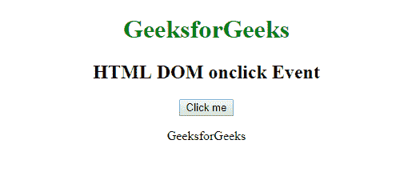
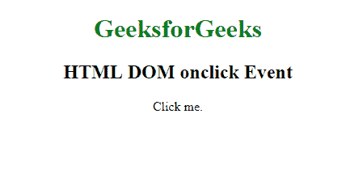
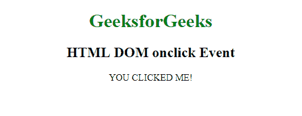

# HTML | DOM onclick 事件

> 原文: [https://www.geeksforgeeks.org/html-dom-onclick-event/](https://www.geeksforgeeks.org/html-dom-onclick-event/)

当用户点击一个元素时，就会出现 **HTML DOM onclick 事件**。

HTML DOM onclick 事件支持所有 HTML 元素，除了: `<iframe>`, `<li>`, `<meta/>`, `<param/>`, `<script/>`, `<style/>`, `<title/>`。

## 语法

### 在 HTML 中:
```html
<element onclick="myScript">
```

### 在 JavaScript 中:
```javascript
object.onclick = function(){myScript};
```

### 在 JavaScript 中，使用 `addEventListener()` 方法:
```javascript
object.addEventListener("click", myScript);
```

## 示例 1: 使用 HTML
```html
<!DOCTYPE html>
<html>
  <body>
    <center>
      <h1 style="color:green">
        GeeksforGeeks
      </h1>
      <h2>HTML DOM onclick Event</h2>
      <button onclick="myFunction()">Click me</button>
      <p id="demo"></p>
      <script>
        function myFunction() {
          document.getElementById(
            "demo").innerHTML = "GeeksforGeeks";
        }
      </script>
    </center>
  </body>
</html>
```

**输出:**


## 示例 2: 使用 JavaScript
```html
<!DOCTYPE html>
<html>
  <body>
    <center>
      <h1 style="color:green">
        GeeksforGeeks
      </h1>
      <h2>HTML DOM onclick Event</h2>
      <p id="demo">Click me.</p>
      <script>
        document.getElementById("demo").onclick = function() {
          GFGfun()
        };
        function GFGfun() {
          document.getElementById(
            "demo").innerHTML = "YOU CLICKED ME!";
        }
      </script>
    </center>
  </body>
</html>
```

**输出:**
**前:**


**之后:**


## 示例 3: 在 JavaScript 中，使用 `addEventListener()` 方法:
```html
<!DOCTYPE html>
<html>
  <body>
    <center>
      <h1 style="color:green">
        GeeksforGeeks
      </h1>
      <h2>HTML DOM onclick Event</h2>
      <p id="demo">Click me.</p>
      <script>
        document.getElementById(
          "demo").addEventListener("click", GFGfun);
        function GFGfun() {
          document.getElementById(
            "demo").innerHTML = "YOU CLICKED ME!";
        }
      </script>
    </center>
  </body>
</html>
```

**输出:**
**前:**


**之后:**


## 支持的浏览器

**DOM onclick 事件**支持的浏览器如下:

*   谷歌 Chrome
*   微软公司出品的 web 浏览器
*   火狐浏览器
*   苹果 Safari
*   歌剧