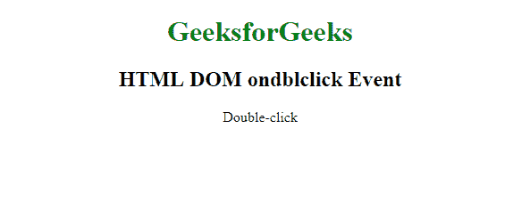
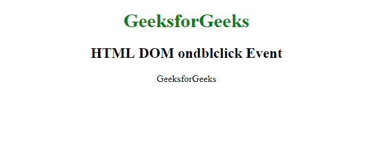

# HTML DOM ondblclick 事件

> 原文: [https://www.geeksforgeeks.org/html-dom-ondblclick-event/](https://www.geeksforgeeks.org/html-dom-ondblclick-event/)

**HTML DOM `ondblclick` 事件**发生在用户双击元素时。

所有 HTML 元素都支持 **`ondblclick` 事件**，除了：`<iframe>`、`<meta>`、`<param>`、`<script>`、`<style>`、`<title>`。

## 语法

**在 HTML 中:**
```html
<element ondblclick="myScript">
```

**在 JavaScript 中:**
```javascript
object.ondblclick = function(){myScript};
```

**在 JavaScript 中，使用 `addEventListener()` 方法:**
```javascript
object.addEventListener("dblclick", myScript);
```

## 示例 1: 使用 HTML

```html
<!DOCTYPE html>
<html>
  <head>
    <title>HTML DOM ondblclick Event</title>
  </head>
  <body>
    <center>
      <h1 style="color:green">
        GeeksforGeeks
      </h1>
      <h2>HTML DOM ondblclick Event</h2>
      <p id="demo" ondblclick="myFunction()">
        Double-click
      </p>
      <script>
        function myFunction() {
          document.getElementById("demo").innerHTML = "GeeksforGeeks";
        }
      </script>
    </center>
  </body>
</html>
```

**输出:**

**前:**


**之后:**


## 示例 2: 使用 JavaScript

```html
<!DOCTYPE html>
<html>
  <head>
    <title>HTML DOM ondblclick Event</title>
  </head>
  <body>
    <center>
      <h1 style="color:green">
        GeeksforGeeks
      </h1>
      <h2>HTML DOM ondblclick Event</h2>
      <p id="demo">Double-click me.</p>
      <script>
        document.getElementById("demo").ondblclick = function() {
          GFGfun()
        };
        function GFGfun() {
          document.getElementById("demo").innerHTML = "GeeksforGeeks";
        }
      </script>
    </center>
  </body>
</html>
```

**输出:**

**前:**


**之后:**


## 示例 3: 在 JavaScript 中，使用 `addEventListener()` 方法

```html
<!DOCTYPE html>
<html>
  <head>
    <title>HTML DOM ondblclick Event</title>
  </head>
  <body>
    <center>
      <h1 style="color:green">
        GeeksforGeeks
      </h1>
      <h2>HTML DOM ondblclick Event</h2>
      <p id="demo">Double-click me.</p>
      <script>
        document.getElementById("demo").addEventListener("dblclick", GFGfun);
        function GFGfun() {
          document.getElementById("demo").innerHTML = "GeeksforGeeks";
        }
      </script>
    </center>
  </body>
</html>
```

**输出:**

**前:**


**之后:**


## 支持的浏览器

支持的浏览器如下:
*   谷歌 Chrome
*   微软 Edge
*   火狐浏览器
*   苹果 Safari
*   Opera