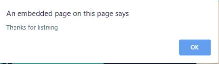
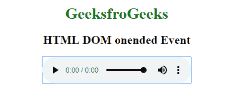
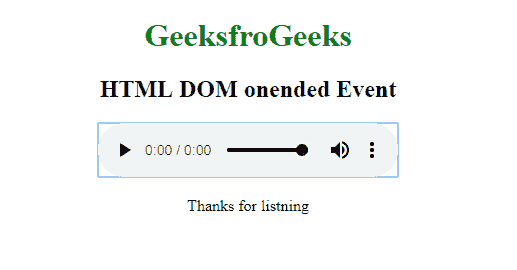

# HTML DOM onended 事件

> 原文: [https://www.geeksforgeeks.org/html-dom-onended-event/](https://www.geeksforgeeks.org/html-dom-onended-event/)

音频/视频结束时会触发 **HTML DOM onended 事件**。我们可以在这个事件中添加一些自定义消息，如“感谢观看”、“分享”等。

## 支持的标签

*   `<audio>`
*   `<video>`

## 语法

**在 HTML 中:**

```html
<element onended="myScript">
```

**在 JavaScript 中:**

```javascript
object.onended = function(){myScript};
```

**在 JavaScript 中，使用 `addEventListener()` 方法:**

```javascript
object.addEventListener("ended", myScript);
```

## 示例: 使用 HTML

```html
<!DOCTYPE html>
<html>

<body>
    <center>
        <h1 style="color:green">GeeksforGeeks</h1>
        <h2>HTML DOM onended Event</h2>
        <audio controls onended="gfgFun()">
            <source src="beep.mp3" type="audio/mpeg">
        </audio>

        <script>
            function gfgFun() {
                alert("Thanks for listening");
            }
        </script>
    </center>
</body>

</html>
```

**输出:**





## 示例: 使用 JavaScript

```html
<!DOCTYPE html>
<html>

<body>
    <center>
        <h1 style="color:green">GeeksforGeeks</h1>
        <h2>HTML DOM onended Event</h2>
        <audio id="audioId" controls>
            <source src="beep.mp3" type="audio/mpeg">
        </audio>

        <p id="try"></p>

        <script>
            document.getElementById("audioId").onended = function() {
                gfgFun()
            };

            function gfgFun() {
                document.getElementById("try").innerHTML = "Thanks for listening";
            }
        </script>
    </center>
</body>

</html>
```

**输出:**



## 示例: 使用 `addEventListener()` 方法

```html
<!DOCTYPE html>
<html>

<body>
    <center>
        <h1 style="color:green">GeeksforGeeks</h1>
        <h2>HTML DOM onended Event</h2>
        <audio id="audioId" controls>
            <source src="beep.mp3" type="audio/mpeg">
        </audio>

        <p id="demo"></p>

        <script>
            document.getElementById("audioId").addEventListener("ended", gfgFun);

            function gfgFun() {
                document.getElementById("demo").innerHTML = "Thanks for listening";
            }
        </script>
    </center>
</body>

</html>
```

**输出:**


## 支持的浏览器

`HTML DOM onended` 事件支持的浏览器如下:

*   Google Chrome
*   Internet Explorer 9.0
*   Firefox
*   Apple Safari
*   Opera