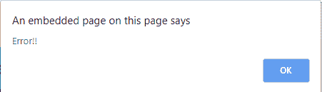
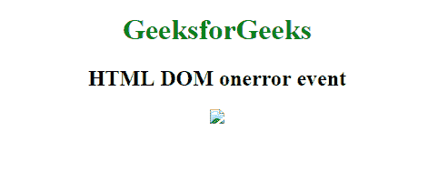
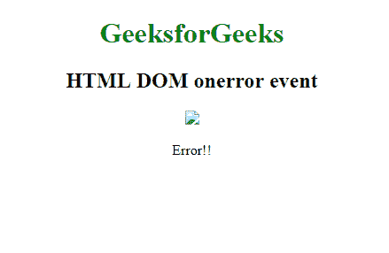

# HTML DOM onerror 事件

> 原文: [https://www.geeksforgeeks.org/html-dom-onerror-event/](https://www.geeksforgeeks.org/html-dom-onerror-event/)

加载外部文件时发生中断时，会触发 HTML DOM `onerror` 事件。
如果媒体加载过程受到某种干扰，会发生以下事件:

*   `onabort`
*   `onerror`
*   `onload`
*   `onsuspend`

## 支持的标签

*   ``
*   `<input type="image">`
*   `<object>`
*   `<link>`
*   `<script>`

## 语法

### 在 HTML 中:

```html
<element onerror="myScript">
```

### 在 JavaScript 中:

```javascript
object.onerror = function(){myScript};
```

### 在 JavaScript 中，使用 `addEventListener()` 方法:

```javascript
object.addEventListener("error", myScript);
```

## 示例: 使用 HTML

```html
<!DOCTYPE html>
<html>

<body>
    <center>
        <h1 style="color:green">GeeksforGeeks</h1>
        <h2>HTML DOM onerror event</h2>
        

        <script>
            function gfgFun() {
                alert('Error!!');
            }
        </script>
    </center>
</body>

</html>
```

**输出:**





## 示例: 使用 JavaScript

```html
<!DOCTYPE html>
<html>

<body>
    <center>
        <h1 style="color:green">GeeksforGeeks</h1>
        <h2>HTML DOM onerror event</h2>

        

        <p id="try"></p>

        <script>
            document.getElementById("logo").onerror = function() {
                myFunction()
            };

            function myFunction() {
                document.getElementById("try").innerHTML = "Error!!";
            }
        </script>
    </center>
</body>

</html>
```

**输出:**



## 示例: 使用 `addEventListener()` 方法

```html
<!DOCTYPE html>
<html>

<body>
    <center>
        <h1 style="color:green">GeeksforGeeks</h1>
        <h2>HTML DOM onerror event</h2>

        

        <p id="try"></p>

        <script>
            document.getElementById("logo").addEventListener("error", myFunction);

            function myFunction() {
                document.getElementById("try").innerHTML = "Error!!";
            }
        </script>
    </center>
</body>

</html>
```

**输出:**


## 支持的浏览器

HTML DOM `onerror` 事件支持的浏览器如下:

*   Google Chrome
*   Microsoft Edge
*   Firefox
*   Safari
*   Opera