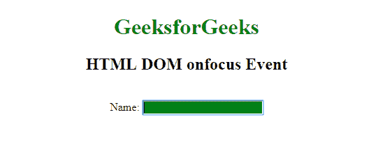

# HTML DOM onfocus 事件

> 原文: [https://www.geeksforgeeks.org/html-dom-onfocus-event/](https://www.geeksforgeeks.org/html-dom-onfocus-event/)

当一个元素获得焦点时，就会出现 `HTML DOM onfocus` 事件。`onfocus` 事件多用于 `<input>`、`<select>`、`<a>`。`onfocus` 事件与 `onblur` 事件相反。

`HTML DOM onfocus` 事件支持所有 HTML 标签，除了: `<iframe>`、`<meta>`、`<param>`、`<script>`、`<style>`、`<title>`。

## 语法

- **在 HTML 中:**
  ```html
  <element onfocus="myScript">
  ```
- **在 JavaScript 中:**
  ```javascript
  object.onfocus = function(){myScript};
  ```
- **在 JavaScript 中，使用 `addEventListener()` 方法:**
  ```javascript
  object.addEventListener("focus", myScript);
  ```

**注:** `onfocus` 事件不同于 `onfocusin` 事件，因为 `onfocus` 事件不冒泡。

## 例 1

```html
<!DOCTYPE html>
<html>
  <head>
    <title>
      HTML DOM onfocus Event
    </title>
  </head>
  <body>
    <center>
      <h1 style="color:green">
        GeeksforGeeks
      </h1>
      <h2>
        HTML DOM onfocus Event
      </h2>
      <br> Name:
      <input type="text"
             onfocus="geekfun(this)">
      <script>
          function geekfun(gfg) {
              gfg.style.background = "green";
          }
      </script>
    </center>
  </body>
</html>
```

**输出:**


## 例 2

```html
<!DOCTYPE html>
<html>
  <head>
    <title>
      HTML DOM onfocus Event
    </title>
  </head>
  <body>
    <center>
      <h1 style="color:green">
        GeeksforGeeks
      </h1>
      <h2>HTML DOM onfocus Event</h2>
      <br> Name:
      <input type="text" id="fname">

      <script>
          document.getElementById(
            "fname").onfocus = function() {
              geekfun()
          };

          function geekfun() {
              document.getElementById(
                "fname").style.backgroundColor =
                "green";
          }
      </script>
    </center>
  </body>
</html>
```

**输出:**


## 例 3

```html
<!DOCTYPE html>
<html>
  <head>
    <title>
      HTML DOM onfocus Event
    </title>
  </head>
  <body>
    <center>
      <h1 style="color:green">
        GeeksforGeeks
      </h1>
      <h2>HTML DOM onfocus Event</h2>
      <br> Name:
      <input type="text" id="fname">

      <script>
          document.getElementById(
            "fname").addEventListener(
            "focus", Geeksfun);

          function Geeksfun() {
              document.getElementById(
                "fname").style.backgroundColor = "green";
          }
      </script>
    </center>
  </body>
</html>
```

**输出:**


## 支持的浏览器

`HTML DOM onfocus Event` 支持的浏览器如下:

- 谷歌 Chrome
- 微软 Edge
- 火狐浏览器
- 苹果 Safari
- Opera