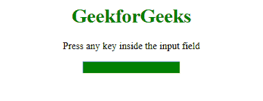
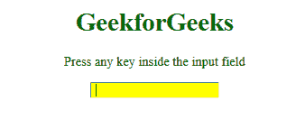

# HTML DOM onkeydown 事件

> 原文: [https://www.geeksforgeeks.org/html-dom-onkeydown-event/](https://www.geeksforgeeks.org/html-dom-onkeydown-event/)

HTML 中的 **DOM onkeydown 事件**发生在用户按下某个键的时候。

与 `onkeydown` 事件相关的事件顺序:

*   `keydown`
*   `keypress`
*   `keyup`

## 支持的 HTML 标签

所有 HTML 元素，除了:

*   `<iframe>`
*   `<meta>`
*   `<param>`
*   `<script>`
*   `<style>`
*   `<title>`

## 语法

*   **在 HTML 中:**
    ```html
    <element onkeydown="myScript">
    ```
*   **在 JavaScript 中:**
    ```javascript
    object.onkeydown = function(){myScript};
    ```
*   **在 JavaScript 中，使用 `addEventListener()` 方法:**
    ```javascript
    object.addEventListener("keydown", myScript);
    ```

## 示例

使用 `addEventListener()` 方法的 `onkeydown` 事件。

```html
<!DOCTYPE html>
<html>
   <body>
    <center>
        <h1 style="color:green">
          GeekforGeeks
      </h1>
        <p>Press any key inside the input field</p>

        <input type="text"
               id="inputField"
               style="background-color:green">

        <script>
            document.getElementById(
              "inputField").addEventListener("keydown", GFGFun);

            function GFGFun() {
                document.getElementById(
                  "inputField").style.backgroundColor =
                  "yellow";

            }
        </script>
    </center>
</body>
</html>
```

**输出:**

**前:**


**之后:**


## 支持的浏览器

**HTML DOM onkeydown 事件**支持的浏览器如下:

*   Google Chrome
*   Internet Explorer
*   Firefox
*   Apple Safari
*   Opera