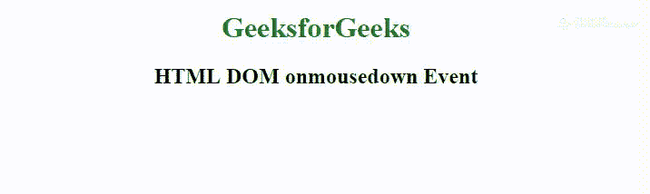

# HTML DOM onmousedown 事件

> 原文: [https://www.geeksforgeeks.org/html-dom-onmousedown-event/](https://www.geeksforgeeks.org/html-dom-onmousedown-event/)

**HTML DOM onmousedown 事件**发生在按下元素上的鼠标按钮时。

**相关事件为左键:**

*   `onmousedown`
*   `onmouseup`
*   `onclick`

**相关事件为右键:**

*   `onmousedown`
*   `onmouseup`
*   `oncontextmenu`

**支持的标签:** 支持所有 HTML 元素，除了:

*   `<base>`
*   `<bdo>`
*   `<br>`
*   `<head>`
*   `<html>`
*   `<iframe>`
*   `<link>`
*   `<meta>`
*   `<script>`
*   `<style>`
*   `<title>`

**语法:**

*   **在 HTML 中:**

```html
<element onmousedown="myScript">
```

*   **在 JavaScript 中:**

```html
object.onmousedown = function(){myScript};
```

*   **在 JavaScript 中，使用 `addEventListener()` 方法:**

```html
object.addEventListener("mousedown", myScript);
```

**示例:** 使用 `addEventListener()` 方法

```html
<!DOCTYPE html>
<html>

<head>
    <title>
      HTML DOM onmousedown Event
  </title>
</head>

<body>
    <center>
        <h1 style="color:green">
          GeeksforGeeks
      </h1>
        <h2 id="try">
          HTML DOM onmousedown Event
      </h2>

<script>
            document.getElementById(
              "try").addEventListener(
              "mousedown", btnpressed);

function btnpressed() {
                document.getElementById(
                  "try").innerHTML =
                  "button pressed.";
            }
        </script>
    </center>
</body>

</html>
```

**输出:**



**支持的浏览器:** **HTML DOM onmousedown Event** 支持的浏览器如下:

*   Google Chrome
*   Internet Explorer
*   Firefox
*   Apple Safari
*   Opera