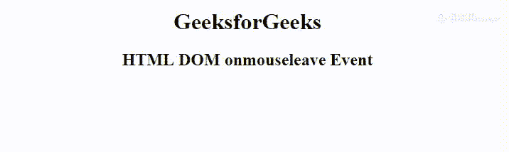

# HTML DOM onmouseleave 事件

> 原文: [https://www.geeksforgeeks.org/html-dom-onmouseleave-event/](https://www.geeksforgeeks.org/html-dom-onmouseleave-event/)

当鼠标指针移出一个元素时，就会出现 HTML 中的 **DOM onmouseleave 事件**。这个事件与 `onmouseenter` 事件相反。本次活动类似于 `onmouseout` 活动。

**支持的标签:** 支持所有 HTML 元素，除了:

*   `<base>`
*   `<bdo>`
*   `<br>`
*   `<head>`
*   `<html>`
*   `<iframe>`
*   `<map>`
*   `<meta>`
*   `<script>`
*   `<style>`
*   `<title>`

**语法:**

*   **在 HTML 中:**

```html
<element onmouseleave="myScript">
```

*   **在 JavaScript 中:**

```html
object.onmouseleave = function(){myScript};
```

*   **在 JavaScript 中，使用 `addEventListener()` 方法:**

```html
object.addEventListener("mouseleave", myScript);
```

**示例:** 使用 `addEventListener()` 方法

## HTML

```html
<!DOCTYPE html>
<html>

<head>
    <title>
        HTML DOM onmouseenter Event
    </title>
</head>

<body>
    <center>
        <h1 id="demo">
          GeeksforGeeks
      </h1>
        <h2>
          HTML DOM onmouseleave Event
      </h2>
    </center>
    <script>
        document.getElementById(
          "demo").addEventListener(
          "mouseenter", enter);

        document.getElementById(
          "demo").addEventListener(
          "mouseleave", leave);

        function enter() {
            document.getElementById(
              "demo").style.color = "yellow";
        }

        function leave() {
            document.getElementById(
              "demo").style.color = "green";
        }
    </script>

</body>

</html>
```

**输出:**



**支持的浏览器:** HTML DOM onmouseleave 事件支持的浏览器如下:

*   Google Chrome 30.0
*   Internet Explorer 5.5
*   Firefox
*   Apple Safari 6.1
*   Opera 11.5