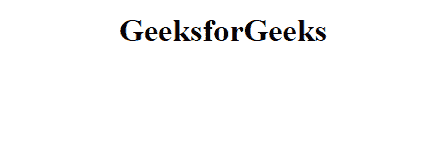
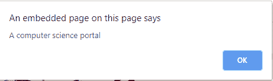

# html | DOM onmoemove event

> 哎哎哎:# t0]https://www . geeksforgeeks . org/html-DOM-onouemove-event/

当指针在一个元素上移动时，就会发生 HTML 中的 `DOM onmousemove 事件`。

**支持的标签:** 支持所有 HTML 元素，除了:
*   `<iframe>`
*   `<meta/>`
*   `<param/>`
*   `<script/>`
*   `<style/>`
*   `<title/>`

**语法:**

**在 HTML 中:**
```html
<element onmousemove="myScript">
```

**在 JavaScript 中:**
```javascript
object.onmousemove = function(){myScript};
```

**在 JavaScript 中，使用 `addEventListener()` 方法:**
```javascript
object.addEventListener("mousemove", myScript);
```

**示例:** 使用 `addEventListener()` 方法

```html
<!DOCTYPE html>
<html>
    <head>
        <title>
            HTML DOM onmousemove Event
        </title>
    </head>
    <body>
        <center>
            <h1 id="eleID">GeeksforGeeks</h1>
            <p id="demo"></p>
            <script>
                document.getElementById(
                    "eleID").addEventListener(
                    "mousemove", function(event) {
                    GFGfun(event);
                });

                function GFGfun(event) {
                    alert("A computer science portal")
                }
            </script>
        </center>
    </body>
</html>
```

**输出:**

**前移:**



**后移:**



**支持的浏览器:**

`DOM onmousemove 事件`支持的浏览器如下:
*   谷歌 Chrome
*   微软公司出品的 web 浏览器
*   火狐浏览器
*   苹果 Safari
*   歌剧