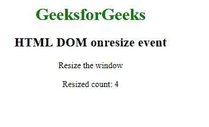

# HTML DOM onresize 事件

> 原文：[https://www.geeksforgeeks.org/html-dom-onresize-event/](https://www.geeksforgeeks.org/html-dom-onresize-event/)

浏览器窗口调整大小时触发 `HTML DOM onresize` 事件。只有 `<body>` 标签支持此事件。

要获取窗口大小，可以使用以下属性：

*   `clientWidth`、`clientHeight`
*   `innerWidth`、`innerHeight`
*   `outerWidth`、`outerHeight`
*   `offsetWidth`、`offsetHeight`

## 支持的标签

## 语法

*   **在 HTML 中：**

```html
<element onresize="myScript">
```

*   **在 JavaScript 中：**

```javascript
object.onresize = function(){myScript};
```

*   **在 JavaScript 中，使用 `addEventListener()` 方法：**

```javascript
object.addEventListener("resize", myScript);
```

## 示例

### HTML

```html
<!DOCTYPE html>
<html>

<head>
    <title>HTML DOM onresize event</title>
</head>

<body>
    <center>
        <h1 style="color:green">GeeksforGeeks</h1>
        <h2>HTML DOM onresize event</h2>

        <p>Resize the window</p>

        <p>Resized count: <span id="try">0</span></p>

    </center>
    <script>
        window.addEventListener("resize", GFGfun);

        var c = 0;

        function GFGfun() {
            var res = c += 1;
            document.getElementById("try").innerHTML = res;
        }
    </script>

</body>

</html>
```

**输出：**



## 支持的浏览器

`HTML DOM onresize Event` 支持的浏览器如下：

*   Google Chrome
*   Internet Explorer
*   Firefox
*   Safari
*   Opera