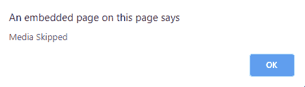

# HTML DOM onseeked 事件

> 原文: [https://www.geeksforgeeks.org/html-dom-onseeked-event/](https://www.geeksforgeeks.org/html-dom-onseeked-event/)

当用户完成跳过媒体到一个新的位置时，在 HTML DOM 中出现 `onseeked` 事件。`onseeked` 事件和 `onseeking` 事件正好相反。要获取媒体的当前位置，请使用 `currentTime` 属性。

## 支持的标签

*   `<audio>`
*   `<video>`

## 语法

*   **在 HTML 中:**

```html
<element onseeked="Script">
```

*   **在 JavaScript 中:**

```javascript
object.onseeked = function(){Script};
```

*   **在 JavaScript 中，使用 `addEventListener()` 方法:**

```javascript
object.addEventListener("seeked", Script);
```

## 示例

使用 `addEventListener()` 方法。

### HTML 代码

```html
<!DOCTYPE html>
<html>

<head>
    <title>
        HTML DOM onseeked Event
    </title>
</head>

<body>
    <center>
        <h1 style="color:green">GeeksforGeeks</h1>
        <h2>HTML DOM onseeked Event</h2>

        <video controls id="videoID">
            <source src="https://media.geeksforgeeks.org/wp-content/uploads/20190723123920/secondneon.mp4"
                    type="video/mp4">
        </video>
    </center>
    <script>
        document.getElementById("videoID").addEventListener("seeked", GFGfun);

        function GFGfun() {
            alert("Media Skipped");
        }
    </script>

</body>

</html>
```

### 输出

**前:**


**之后:**



## 支持的浏览器

`HTML DOM onseeked Event` 支持的浏览器如下:

*   Google Chrome
*   Internet Explorer 9+
*   Firefox
*   Apple Safari
*   Opera