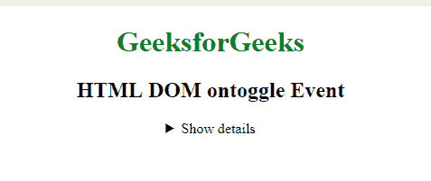
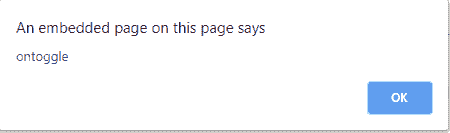
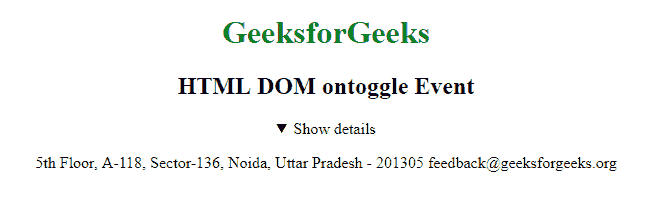

# HTML DOM ontoggle 事件

> 原文：`https://www.geeksforgeeks.org/html-dom-ontoggle-event/`

当用户打开或关闭 `<details>` 元素时，HTML DOM 中的 `ontoggle` 事件发生。`<details>` 标签用于最初隐藏的内容/信息，但如果用户希望查看，可以显示。

## 支持的标签

`<details>`

## 语法

*   **在 HTML 中：**

```html
<element ontoggle="Script">
```

*   **在 JavaScript 中：**

```javascript
object.ontoggle = function(){Script};
```

*   **在 JavaScript 中，使用 `addEventListener()` 方法：**

```javascript
object.addEventListener("toggle", Script);
```

## 示例

### HTML

```html
<!DOCTYPE html>
<html>

<head>
    <title>HTML DOM ontoggle Event</title>
</head>

<body>
    <center>
        <h1 style="color:green">GeeksforGeeks</h1>
        <h2>HTML DOM ontoggle Event</h2>

        <details id="detailsID">
            <summary>Show details</summary>
            <p>
                5th Floor, A-118,
                Sector-136, Noida, Uttar Pradesh - 201305
                feedback@geeksforgeeks.org
            </p>
        </details>
    </center>
    <script>
        document.getElementById("detailsID").addEventListener("toggle", GFGfun);

        function GFGfun() {
            alert("ontoggle");
        }
    </script>
</body>

</html>
```

**输出：**

**前：**



**之后：**





## 支持的浏览器

`ontoggle` 事件支持的浏览器如下：

*   Google Chrome
*   Internet Explorer
*   Firefox
*   Safari
*   Opera