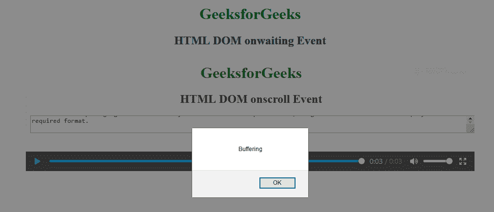

# HTML DOM onwaiting 事件

> 原文：`https://www.geeksforgeeks.org/html-dom-onwaiting-event/`

HTML DOM 中的 `onwaiting` 事件发生在视频停止缓冲下一帧时。

## 支持的标签

*   `<audio>`
*   `<video>`

## 语法

### 在 HTML 中

```html
<element onwaiting="Script">
```

### 在 JavaScript 中

```javascript
object.onwaiting = function(){Script};
```

### 在 JavaScript 中，使用 `addEventListener()` 方法

```javascript
object.addEventListener("waiting", Script);
```

## 示例：使用 `addEventListener()` 方法

```html
<!DOCTYPE html>
<html>
<head>
    <title>HTML DOM onwaiting Event</title>
</head>
<body>
    <center>
        <h1 style="color:green">GeeksforGeeks</h1>
        <h2>HTML DOM onwaiting Event</h2>
        <video controls id="videoID">
            <source src="GFG.mp4" type="video/mp4">
        </video>
    </center>
    <script>
        document.getElementById("videoID").addEventListener("waiting", GFGfun);

        function GFGfun() {
            alert("Buffering");
        }
    </script>
</body>
</html>
```

## 输出



## 支持的浏览器

`onwaiting` 事件上 HTML DOM 支持的浏览器如下：

*   Google Chrome
*   Internet Explorer
*   Firefox
*   Safari
*   Opera