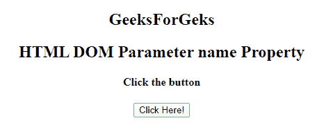
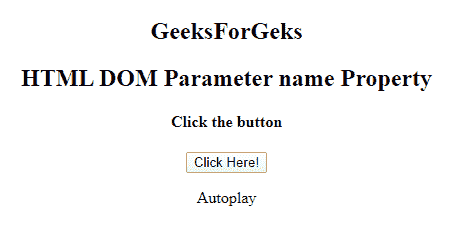

# HTML DOM Parameter name 属性

> 原文：[`https://www.geeksforgeeks.org/html-dom-parameter-name-property/`](https://www.geeksforgeeks.org/html-dom-parameter-name-property/)

**HTML DOM Parameter name 属性**用于设置或返回 `parameter` 元素的 `name` 属性。`name` 属性用于在提交表单后引用表单数据或在 JavaScript 中引用元素。

## 语法

它返回 `name` 属性。

```html
parameterObject.name
```

它用于设置 `name` 属性。

```html
parameterObject.name = name
```

## 属性值

接受单个参数 `name`，并指定 `parameter` 元素的名称。

## 返回值

返回代表 `parameter` 元素名称的字符串值。

## 示例

这个程序说明了如何返回 `name` 属性。

```html
<!DOCTYPE html>
<html>
<title>
    HTML DOM Parameter name Property
</title>

<body>
    <center>
        <h2>
    GeeksForGeks
</h2>
        <h2>
    HTML DOM Parameter name Property
</h2>
        <h4>Click the button</h4>
        <button onclick="GFG()">Click Here!
            <br>
        </button>

<p></p>

<object data="sample.mp4">
            <param id="myParam"
                   name="Autoplay"
                   value="true">
        </object>
        <p id="Geeks"></p>

<script>
            function GFG() {
                var x =
                    document.getElementById("myParam").name;
                document.getElementById(
                  "Geeks").innerHTML = x;
            }
        </script>
    </center>
</body>

</html>
```

## 输出

**点击按钮之前**



**点击按钮之后**



## 支持的浏览器

**DOM Parameter name 属性**支持的浏览器如下：

*   Google Chrome
*   Microsoft Edge
*   Firefox
*   Safari
*   Opera