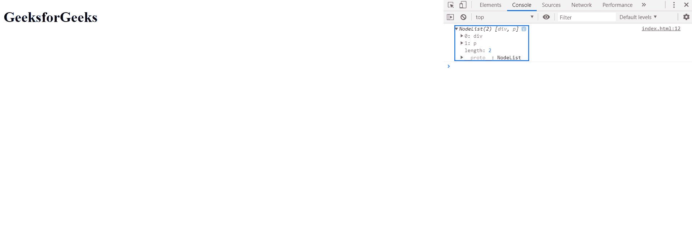
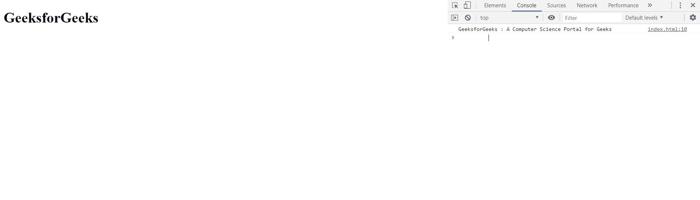

# HTML DOM ParentNode.prepend() 方法

> 原文：[https://www.geeksforgeeks.org/html-dom-parentnode-prepend-method/](https://www.geeksforgeeks.org/html-dom-parentnode-prepend-method/)

该方法在父节点的第一个子节点之前插入一组节点对象或多字符串对象。因此，子节点被设置为节点对象列表的第 0 个索引。

## 语法

```html
ParentNode.prepend( ChildNodesToPrepend );
```

## 参数

*   `ChildNodesToPrepend`：要前置的子节点充当此方法的参数。
*   前置文字：我们也可以前置文字。

## 返回值

该方法返回 `undefined`。

以下示例说明了 `ParentNode.prepend()` 方法：

### 示例 1：前置元素

为了展示这个方法，我们创建了三个元素 `parentNode`，`Child1` 和 `Child2`。然后我们将 `Child1` 和 `Child2` 前置到 `parentNode`。

在控制台中，我们显示了 `parentNode` 的子节点。

```html
<!DOCTYPE html>
<html lang="en">

<head>
    <meta charset="UTF-8">
    <title>Prepend</title>
</head>

<body>
    <h1>GeeksforGeeks</h1>

<script>
        var parentNode = document.createElement("div");
        var Child1 = document.createElement("p");
        var Child2 = document.createElement("div");
        parentNode.prepend(Child1);
        parentNode.prepend(Child2);
        console.log(parentNode.childNodes);
    </script>
</body>

</html>
```

**输出：**

在控制台中，您可以看到 `parentNode` 的子节点列表。一个是 `div` 一个是 `p`。



### 示例 2：前置文本

在这个例子中，我们在元素的 `innerHTML` 和元素的 `textContent` 前添加了一些文本。

```html
<!DOCTYPE html>
<html lang="en">

<head>
    <meta charset="UTF-8">
    <title>Prepend</title>
</head>

<body>
    <h1>GeeksforGeeks</h1>

<script>
        var parent = document.createElement("div");
        parent.innerHTML = 
            "A Computer Science Portal for Geeks";
        parent.prepend("GeeksforGeeks : ");
        console.log(parent.textContent);
    </script>
</body>

</html>
```

**输出：**

在控制台中，可以看到 `parent` 元素的文本内容。

