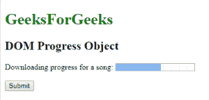
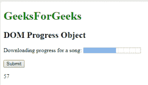
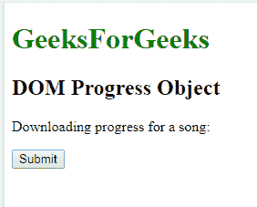
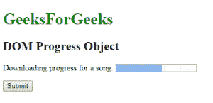

# HTML DOM 进度对象

> 原文: [https://www.geeksforgeeks.org/html-dom-progress-object/](https://www.geeksforgeeks.org/html-dom-progress-object/)

HTML DOM 中的进度对象用来表示 HTML `<progress>` 元素。使用 `getElementById()` 方法可以访问 `<progress>` 元素。

**属性:**

*   `level:` 返回进度条列表。
*   `max:` 用于设置或返回进度条的 `max` 属性值。
*   `value:` 它代表已经完成的工作量。
*   `position:` 返回进度条当前位置。

**语法:**

```html
document.getElementById("ID");
```

其中 `ID` 被分配给 `<progress>` 元素。

## 示例 1

```html
<!DOCTYPE html>
<html>
    <head>
        <title>
            HTML DOM Progress Object
        </title>
    </head>

<body>
        <h1 style="color:green;">
            GeeksForGeeks
        </h1>

<h2>DOM Progress Object</h2>

Downloading progress for a song:
        <progress id = "GFG" value = "57" max = "100">
        </progress>

<br><br>

<button onclick = "myGeeks()">
            Submit
        </button>

<p id = "sudo"></p>

<script>
            function myGeeks() {
                var pr = document.getElementById("GFG").value;
                document.getElementById("sudo").innerHTML = pr;
            }
        </script>
    </body>
</html>
```

**输出:**

**点击按钮之前:**



**点击按钮之后:**



## 示例 2

可以使用 `document.createElement()` 方法创建进度对象。

```html
<!DOCTYPE html>
<html>
    <head>
        <title>
            HTML DOM Progress Object
        </title>
    </head>

<body>
        <h1 style = "color:green;">
            GeeksForGeeks
        </h1>

<h2>DOM Progress Object</h2>

<p id = "GFG">
            Downloading progress for a song:
        </p>

<button onclick = "myGeeks()">
            Submit
        </button>

<script>
            function myGeeks() {
                var g = document.createElement("PROGRESS");
                g.setAttribute("value", "57");
                g.setAttribute("max", "100");
                document.getElementById("GFG").appendChild(g);
            }
        </script>
    </body>
</html>
```

**输出:**

**点击按钮之前:**



**点击按钮之后:**



**支持的浏览器:**

`DOM Progress` 对象支持的浏览器如下:

*   Google Chrome
*   Microsoft Edge
*   Firefox
*   Opera
*   Safari