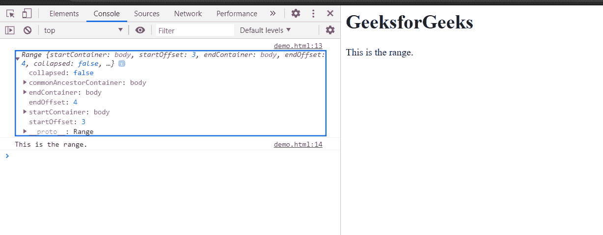

# HTML DOM Range cloneRange() 方法

> 原文：[https://www.geeksforgeeks.org/html-dom-range-clonerange-method/](https://www.geeksforgeeks.org/html-dom-range-clonerange-method/)

使用 `cloneRange()` 方法对原始范围进行克隆，并将克隆的范围对象返回到新变量中。

**注意：** 任一范围的变化不影响另一范围。

## 语法

```html
newRange = originalRange.cloneRange();
```

## 参数

此方法不接受任何参数。

## 返回值

该方法返回新创建的范围对象。

## 示例

在本例中，克隆了一个范围。为了更清楚地说明克隆范围，使用 `toString()` 方法将克隆范围转换为字符串文本，并在控制台中显示该克隆范围对象。

### HTML

```html
<!DOCTYPE html>
<html>

<head>
    <title>
        HTML DOM range cloneRange() method
    </title>
</head>

<body>
    <h1>GeeksforGeeks</h1>

    <p>This is the range.</p>

    <script>
        originalRange = document.createRange();
        originalRange.selectNode(document.getElementsByTagName("p").item(0));
        clonedRange = originalRange.cloneRange();
        console.log(clonedRange);
        console.log(clonedRange.toString());
    </script>
</body>

</html>
```

## 输出

在控制台中，可以看到新克隆的范围对象。



## 支持的浏览器

*   Google Chrome
*   Edge
*   Firefox
*   Safari
*   Opera