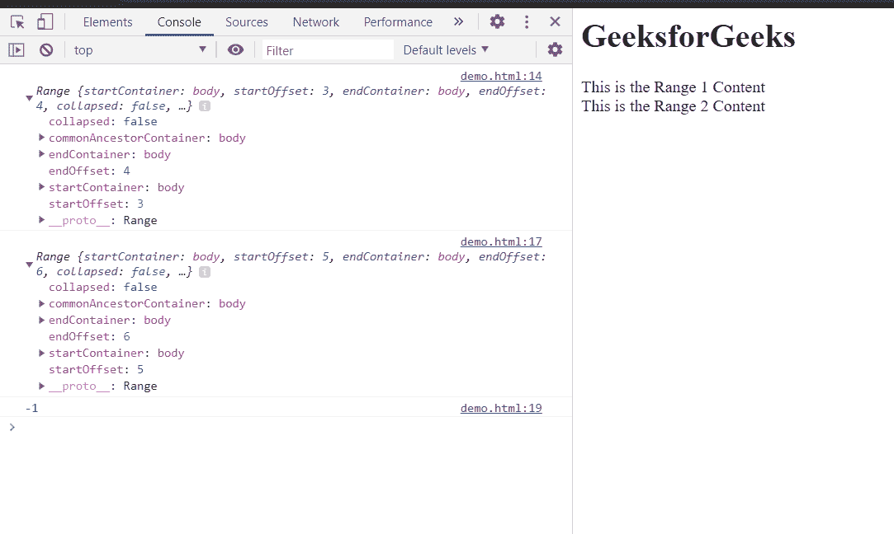

# HTML DOM Range compareBoundaryPoints() 方法

> 原文：[https://www.geeksforgeeks.org/html-dom-range-compareboundarypoints-method/](https://www.geeksforgeeks.org/html-dom-range-compareboundarypoints-method/)

`compareBoundaryPoints()` 方法用于将一个范围的边界点与另一个范围的边界点进行比较。

## 语法

```html
compare = firstRange.compareBoundaryPoints(comparision_method, otherRange);
```

## 返回值

该方法返回一个数字，表示边界点的位置：

*   **-1**：如果第一范围的边界点位于第二范围的边界点之前，则返回 `-1`。
*   **0**：如果第一范围的边界点等于第二范围的边界点，则返回 `0`。
*   **1**：如果第一个范围的边界点位于第二个范围的边界点之后，则返回 `1`。

## 参数

该方法包含 2 个参数：

1.  描述比较方法的常数：
    *   `Range.END_TO_END`：比较第一范围的结束边界点和第二范围的结束边界点。
    *   `Range.END_TO_START`：比较第一范围的结束边界点和第二范围的开始边界点。
    *   `Range.START_TO_END`：比较第一范围的开始边界点和第二范围的结束边界点。
    *   `Range.START_TO_START`：比较第一范围的开始边界点和第二范围的开始边界点。
2.  `otherRange`：用于比较的其他范围。

## 示例

在示例中，我们将创建并比较两个范围。

### HTML

```html
<html>
<head>
<title>HTML DOM range compareBoundaryPoints() method</title>
</head>
<body>
    <h1>GeeksforGeeks</h1>
    <div>This is the Range 1 Content</div>
    <div>This is the Range 2 Content</div>
</body>
<script>
    var range1, range2, compare;
    range1 = document.createRange();
    range1.selectNode(document.getElementsByTagName("div")[0]);
    console.log(range1);
    range2 = document.createRange();
    range2.selectNode(document.getElementsByTagName("div")[1]);
    console.log(range2);
    compare = range1.compareBoundaryPoints(Range.START_TO_END, range2);
    console.log(compare);
</script>
</html>
```

## 输出

在控制台中，我们可以看到两个范围以及这些范围的记录比较。

输出为 `-1`，因为范围 1 的起始偏移量为 3，范围 2 的结束偏移量为 6。



## 支持的浏览器

DOM `compareBoundaryPoints()` 方法支持的浏览器如下：

*   Google Chrome
*   Edge
*   Firefox
*   Safari
*   Opera
*   Internet Explorer