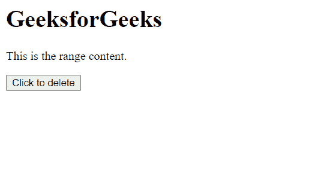
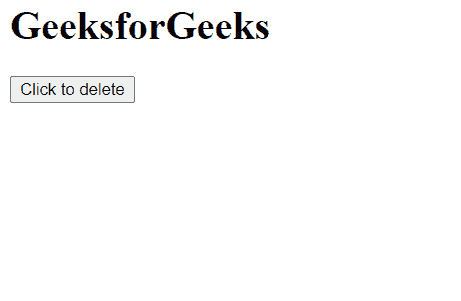

# HTML DOM Range deleteContents() 方法

> 原文：[https://www.geeksforgeeks.org/html-dom-range-deletecontents-method/](https://www.geeksforgeeks.org/html-dom-range-deletecontents-method/)

`deleteContents()` 方法从文档树中删除范围的所有内容。

## 语法

```html
range.deleteContents()
```

## 参数

此方法不接受任何参数。

## 返回值

此方法不返回值。

## 示例

本示例介绍如何从文档树中删除当前范围。

### HTML

```html
<!DOCTYPE html>
<html>

<head>
    <title>
        HTML DOM range deleteContents() method
    </title>
</head>

<body>
    <h1>GeeksforGeeks</h1>

    <p>This is the range content.</p>

    <button onclick="del()">
        Click to delete
    </button>

    <script>
        var range = document.createRange();
        range.selectNode(document
            .getElementsByTagName("p").item(0));

        function del() {
            range.deleteContents();
        }
    </script>
</body>

</html>
```

## 输出

*   **点击按钮前：**



*   **点击按钮后：**



## 支持的浏览器

*   Google Chrome
*   Edge
*   Firefox
*   Safari
*   Opera
*   Internet Explorer