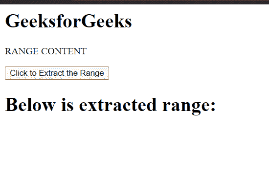
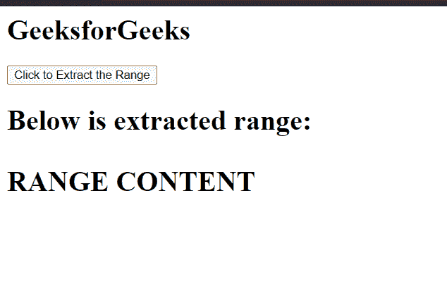

# HTML DOM `extractContents()` 方法

> 原文：[https://www.geeksforgeeks.org/html-dom-range-extractcontents-method/](https://www.geeksforgeeks.org/html-dom-range-extractcontents-method/)

`extractContents()` 方法将 `Range` 的内容从文档树移动到 `DocumentFragment` 变量中。`Range` 的内容从文档树中移除。

`extractContents()` 方法类似于 `cloneContents()` 方法。`extractContents()` 方法从 `Range` 对象的内容中创建 `DocumentFragment` 对象，并从文档树中移除 `Range` 的内容。

## 语法

```javascript
documentFragment = range.extractContents();
```

## 参数

此方法不接受任何参数。

## 返回值

该方法返回一个从 `Range` 内容创建的 `DocumentFragment` 对象。

## 示例

这个示例展示了如何使用这个方法创建一个 `DocumentFragment` 对象并将其追加到一个元素中。

### HTML

```html
<!DOCTYPE html>
<html>

<head>
    <title>
        HTML DOM range extractContents() method
    </title>
</head>

<body>
    <h1>GeeksforGeeks</h1>

    <p>RANGE CONTENT</p>

    <button onclick="extract()">
        Click to Extract the Range
    </button>

    <h1 id="element">
        Below is extracted range: 
    </h1>

    <script>
        var range = document.createRange();

        range.selectNode(document
            .getElementsByTagName("p").item(0));

        const element = 
            document.getElementById('element');

        function extract() {
            var documentFragment = 
                range.extractContents();

            console.log(documentFragment);
            element.appendChild(documentFragment);
        }
    </script>
</body>

</html>
```

## 输出

*   **点击按钮前：**



*   **点击按钮后：**



## 支持的浏览器

*   Google Chrome
*   Edge
*   Firefox
*   Safari
*   Opera
*   Internet Explorer