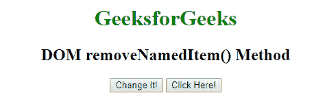
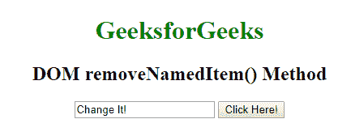

# HTML DOM `removeNamedItem()` 方法

> 原文：[https://www.geeksforgeeks.org/html-dom-removenameditem-method/](https://www.geeksforgeeks.org/html-dom-removenameditem-method/)

HTML 中的 `removeNamedItem()` 方法用于移除 `NamedNodeMap` 对象中具有指定名称的节点。

### 语法
```html
namednode.removeNamedItem( nodename )
```

### 参数
`removeNamedItem()` 仅包含一个参数 `nodename`，如下所述。

*   `nodename`: 该方法接受单参数 `nodename`，该参数为必选项。它指的是 `NamedNodeMap` 中需要删除的节点的名称。

### 返回值
它返回一个 `Node` 对象，代表被删除的属性节点。

### 示例
```html
<!DOCTYPE html>
<html>
    <head>
        <title>
            DOM removeNamedItem() Method
        </title>
        <script>
            function myFunction() {
                var button =
                    document.getElementsByTagName("INPUT")[0];
                button.attributes.removeNamedItem("type");
            }
        </script>
    </head>

<body style = "text-align: center;">

<h1 style = "color: green">
            GeeksforGeeks
        </h1>

<h2>
            DOM removeNamedItem() Method
        </h2>

<input type="button" value="Change It!">

<!-- removeNamedItem() method used here -->
        <button onclick="myFunction()">
            Click Here!
        </button>
    </body>
</html>
```

### 输出
点击 “Click Here!” 按钮前：



点击 “Click Here!” 按钮后：



### 注意
当我们移除输入元素的 `type` 属性时，该元素将变为类型 `text`，这是默认值。

### 支持的浏览器
下面列出了 `removeNamedItem()` 方法支持的浏览器：

*   Google Chrome
*   Microsoft Edge
*   Firefox
*   Opera
*   Safari