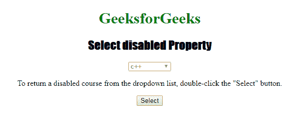
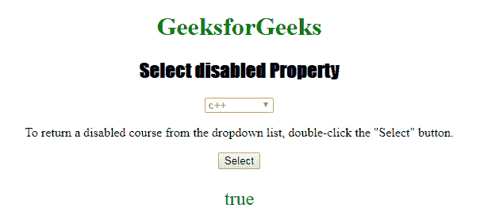
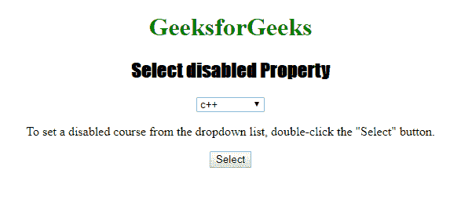
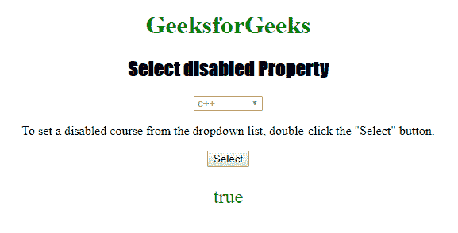

# HTML DOM Select disabled 属性

> 原文：[https://www.geeksforgeeks.org/html-dom-select-disabled-property/](https://www.geeksforgeeks.org/html-dom-select-disabled-property/)

HTML DOM 中的 `disabled` 属性用于设置或返回下拉列表是否被禁用。禁用的元素不可点击或不可用，通常在浏览器中默认为灰色。此属性用于反映 HTML `disabled` 属性。

## 语法

它返回 `disabled` 属性。

```html
selectObject.disabled
```

它用于设置 `disabled` 属性。

```html
selectObject.disabled = true|false
```

## 属性值

*   `true`：指定下拉列表将被禁用。
*   `false`：指定下拉列表不会被禁用。

## 返回值

返回一个布尔值，表示下拉列表是否被禁用。

## 示例

本示例返回 `disabled` 属性。

```html
<!DOCTYPE html>
<html>

<head>
    <title>
        Select disabled Property in HTML
    </title>
    <style>
        h1 {
            color: green;
        }

        h2 {
            font-family: Impact;
        }

        body {
            text-align: center;
        }
    </style>
</head>

<body>

<h1>
    GeeksforGeeks
</h1>
<h2>
    Select disabled Property
</h2>

<select name="Courses Titles"
        id="myCourses"
        disabled>
    <option value="C++">c++</option>
    <option value="Placement">Placement</option>
    <option value="Java">Java</option>
    <option value="Python">Python</option>
</select>

<p>
    To return a disabled course from the
    dropdown list, double-click the "Select" button.
</p>

<button ondblclick="My_list()">
    Select
</button>
<p id="sudo"
   style="font-size:24px;
          color:green">
</p>
<script>
    function My_list() {
        var g = document.getElementById(
            "myCourses").disabled;
        document.getElementById("sudo").innerHTML = g;
    }
</script>

</body>

</html>
```

**输出：**

**点击按钮前：**


**点击按钮后：**


### 示例 2

本示例设置 `disabled` 属性。

```html
<!DOCTYPE html>
<html>

<head>
    <title>
        Select disabled Property in HTML
    </title>
    <style>
        h1 {
            color: green;
        }

        h2 {
            font-family: Impact;
        }

        body {
            text-align: center;
        }
    </style>
</head>

<body>

<h1>
    GeeksforGeeks
</h1>
<h2>
    Select disabled Property
</h2>

<select name="Courses Titles"
        id="myCourses"
        disabled>
    <option value="C++">c++</option>
    <option value="Placement">Placement</option>
    <option value="Java">Java</option>
    <option value="Python">Python</option>
</select>

<p>
    To set a disabled course from the dropdown
    list, double-click the "Select" button.
</p>

<button ondblclick="My_list()">
    Select
</button>
<p id="sudo"
   style="font-size:24px;
          color:green">
</p>
<script>
    function My_list() {
        var g = document.getElementById(
            "myCourses").disabled = "false";
        document.getElementById("sudo").innerHTML = g;
    }
</script>

</body>

</html>
```

**输出：**

**点击按钮前：**


**点击按钮后：**


## 支持的浏览器

*   Google Chrome
*   Mozilla Firefox
*   Microsoft Edge
*   Opera
*   Safari