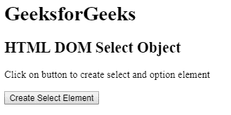
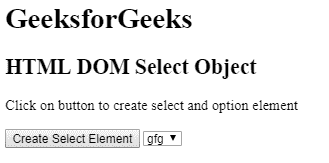
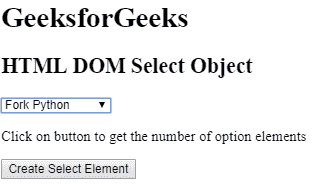
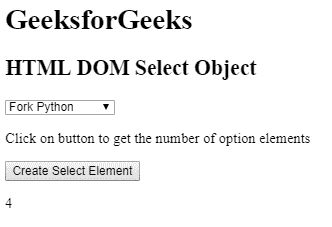

# HTML DOM 选择对象

> 原文: [https://www.geeksforgeeks.org/html-dom-select-object/](https://www.geeksforgeeks.org/html-dom-select-object/)

HTML DOM 中的选择对象用来表示一个 HTML `<select>` 元素。可以使用 `document.createElement()` 方法创建 `<select>` 元素，并且可以使用 `getElementById()` 访问该元素。

## 语法

*   用于创建 `<select>` 元素：`document.createElement("SELECT")`
*   用于访问 `<select>` 元素：`document.getElementById("mySelect")`

## 选择对象属性

*   `autofocus`: 用于设置或返回下拉列表，页面加载时自动对焦。
*   `disabled`: 用于设置或返回下拉列表是否禁用。
*   `form`: 返回对包含下拉列表的表单的引用。
*   `length`: 返回下拉列表中 `<option>` 元素的个数。
*   `multiple`: 用于设置或返回下拉列表中是否可以选择多个选项。
*   `name`: 用于设置或返回下拉列表的 `name` 属性的值。
*   `selectedIndex`: 用于在下拉列表中设置或返回选中选项的索引。
*   `size`: 用于设置或返回下拉列表的 `size` 值。
*   `type`: 从下拉列表中返回表单元素的类型。
*   `value`: 用于在下拉列表中设置或返回选中选项的值。

## 选择对象方法

*   `add()`: 用于在下拉列表中添加一个选项。
*   `checkValidity()`: 用于检查下拉列表的有效性。
*   `remove()`: 用于从下拉列表中删除一个选项。

## 选择对象集合

*   `options`: 返回下拉列表中所有选项的集合。

下面的程序说明了在超文本标记语言中选择对象：

### 示例 1

本示例使用 `document.createElement()` 方法创建 `<select>` 元素。

```html
<!DOCTYPE html>
<html>

<head> 
    <title>
        HTML DOM Select Object
    </title> 
</head>

<body>
    <h1>GeeksforGeeks</h1>

    <h2>HTML DOM Select Object</h2>

    <p>
        Click on button to create select
        and option element
    </p>

    <button onclick = "myGeeks()">
        Create Select Element
    </button>

    <!-- script to create select element -->
    <script>
        function myGeeks() {
            var sel = document.createElement("Select");
            sel.setAttribute("id", "MySelect");
            document.body.appendChild(sel);

            var opt = document.createElement("option");
            opt.setAttribute("value", "gfg");
            var nod = document.createTextNode("gfg");
            opt.appendChild(nod);
            document.getElementById("MySelect").appendChild(opt);
        }
    </script>
</body>

</html>
```

**输出:**
**之前点击按钮:**

**之后点击按钮:**


### 示例 2

本示例使用 `getElementById()` 方法访问 `<select>` 元素。

```html
<!DOCTYPE html>
<html>

<head> 
    <title>
        HTML DOM Select Object
    </title> 
</head>

<body>

    <h1>GeeksforGeeks</h1>

    <h2>HTML DOM Select Object</h2>

    <select id="GFG">
        <option>Fork Python</option>
        <option>Fork Java</option>
        <option>Fork CPP</option>
        <option>Sudo Placement</option>
    </select>

    <p>
        Click on button to get the number
        of option elements
    </p>

    <button onclick = "myGeeks()">
        Create Select Element
    </button>

    <p id="test"></p>

    <!-- script to count select element -->
    <script>
        function myGeeks() {
            var len = document.getElementById("GFG").length;
            document.getElementById("test").innerHTML = len;
        }
    </script>
</body>

</html>
```

**输出:**
**之前点击按钮:**

**之后点击按钮:**


## 支持的浏览器

DOM 选择对象支持的浏览器如下:

*   Opera
*   Microsoft Edge
*   Google Chrome
*   Firefox
*   Safari