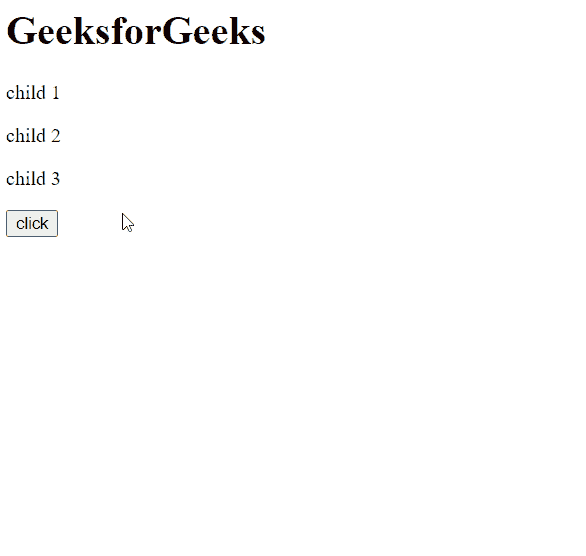

# HTML DOM selectAllChildren()方法

> 原文: [https://www.geeksforgeeks.org/html-dom-selectallchildren-method/](https://www.geeksforgeeks.org/html-dom-selectallchildren-method/)

`selectAllChildren()` 方法将指定节点的所有子节点添加到当前选择中。

## 语法

```html
selection.selectAllChildren( parentNode )
```

## 参数

*   `parentNode`: 要选择其子节点的节点。

## 示例

在本例中，使用此方法，在按钮点击时，父 `div` 的所有子元素都将被选中。

### HTML

```html
<!DOCTYPE html>
<html>

<head>
    <title>GeeksforGeeks</title>
</head>

<body>
    <main>
        <h1>GeeksforGeeks</h1>
    </main>

    <div>
        <p>child 1</p>
        <p>child 2</p>
        <p>child 3</p>
    </div>

    <button onclick="select()">
        click
    </button>

    <script>
        const pNode = document.querySelector('div');

        function select() {
            window.getSelection().selectAllChildren(pNode);
        };
    </script>
</body>

</html>
```

### 输出

**点击按钮选择父 div 的子节点:**


## 支持的浏览器

`selectAllChildren()` 方法支持的浏览器如下:

*   Google Chrome
*   Edge
*   Firefox
*   Opera
*   Safari
*   Internet Explorer