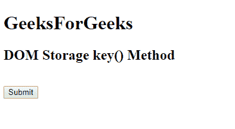
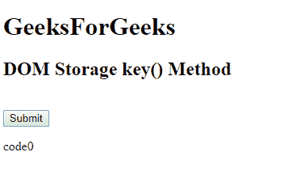

# HTML DOM `key()` 方法

> 原文: [https://www.geeksforgeeks.org/html-dom-storage-key-method/](https://www.geeksforgeeks.org/html-dom-storage-key-method/)

DOM `key()` 方法与 `Storage` 对象相关，用于返回具有指定索引的键的名称。`Storage` 对象可以是 `localStorage` 或 `sessionStorage` 对象。

## 语法

*   `localStorage`:

```html
localStorage.key(index)
```

*   `sessionStorage`:

```html
sessionStorage.key(index)
```

## 参数

它接受一个参数，即 `index`，以获得具有该特定给定索引的键的名称。

## 返回值

以字符串的形式返回键名。

下面是展示 HTML DOM `key()` 方法的 HTML 代码：

### 示例

```html
<!DOCTYPE html>
<html>
<head>
    <title>
        HTML DOM Storage key() Method
    </title>
    <!-- Script to get the name of the key -->
    <script>
        function myGeeks() {
            var key = localStorage.key(0);
            document.getElementById("geeks").innerHTML = key;
        }
    </script>
</head>
<body>
    <h1>GeeksForGeeks</h1>
    <h2>DOM Storage key() Method</h2>
    <br>
    <button onclick="myGeeks()">
        Submit
    </button>
    <p id="geeks"></p>
</body>
</html>
```

## 输出

*   **点击前:**
    
*   **点击后:**
    

## 支持的浏览器

DOM `key()` 方法支持的浏览器如下:

*   Google Chrome 4
*   Internet Explorer 8
*   Firefox 3.5
*   Opera 10.5
*   Safari 4