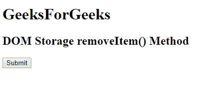
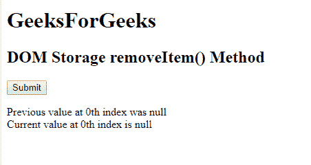
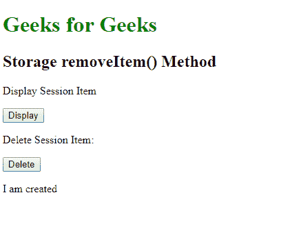
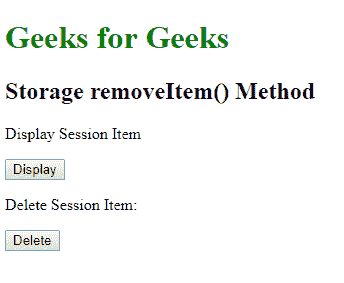

# HTML DOM Storage removeItem() 方法

> 原文：[https://www.geeksforgeeks.org/html-dom-storage-removeitem-method/](https://www.geeksforgeeks.org/html-dom-storage-removeitem-method/)

`Storage` `removeItem()` 方法与 `Storage` 对象相关，用于删除指定的 `Storage` 对象项。**存储对象**可以是 `localStorage` 或 `sessionStorage` 对象。

## 语法

*   **本地存储删除项目：**

```html
localStorage.removeItem(keyname)
```

*   **会话存储删除项目：**

```html
sessionStorage.removeItem(keyname)
```

## 参数

它接受一个必需的参数 `keyname`，即要删除的项目的名称。

## 返回值

不返回值。

下面是展示 HTML DOM `Storage` `removeItem()` 对象的 HTML 代码：

### 示例 1

```html
<!DOCTYPE html>
<html>

<head>
    <title>
        HTML DOM Storage removeItem() Method
    </title>
    <!-- Script to get the name of the key -->
    <script>
        function myGeeks() {
            // Storing key present at 0th index
            var key = localStorage.key(0);

            // Removing key at 0th index
            localStorage.removeItem(key);

            // Printing key at 0th index
            var key2 = localStorage.key(0);

            document.getElementById("geeks").innerHTML =
                "Previous value at 0th index was " + key + "<br>" +
                "Current value at 0th index is " + key2;
        }
    </script>
</head>

<body>
    <h1>GeeksForGeeks</h1>
    <h2>DOM Storage removeItem() Method</h2>

    <button onclick="myGeeks()">
        Submit
    </button>

    <p id="geeks"></p>

</body>

</html>
```

**输出：**

*   **点击前：**



*   **点击后：**



下面是展示 `sessionStorage` 项工作原理的 HTML 代码：

### 示例 2

```html
<!DOCTYPE html>
<html>

<body>

<h1 style="color: green;">
    Geeks for Geeks</h1>

<h2>Storage removeItem() Method</h2>

<p>Display Session Item</p>

<button onclick="displayItem()">Display</button>

<p>Delete Session Item:</p>

<button onclick="deleteItem()">Delete</button>

<p id="try"></p>

<script>
    // set item.
    sessionStorage.setItem("gfg", "I am created");

    function deleteItem() {
        // Remove item.
        sessionStorage.removeItem("gfg");
    }

    function displayItem() {
        //  Display item.
        var remove_item = sessionStorage.getItem("gfg");

        document.getElementById("try").innerHTML = remove_item;
    }
</script>
</body>

</html>
```

**输出：**

*   **点击前：**



*   **点击后：**



## 支持的浏览器

以下是 `DOM Storage` `removeItem()` 支持的浏览器：

*   谷歌 Chrome 4
*   Internet Explorer 8
*   Firefox 3.5
*   歌剧 10.5
*   Safari 4