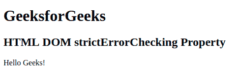

# HTML DOM 严格错误检查属性

> 原文: [https://www.geeksforgeeks.org/html-dom-stricterrorchecking-property/](https://www.geeksforgeeks.org/html-dom-stricterrorchecking-property/)

**DOM 严格错误检查**属性设置或返回是否可以对文档执行严格错误检查。用于返回布尔值真或假。如果为真表示可以对文件进行严格检查，如果为假则不能进行检查。该属性默认为真。

**返回值:** 返回一个布尔值，真或假。

## 语法

*   **返回:**

    `documentObject.strictErrorChecking`

*   **设置:**

    `documentObject.strictErrorChecking=true|false`

## 示例

```html
<!DOCTYPE html>
<html>

<head>
    <title>
        HTML DOM strictErrorChecking Property
    </title>
</head>

<body>
    <h1>GeeksforGeeks</h1>
    <h2>HTML DOM strictErrorChecking Property</h2>

    <p id="geeks" onclick="MyGeeks()">
        Hello Geeks!
    </p>

    <script>
        function MyGeeks() {
            document.getElementById("geeks").strictErrorChecking;
        }
    </script>
</body>

</html>
```

**输出:**


**支持的浏览器:** 主要浏览器不支持 DOM strict error checking Property。