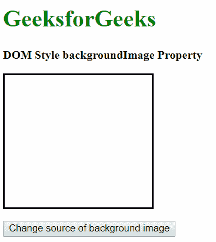
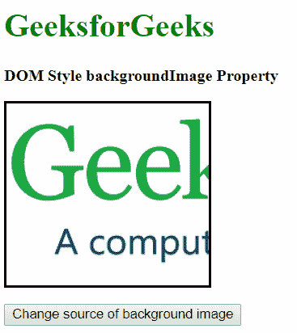
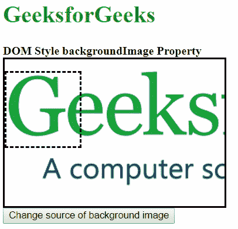
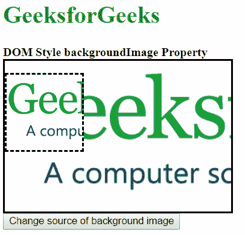

# HTML DOM 样式背景图像属性

> 原文: [https://www.geeksforgeeks.org/html-dom-style-backgroundimage-property/](https://www.geeksforgeeks.org/html-dom-style-backgroundimage-property/)

`DOM Style backgroundImage` 属性用于设置或返回元素的背景图像。

## 语法

*   获取 `backgroundImage` 属性

    ```html
    object.style.backgroundImage
    ```

*   设置背景图像属性

    ```html
    object.style.backgroundImage = "image | none | initial | inherit"
    ```

## 返回值

返回一个字符串，代表背景图像。

## 属性值

### `image`
这将属性设置为使用指定的图像。可以在 `url()` 函数中指定图像路径。

### `none`
这将属性设置为不使用背景图像。

### `initial`
用于将该属性设置为默认值。

### `inherit`
用于从其父级继承属性。

## 示例

### 示例-1: `image`

```html
<!DOCTYPE html>
<html lang="en">

<head>
    <title>DOM Style backgroundImage Property</title>
    <style>
        .bg-img {
            border: solid;
            height: 180px;
            width: 200px;
        }
    </style>
</head>

<body>
    <h1 style="color: green">GeeksforGeeks</h1>
    <b>DOM Style backgroundImage Property</b>
    <p class="bg-img"></p>
    <button onclick="changeImage()">
      Change source of background image
    </button>

    <script>
        function changeImage() {
            elem = document.querySelector('.bg-img');
            // Setting the backgroundImage to an url
            elem.style.backgroundImage = "url('https://media.geeksforgeeks.org/wp-content/uploads/geeksforgeeks-logo.png')";
        }
    </script>
</body>

</html>
```

**输出:**

*   **点击按钮前:**
    
*   **点击按钮后:**
    

### 示例-2: `none`

```html
<!DOCTYPE html>
<html lang="en">

<head>
    <title>DOM Style backgroundImage Property</title>
    <style>
        .bg-img {
            border: solid;
            height: 180px;
            width: 200px;
            background-image: url('https://media.geeksforgeeks.org/wp-content/uploads/geeksforgeeks-logo.png');
        }
    </style>
</head>

<body>
    <h1 style="color: green">GeeksforGeeks</h1>
    <b>DOM Style backgroundImage Property</b>
    <p class="bg-img"></p>
    <button onclick="changeImage()">
      Change source of background image
    </button>

    <script>
        function changeImage() {
            elem = document.querySelector('.bg-img');
            // Setting the backgroundImage to none
            elem.style.backgroundImage = "none";
        }
    </script>
</body>

</html>
```

**输出:**

*   **点击按钮前:**
    
*   **点击按钮后:**
    

### 示例-3: `initial`

```html
<!DOCTYPE html>
<html lang="en">

<head>
    <title>DOM Style backgroundImage Property</title>
    <style>
        .bg-img {
            border: solid;
            height: 180px;
            width: 200px;
            background-image: url('https://media.geeksforgeeks.org/wp-content/uploads/geeksforgeeks-logo.png');
        }
    </style>
</head>

<body>
    <h1 style="color: green">GeeksforGeeks</h1>
    <b>DOM Style backgroundImage Property</b>
    <p class="bg-img"></p>
    <button onclick="changeImage()">
      Change source of background image
    </button>

    <script>
        function changeImage() {
            elem = document.querySelector('.bg-img');
            // Setting the backgroundImage to initial
            elem.style.backgroundImage = "initial";
        }
    </script>
</body>

</html>
```

**输出:**

*   **点击按钮前:**
    
*   **点击按钮后:**
    

### 示例-4: `inherit`

```html
<!DOCTYPE html>
<html lang="en">

<head>
    <title>DOM Style backgroundImage Property</title>
    <style>
        #parent {
            border: solid;
            height: 200px;
            width: 300px;
            background: url('https://media.geeksforgeeks.org/wp-content/uploads/geeksforgeeks-logo.png') no-repeat;
            background-size: cover;
        }

        .bg-img {
            border: dashed;
            height: 100px;
            width: 100px;
            background-size: cover;
        }
    </style>
</head>

<body>
    <h1 style="color: green">GeeksforGeeks</h1>
    <b>DOM Style backgroundImage Property</b>
    <div id="parent">
        <p class="bg-img"></p>
    </div>
    <button onclick="changeImage()">
      Change source of background image
    </button>

    <script>
        function changeImage() {
            elem = document.querySelector('.bg-img');
            // Setting the backgroundImage to inherit
            elem.style.backgroundImage = "inherit";
        }
    </script>
</body>

</html>
```

**输出:**

*   **点击按钮前:**
    
*   **点击按钮后:**
    

## 支持的浏览器

支持的 `backgroundImage` 属性的浏览器如下:

*   Chrome 1.0
*   Internet Explorer 4.0
*   Firefox 1.0
*   Opera 3.5
*   Safari 1.0