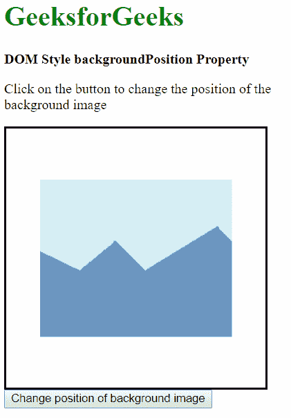
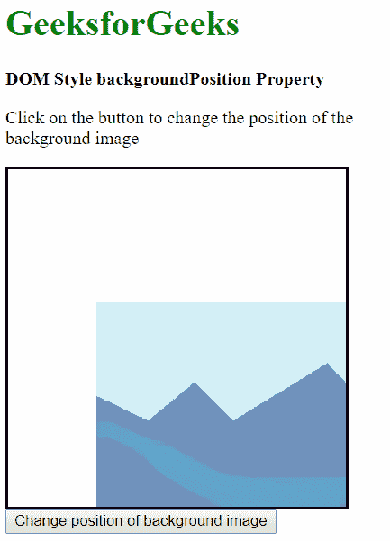
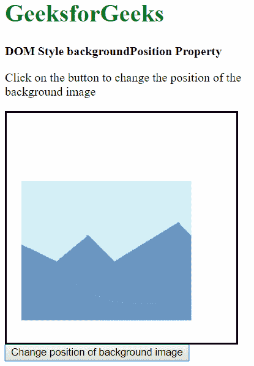
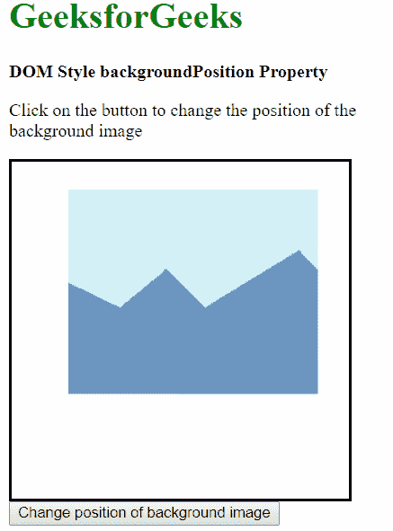
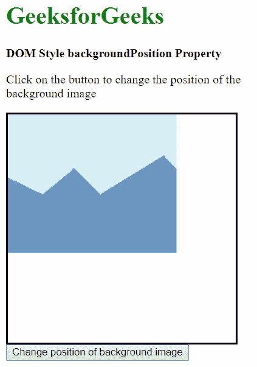
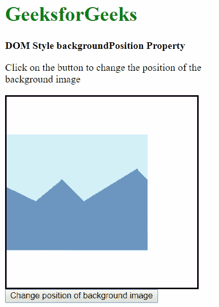

# HTML DOM 样式背景位置属性

> 原文: [https://www.geeksforgeeks.org/html-dom-style-backgroundposition-property/](https://www.geeksforgeeks.org/html-dom-style-backgroundposition-property/)

HTML DOM 样式 `backgroundPosition`：设置或返回背景图像在元素中的位置。

## 语法

*   获取背景位置属性

```html
object.style.backgroundPosition
```

*   设置背景位置属性

```html
object.style.backgroundPosition = value
```

## 返回值

返回一个字符串值，代表背景图像的位置。

## 属性值

*   **关键词值:** 这是用关键词指定位置。如果只指定了一个值，默认情况下，另一个值将是“中心”。可能的关键字组合有:
    *   `left top`
    *   `top center`
    *   `right top`
    *   `center left`
    *   `center center`
    *   `center right`
    *   `left bottom`
    *   `bottom center`
    *   `right bottom`
*   **`x% y%`** 这是用百分比来指定位置的。 `x%` 确定相对于初始左上角位置的水平位置， `y%` 确定相对于初始左上角位置的垂直位置。
*   **`xpos ypos`**: 用于使用像素或任何其他 CSS 测量来指定位置。 `xpos` 确定水平位置， `ypos` 确定相对于初始左上角位置的垂直位置。
*   **`initial`**: 用于将该属性设置为默认值。
*   **`inherit`**: 这是从其父级继承属性。

使用以下示例解释这些值:

## 示例-1: 使用关键字值

在本例中，我们使用值 `'bottom right'`。

```html
<!DOCTYPE html>
<html lang="en">

<head>
    <title>
      DOM Style backgroundPosition Property
    </title>
    <style>
        .bg-img {
            height: 300px;
            width: 300px;
            border-style: solid;
            background: url('https://media.geeksforgeeks.org/wp-content/uploads/sample_image.png')
                        no-repeat center;
        }
    </style>
</head>

<body>
    <h1 style="color: green">
      GeeksforGeeks
    </h1>
    <b>
      DOM Style backgroundPosition Property
    </b>
    <p>
      Click on the button to change the position of the background image
    </p>
    <div class="bg-img">
    </div>

    <button onclick="changePos()">
        Change position of background image
    </button>

    <script>
        function changePos() {
            elem = document.querySelector('.bg-img');
            // Setting the position to bottom vertically
            // and right horizontally
            elem.style.backgroundPosition = 'bottom right';
        }
    </script>
</body>

</html>
```

**输出:**

*   **按下按钮前:**
    
*   **按下按钮后:**
    

## 示例-2: 使用百分比指定位置

我们使用 `'25% 75%'` 来定位图像。

```html
<!DOCTYPE html>
<html lang="en">

<head>
    <meta charset="UTF-8">
    <title>
      DOM Style backgroundPosition Property
    </title>
    <style>
        .bg-img {
            height: 300px;
            width: 300px;
            border-style: solid;
            background: url('https://media.geeksforgeeks.org/wp-content/uploads/sample_image.png')
                        no-repeat center;
        }
    </style>
</head>

<body>
    <h1 style="color: green">
      GeeksforGeeks
    </h1>
    <b>
      DOM Style backgroundPosition Property
    </b>
    <p>
      Click on the button to change the position of the background image
    </p>

    <div class="bg-img">
    </div>
    <button onclick="changePos()">
        Change position of background image
    </button>

    <script>
        function changePos() {
            elem = document.querySelector('.bg-img');
            // Setting the position to 25% horizontally
            // and 75% vertically
            elem.style.backgroundPosition = '25% 75%';
        }
    </script>
</body>

</html>
```

**输出:**

*   **按下按钮前:**
    
*   **按下按钮后:**
    

## 示例-3: 使用固定单位指定位置

我们使用 `'50px 25px'` 来定位图像。

```html
<!DOCTYPE html>
<html lang="en">

<head>
    <title>
      DOM Style backgroundPosition Property
    </title>
    <style>
        .bg-img {
            height: 300px;
            width: 300px;
            border-style: solid;
            background: url('https://media.geeksforgeeks.org/wp-content/uploads/sample_image.png')
                        no-repeat center;
        }
    </style>
</head>

<body>
    <h1 style="color: green">
      GeeksforGeeks
    </h1>
    <b>
      DOM Style backgroundPosition Property
    </b>
    <p>
      Click on the button to change the position of the background image
    </p>
    <div class="bg-img">
    </div>

    <button onclick="changePos()">
        Change position of background image
    </button>

    <script>
        function changePos() {
            elem = document.querySelector('.bg-img');
            // Setting the position to 50px horizontally
            // and 25px vertically
            elem.style.backgroundPosition = '50px 25px';
        }
    </script>
</body>

</html>
```

**输出:**

*   **按下按钮前:**
    
*   **按下按钮后:**
    

## 示例-4: 使用初始值

这会将位置设置为默认值。

```html
<!DOCTYPE html>
<html lang="en">

<head>
    <title>DOM Style backgroundPosition Property</title>
    <style>
        .bg-img {
            height: 300px;
            width: 300px;
            border-style: solid;
            background: url('https://media.geeksforgeeks.org/wp-content/uploads/sample_image.png')
                        no-repeat center;
        }
    </style>
</head>

<body>
    <h1 style="color: green">
      GeeksforGeeks
    </h1>
    <b>
      DOM Style backgroundPosition Property
    </b>
    <p>
      Click on the button to change the position of the background image
    </p>
    <div class="bg-img">
    </div>

    <button onclick="changePos()">
        Change position of background image
    </button>

    <script>
        function changePos() {
            elem = document.querySelector('.bg-img');
            // Setting the position to the default value with initial
            elem.style.backgroundPosition = 'initial';
        }
    </script>
</body>

</html>
```

**输出:**

*   **按下按钮前:**
    
*   **按下按钮后:**
    

## 示例-5: 使用继承值

这将从其父元素继承位置。

```html
<!DOCTYPE html>
<html lang="en">

<head>
    <title>
      DOM Style backgroundPosition Property
    </title>
    <style>
        /* Parent element */
        #parent {
            height: 300px;
            width: 300px;
            border-style: solid;
            /* Setting the parent's background-position to center left */
            background-position: center left;
        }

        .bg-img {
            height: 300px;
            width: 300px;
            background: url('https://media.geeksforgeeks.org/wp-content/uploads/sample_image.png')
                        no-repeat center;
        }
    </style>
</head>

<body>
    <h1 style="color: green">
      GeeksforGeeks
    </h1>
    <b>
      DOM Style backgroundPosition Property
    </b>
    <p>
      Click on the button to change the position of the background image
    </p>
    <div id="parent">
        <div class="bg-img"></div>
    </div>

    <button onclick="changePos()">
        Change position of background image
    </button>

    <script>
        function changePos() {
            elem = document.querySelector('.bg-img');
            // Setting the position to inherit from its parent
            elem.style.backgroundPosition = 'inherit';
        }
    </script>
</body>

</html>
```

**输出:**

*   **按下按钮前:**
    
*   **按下按钮后:**
    

## 支持的浏览器

以下是 `backgroundPosition` 属性支持的浏览器:

*   Chrome 1.0
*   Internet Explorer 4.0
*   Firefox 1.0
*   Opera 3.5
*   Safari 1.0