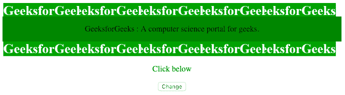
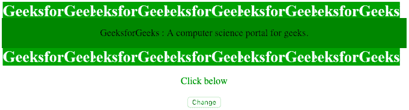
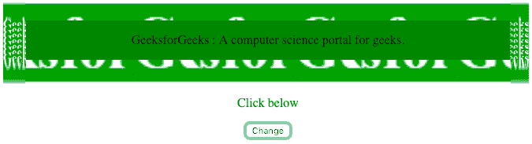
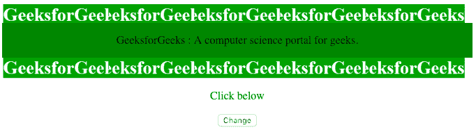
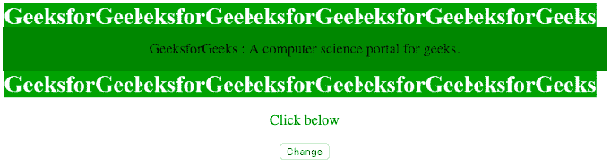
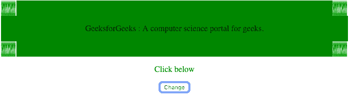
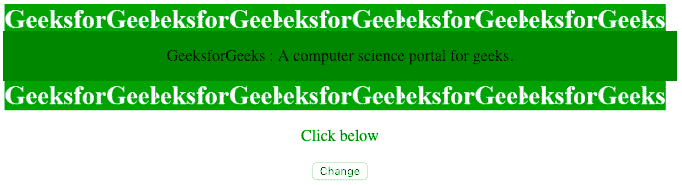
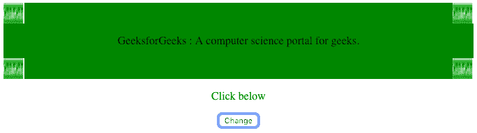

# HTML DOM 样式 borderImageSlice 属性

> 原文：[https://www.geeksforgeeks.org/html-dom-style-borderimageslice-property/](https://www.geeksforgeeks.org/html-dom-style-borderimageslice-property/)

`borderImageSlice` 属性用于指定*图像边界*的向内偏移。用户可以用*百分比*、*数字*或*全局值*来指定该属性的值。

**语法：**

```html
object.style.borderImageSlice = "number|%|fill|initial|inherit"
```

**返回值：** 返回一个字符串值，代表元素的边框图像切片属性。

**属性值：**

*   `number`
*   `%`
*   `fill`
*   `initial`
*   `inherit`

### 1. `number`
`borderImageSlice` 属性可以将数字作为值，其中该数字表示图像或矢量坐标中的像素（如果图像是矢量图像）。

**示例-1：**

```html
<!DOCTYPE html>
<html>

<head>
    <style>
        div {
            background-color: green;
            border: 30px solid transparent;
            border-image: url(
'https://media.geeksforgeeks.org/wp-content/uploads/border-3.png');
            border-image-slice: 40;
            border-image-width: 1 1 1 1;
            border-image-outset: 0;
            border-image-repeat: round;
        }
    </style>
</head>

<body>
    <center>
        <div id="main">
            <p>
                GeeksforGeeks :
                A computer science portal for geeks.
            </p>
        </div>
        <p style="color:green;">Click below</p>
        <button onclick="myFunction()">Change</button>
    </center>

    <script>
        function myFunction() {
            document.getElementById(
                "main").style.borderImageSlice = "30";
        }
    </script>
</body>

</html>
```

**输出：**

*   **点击前：**



*   **点击后：**


### 2. 百分比 (`%`)
百分比相对于默认值为 `100%` 的图像大小。

**示例-2：**

```html
<!DOCTYPE html>
<html>

<head>
    <style>
        div {
            background-color: green;
            border: 30px solid transparent;
            border-image: url(
'https://media.geeksforgeeks.org/wp-content/uploads/border-3.png');
            border-image-slice: 40;
            border-image-width: 1 1 1 1;
            border-image-outset: 0;
            border-image-repeat: round;
        }
    </style>
</head>

<body>
    <center>
        <div id="main">
            <p>
                GeeksforGeeks :
                A computer science portal for geeks.
            </p>
        </div>
        <p style="color:green;">Click below</p>
        <button onclick="myFunction()">Change</button>
    </center>

    <script>
        function myFunction() {
            document.getElementById(
                "main").style.borderImageSlice = "30% 30%";
        }
    </script>
</body>

</html>
```

**输出：**

*   **点击前：**



*   **点击后：**



### 3. `fill`
使边框的中间部分得以保留。

**示例-3：**

```html
<!DOCTYPE html>
<html>

<head>
    <style>
        div {
            background-color: green;
            border: 30px solid transparent;
            border-image: url(
'https://media.geeksforgeeks.org/wp-content/uploads/border-3.png');
            border-image-slice: 40;
            border-image-width: 1 1 1 1;
            border-image-outset: 0;
            border-image-repeat: round;
        }
    </style>
</head>

<body>
    <center>
        <div id="main">
            <p>
                GeeksforGeeks :
                A computer science portal for geeks.
            </p>
        </div>
        <p style="color:green;">Click below</p>
        <button onclick="myFunction()">Change</button>
    </center>

    <script>
        function myFunction() {
            document.getElementById(
                "main").style.borderImageSlice = "fill";
        }
    </script>
</body>

</html>
```

**输出：**

*   **点击前：**



*   **点击后：**


### 4. `initial`
将属性设置为默认值。这里的默认值是 `100%`。

**示例-4：**

```html
<!DOCTYPE html>
<html>

<head>
    <style>
        div {
            background-color: green;
            border: 30px solid transparent;
            border-image: url(
'https://media.geeksforgeeks.org/wp-content/uploads/border-3.png');
            border-image-slice: 40;
            border-image-width: 1 1 1 1;
            border-image-outset: 0;
            border-image-repeat: round;
        }
    </style>
</head>

<body>
    <center>
        <div id="main">
            <p>
                GeeksforGeeks :
                A computer science portal for geeks.
            </p>
        </div>
        <p style="color:green;">Click below</p>
        <button onclick="myFunction()">Change</button>
    </center>

    <script>
        function myFunction() {
            document.getElementById(
                "main").style.borderImageSlice = "initial";
        }
    </script>
</body>

</html>
```

**输出：**

*   **点击前：**



*   **点击后：**



### 5. `inherit`
从其父元素继承该属性。

**示例-5：**

```html
<!DOCTYPE html>
<html>

<head>
    <style>
        div {
            background-color: green;
            border: 30px solid transparent;
            border-image: url(
'https://media.geeksforgeeks.org/wp-content/uploads/border-3.png');
            border-image-slice: 40;
            border-image-width: 1 1 1 1;
            border-image-outset: 0;
            border-image-repeat: round;
        }
    </style>
</head>

<body>
    <center>
        <div id="main">
            <p>
                GeeksforGeeks :
                A computer science portal for geeks.
            </p>
        </div>
        <p style="color:green;">Click below</p>
        <button onclick="myFunction()">Change</button>
    </center>

    <script>
        function myFunction() {
            document.getElementById(
                "main").style.borderImageSlice = "inherit";
        }
    </script>
</body>

</html>
```

**输出：**

*   **点击前：**



*   **点击后：**



**支持的浏览器：** 以下列出的 *DOM 样式 borderImageSlice 属性*支持的浏览器：

*   Google Chrome
*   Edge
*   Mozilla Firefox
*   Opera
*   Safari