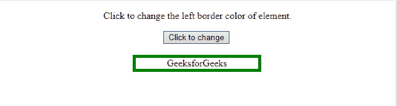
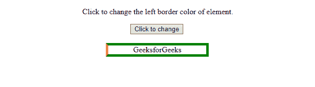
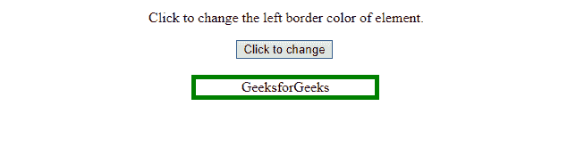
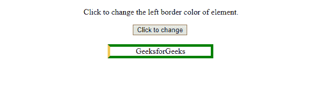
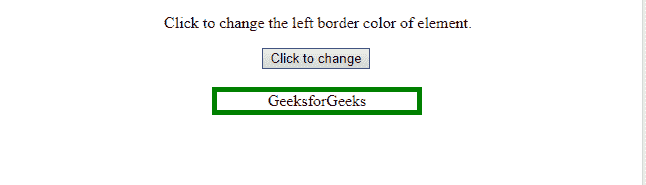
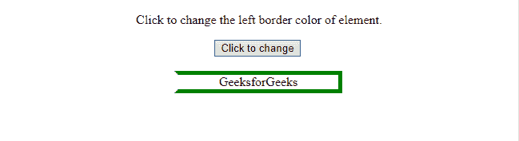

# HTML DOM 样式 borderLeftColor 属性

> 原文: [https://www.geeksforgeeks.org/html-dom-style-borderleftcolor-property/](https://www.geeksforgeeks.org/html-dom-style-borderleftcolor-property/)

`borderLeftColor` 属性允许我们设置或获取元素左边框的颜色。

## 语法

获取 `borderLeftColor` 属性的语法如下：

```html
object.style.borderLeftColor
```

设置 `borderLeftColor` 属性的语法如下：

```html
object.style.borderLeftColor = "color|transparent|initial|inherit"
```

## 返回值

`borderLeftColor` 属性返回元素左边框的颜色。

## 属性值

### color
指定对应元素的边框颜色。黑色是默认颜色。

语法：

```html
borderLeftColor = "red"
```

示例：

```html
<!DOCTYPE html>
<html>
<head>
    <style>
        #GFG_Div {
            width: 200px;
            margin-left: 210px;
            border: thick solid green;
        }
    </style>
</head>
<body align="center">
    <p>Click to change the left border color of element.</p>
    <button type="button" onclick="myGeeks()">Click to change</button>
    <br>
    <br>
    <div id="GFG_Div">GeeksforGeeks</div>
    <script>
        function myGeeks() {
            document.getElementById("GFG_Div").style.borderLeftColor = "red";
        }
    </script>
</body>
</html>
```

输出：
*   点击按钮前
    
*   点击按钮后
    

语法：

```html
borderLeftColor = "yellow"
```

示例：

```html
<!DOCTYPE html>
<html>
<head>
    <style>
        #GFG_Div {
            width: 200px;
            margin-left: 210px;
            border: thick solid green;
        }
    </style>
</head>
<body align="center">
    <p>Click to change the left border color of element.</p>
    <button type="button" onclick="myGeeks()">Click to change</button>
    <br>
    <br>
    <div id="GFG_Div">GeeksforGeeks</div>
    <script>
        function myGeeks() {
            document.getElementById("GFG_Div").style.borderLeftColor = "yellow";
        }
    </script>
</body>
</html>
```

输出：
*   点击按钮前
    
*   点击按钮后
    

### transparent
将对应元素的边框颜色设置为透明。

语法：

```html
borderLeftColor = "transparent"
```

示例：

```html
<!DOCTYPE html>
<html>
<head>
    <style>
        #GFG_Div {
            width: 200px;
            margin-left: 210px;
            border: thick solid green;
        }
    </style>
</head>
<body align="center">
    <p>Click to change the left border color of element.</p>
    <button type="button" onclick="myGeeks()">Click to change</button>
    <br>
    <br>
    <div id="GFG_Div">GeeksforGeeks</div>
    <script>
        function myGeeks() {
            document.getElementById("GFG_Div").style.borderLeftColor = "transparent";
        }
    </script>
</body>
</html>
```

输出：
*   点击按钮前
    
*   点击按钮后
    

### initial
当没有为此字段指定值时，从元素的父元素继承。如果没有父元素意味着这个元素是根元素，那么它采用初始值（或缺省值）。

### inherit
此关键字将属性的初始值（或默认值）应用于元素。初始值不应与浏览器样式表指定的值混淆。当边框颜色设置为初始时，它显示为黑色（默认）。

## 浏览器支持
以下是 *DOM Style borderLeftColor 属性* 支持的浏览器：
*   Google Chrome
*   Microsoft Edge
*   Mozilla Firefox
*   Opera
*   Safari