# HTML DOM Style borderTopStyle 属性

> 原文：[https://www.geeksforgeeks.org/html-dom-style-bordertopstyle-property/](https://www.geeksforgeeks.org/html-dom-style-bordertopstyle-property/)

DOM Style `borderTopStyle` 属性用于设置或返回元素的顶部边框样式。

## 语法

获取 `borderTopStyle` 属性：
```html
object.style.borderTopStyle
```

设置 `borderTopStyle` 属性：
```html
object.style.borderTopStyle = "none | hidden | dotted | dashed | solid | double | groove | ridge | inset | outset | initial | inherit"
```

## 返回值

返回一个字符串值，代表元素上边框的样式。

## 属性值

| 值 | 描述 |
| --- | --- |
| `none` | 无边框。这是默认值。 |
| `hidden` | 与 `none` 相同，但在表格元素的边界冲突解决过程中有帮助。 |
| `dotted` | 点状边框。 |
| `dashed` | 虚线边框。 |
| `solid` | 实线边框。 |
| `double` | 双线边框。 |
| `groove` | 3D 凹槽边框。效果取决于 `border-color` 值。 |
| `ridge` | 3D 脊状边框。效果取决于 `border-color` 值。 |
| `inset` | 3D 内嵌边框。效果取决于 `border-color` 值。 |
| `outset` | 3D 外凸边框。效果取决于 `border-color` 值。 |
| `initial` | 将属性设置为其默认值。 |
| `inherit` | 从父元素继承该属性。 |

这些值通过以下示例进行了演示：

## 示例-1：使用 `none` 值

```html
<!DOCTYPE html>
<html lang="en">
<head>
    <title>DOM Style borderTopStyle Property</title>
    <style>
        .item {
            height: 50px;
            padding: 10px;
            border: 15px solid green;
        }
    </style>
</head>
<body>
    <h1 style="color: green">GeeksforGeeks</h1>
    <b>DOM Style borderTopStyle Property</b>
    <p>Click on the button to change the style of the border on the top</p>
    <div class="item">GeeksforGeeks</div>
    <button onclick="changeBorderTopStyle()">Change style</button>
    <script>
        function changeBorderTopStyle() {
            elem = document.querySelector('.item');
            // Setting the border style
            elem.style.borderTopStyle = 'none';
        }
    </script>
</body>
</html>
```

**输出：**

**点击按钮前：**
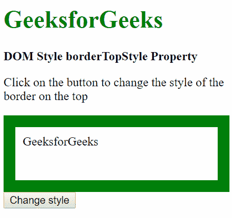

**点击按钮后：**


## 示例-2：使用 `hidden` 值

```html
<!DOCTYPE html>
<html lang="en">
<head>
    <title>DOM Style borderTopStyle Property</title>
    <style>
        .item {
            height: 50px;
            padding: 10px;
            border: 15px solid green;
        }
    </style>
</head>
<body>
    <h1 style="color: green">GeeksforGeeks</h1>
    <b>DOM Style borderTopStyle Property</b>
    <p>Click on the button to change the style of the border on the top</p>
    <div class="item">GeeksforGeeks</div>
    <button onclick="changeBorderTopStyle()">Change style</button>
    <script>
        function changeBorderTopStyle() {
            elem = document.querySelector('.item');
            // Setting the border style
            elem.style.borderTopStyle = 'hidden';
        }
    </script>
</body>
</html>
```

**输出：**

**点击按钮前：**


**点击按钮后：**


## 示例-3：使用 `dotted` 值

```html
<!DOCTYPE html>
<html lang="en">
<head>
    <title>DOM Style borderTopStyle Property</title>
    <style>
        .item {
            height: 50px;
            padding: 10px;
            border: 15px solid green;
        }
    </style>
</head>
<body>
    <h1 style="color: green">GeeksforGeeks</h1>
    <b>DOM Style borderTopStyle Property</b>
    <p>Click on the button to change the style of the border on the top</p>
    <div class="item">GeeksforGeeks</div>
    <button onclick="changeBorderTopStyle()">Change style</button>
    <script>
        function changeBorderTopStyle() {
            elem = document.querySelector('.item');
            // Setting the border style
            elem.style.borderTopStyle = 'dotted';
        }
    </script>
</body>
</html>
```

**输出：**

**点击按钮前：**


**点击按钮后：**
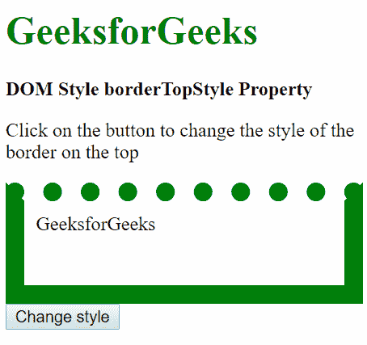

## 示例-4：使用 `dashed` 值

```html
<!DOCTYPE html>
<html lang="en">
<head>
    <title>DOM Style borderTopStyle Property</title>
    <style>
        .item {
            height: 50px;
            padding: 10px;
            border: 15px solid green;
        }
    </style>
</head>
<body>
    <h1 style="color: green">GeeksforGeeks</h1>
    <b>DOM Style borderTopStyle Property</b>
    <p>Click on the button to change the style of the border on the top</p>
    <div class="item">GeeksforGeeks</div>
    <button onclick="changeBorderTopStyle()">Change style</button>
    <script>
        function changeBorderTopStyle() {
            elem = document.querySelector('.item');
            // Setting the border style
            elem.style.borderTopStyle = 'dashed';
        }
    </script>
</body>
</html>
```

**输出：**

**点击按钮前：**


**点击按钮后：**
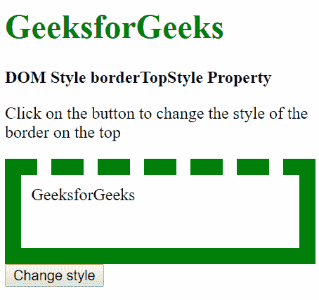

## 示例-5：使用 `solid` 值

```html
<!DOCTYPE html>
<html lang="en">
<head>
    <title>DOM Style borderTopStyle Property</title>
    <style>
        .item {
            height: 50px;
            padding: 10px;
            border: 15px dotted green;
        }
    </style>
</head>
<body>
    <h1 style="color: green">GeeksforGeeks</h1>
    <b>DOM Style borderTopStyle Property</b>
    <p>Click on the button to change the style of the border on the top</p>
    <div class="item">GeeksforGeeks</div>
    <button onclick="changeBorderTopStyle()">Change style</button>
    <script>
        function changeBorderTopStyle() {
            elem = document.querySelector('.item');
            // Setting the border style
            elem.style.borderTopStyle = 'solid';
        }
    </script>
</body>
</html>
```

**输出：**

**点击按钮前：**
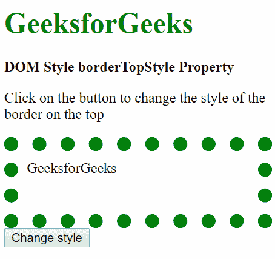

**点击按钮后：**
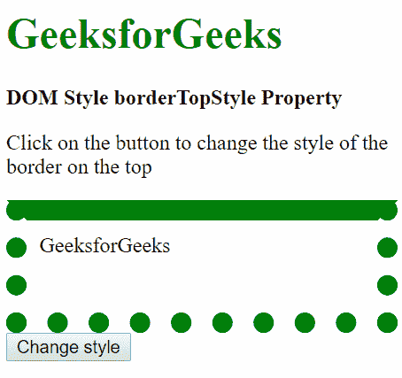

## 示例-6：使用 `double` 值

```html
<!DOCTYPE html>
<html lang="en">
<head>
    <title>DOM Style borderTopStyle Property</title>
    <style>
        .item {
            height: 50px;
            padding: 10px;
            border: 15px solid green;
        }
    </style>
</head>
<body>
    <h1 style="color: green">GeeksforGeeks</h1>
    <b>DOM Style borderTopStyle Property</b>
    <p>Click on the button to change the style of the border on the top</p>
    <div class="item">GeeksforGeeks</div>
    <button onclick="changeBorderTopStyle()">Change style</button>
    <script>
        function changeBorderTopStyle() {
            elem = document.querySelector('.item');
            // Setting the border style
            elem.style.borderTopStyle = 'double';
        }
    </script>
</body>
</html>
```

**输出：**

**点击按钮前：**


**点击按钮后：**
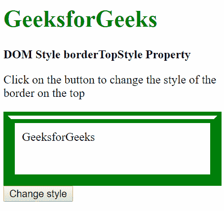

## 示例-7：使用 `groove` 值

```html
<!DOCTYPE html>
<html lang="en">
<head>
    <title>DOM Style borderTopStyle Property</title>
    <style>
        .item {
            height: 50px;
            padding: 10px;
            border: 15px solid green;
        }
    </style>
</head>
<body>
    <h1 style="color: green">GeeksforGeeks</h1>
    <b>DOM Style borderTopStyle Property</b>
    <p>Click on the button to change the style of the border on the top</p>
    <div class="item">GeeksforGeeks</div>
    <button onclick="changeBorderTopStyle()">Change style</button>
    <script>
        function changeBorderTopStyle() {
            elem = document.querySelector('.item');
            // Setting the border style
            elem.style.borderTopStyle = 'groove';
        }
    </script>
</body>
</html>
```

**输出：**

**点击按钮前：**


**点击按钮后：**


## 示例-8：使用 `ridge` 值

```html
<!DOCTYPE html>
<html lang="en">
<head>
    <title>DOM Style borderTopStyle Property</title>
    <style>
        .item {
            height: 50px;
            padding: 10px;
            border: 15px solid green;
        }
    </style>
</head>
```

# DOM Style borderTopStyle Property

## 示例-9: 使用插入值

```html
<!DOCTYPE html>
<html lang="en">

<head>
    <title>
        DOM Style borderTopStyle Property
    </title>
    <style>
        .item {
            height: 50px;
            padding: 10px;
            border: 15px solid green;
        }
    </style>
</head>

<body>
    <h1 style="color: green">GeeksforGeeks</h1>
    <b>DOM Style borderTopStyle Property</b>
    <p>Click on the button to change the style
      of the border on the top</p>
    <div class="item">GeeksforGeeks</div>

<button onclick="changeBorderTopStyle()">
      Change style
    </button>

<script>
        function changeBorderTopStyle() {
            elem = document.querySelector('.item');

// Setting the border style
            elem.style.borderTopStyle = 'inset';
        }
    </script>
</body>

</html>
```

### 输出:

**点击按钮前:**


**点击按钮后:**

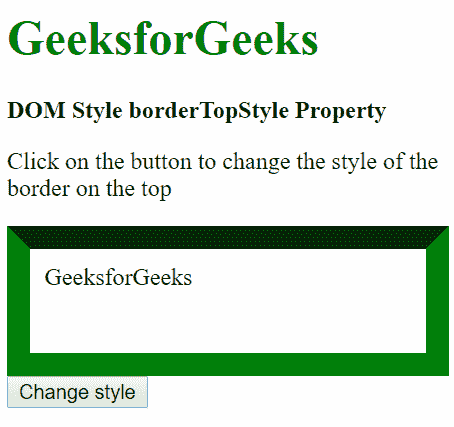

## 示例-10: 使用起始值

```html
<!DOCTYPE html>
<html lang="en">

<head>
    <title>
        DOM Style borderTopStyle Property
    </title>
    <style>
        .item {
            height: 50px;
            padding: 10px;
            border: 15px inset green;
        }
    </style>
</head>

<body>
    <h1 style="color: green">GeeksforGeeks</h1>
    <b>DOM Style borderTopStyle Property</b>
    <p>Click on the button to change the style
      of the border on the top</p>
    <div class="item">GeeksforGeeks</div>

<button onclick="changeBorderTopStyle()">
      Change style
    </button>

<script>
        function changeBorderTopStyle() {
            elem = document.querySelector('.item');

// Setting the border style
            elem.style.borderTopStyle = 'outset';
        }
    </script>
</body>

</html>
```

### 输出:

**点击按钮前:**

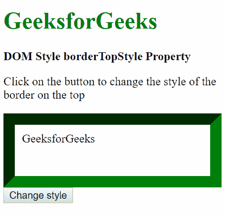

**点击按钮后:**

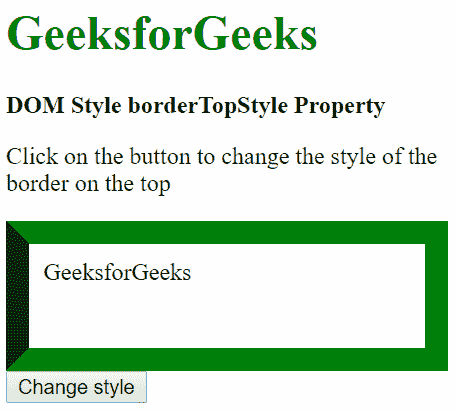

## 示例-11: 使用初始值

```html
<!DOCTYPE html>
<html lang="en">

<head>
    <title>
        DOM Style borderTopStyle Property
    </title>
    <style>
        .item {
            height: 50px;
            padding: 10px;
            border: 15px solid green;
        }
    </style>
</head>

<body>
    <h1 style="color: green">GeeksforGeeks</h1>
    <b>DOM Style borderTopStyle Property</b>
    <p>Click on the button to change the style
      of the border on the top</p>
    <div class="item">GeeksforGeeks</div>

<button onclick="changeBorderTopStyle()">
      Change style
    </button>

<script>
        function changeBorderTopStyle() {
            elem = document.querySelector('.item');

// Setting the border style
            elem.style.borderTopStyle = 'initial';
        }
    </script>
</body>

</html>
```

### 输出:

**点击按钮前:**


**点击按钮后:**

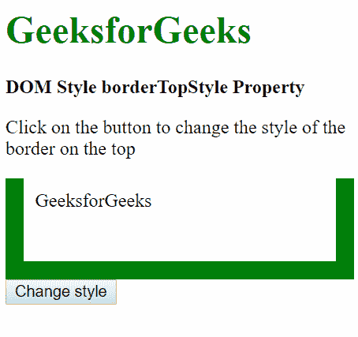

## 示例-12: 使用继承值

```html
<!DOCTYPE html>
<html lang="en">

<head>
    <title>
        DOM Style borderTopStyle Property
    </title>
    <style>
        #parent {
            border-top-style: dotted;
            padding: 10px;
        }

.item {
            height: 50px;
            padding: 10px;
            border: 15px solid green;
        }
    </style>
</head>

<body>
    <h1 style="color: green">GeeksforGeeks</h1>
    <b>DOM Style borderTopStyle Property</b>
    <p>Click on the button to change the style
      of the border on the top</p>
    <div id="parent">
        <div class="item">GeeksforGeeks</div>
    </div>

<button onclick="changeBorderTopStyle()">
      Change style
    </button>

<script>
        function changeBorderTopStyle() {
            elem = document.querySelector('.item');

// Setting the border style
            elem.style.borderTopStyle = 'inherit';
        }
    </script>
</body>

</html>
```

### 输出:

**点击按钮前:**

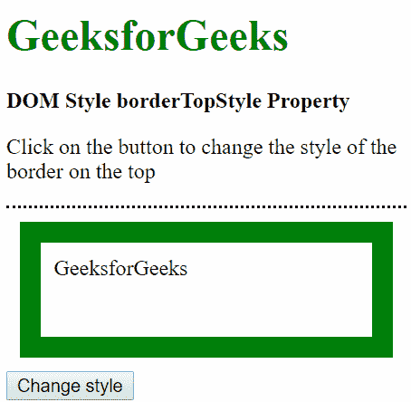

**点击按钮后:**

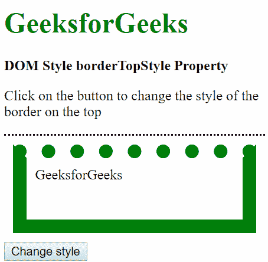

## 支持的浏览器

由 `borderTopStyle` 属性支持的浏览器如下:

*   谷歌 Chrome
*   微软公司出品的 web 浏览器
*   火狐浏览器
*   歌剧
*   苹果 Safari