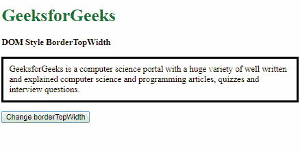
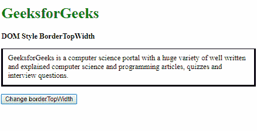
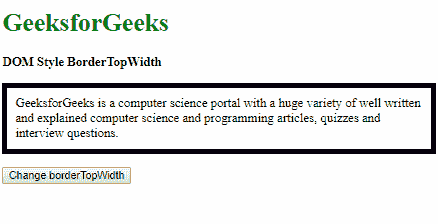
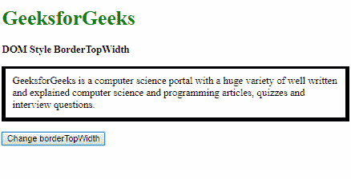
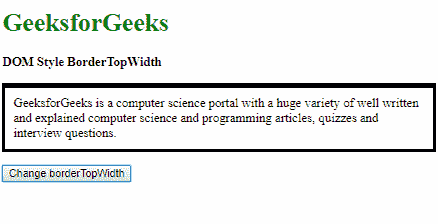
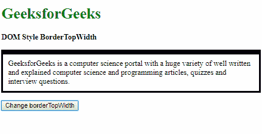
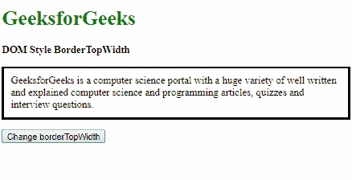
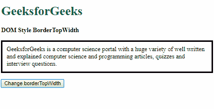
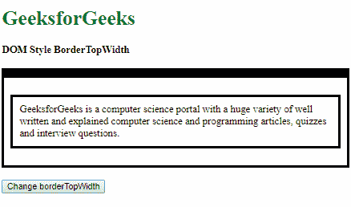
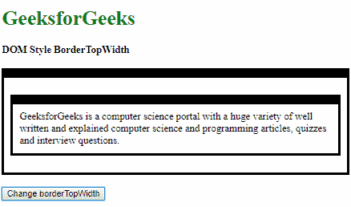

# HTML DOM 样式 borderTopWidth 属性

> 原文：[https://www.geeksforgeeks.org/html-dom-style-bordertopwidth-property/](https://www.geeksforgeeks.org/html-dom-style-bordertopwidth-property/)

HTML DOM 中的 `borderTopWidth` 属性用于设置或返回元素顶部边框的宽度。

## 语法

要获取 `borderTopWidth` 属性：

```html
object.style.borderTopWidth
```

要设置 `borderTopWidth` 属性：

```html
object.style.borderTopWidth = "thin | medium | thick | length | initial | inherit"
```

## 返回值

返回一个字符串值，代表元素上边框的宽度。

## 属性值

### thin
用于定义细的上边框。

**示例：**

```html
<!DOCTYPE html>
<html lang="en">
<head>
    <title>DOM Style BorderTopWidth</title>
    <style>
        .elem {
            border-style: solid;
            padding: 10px;
        }
    </style>
</head>
<body>
    <h1 style="color: green">GeeksforGeeks</h1>
    <b>DOM Style BorderTopWidth</b>
    <p class="elem">
        GeeksforGeeks is a computer science portal with a huge variety of well written and explained computer science and programming articles, quizzes and interview questions.
    </p>
    <button onclick="changeWidth()">Change borderTopWidth</button>
    <!-- Script to change borderTopWidth -->
    <script>
        function changeWidth() {
            elem = document.querySelector('.elem');
            elem.style.borderTopWidth = 'thin';
        }
    </script>
</body>
</html>
```

**输出：**

**点击按钮前：**



**点击按钮后：**



### medium
用于定义中等的上边框。这是默认值。

**示例：**

```html
<!DOCTYPE html>
<html lang="en">
<head>
    <title>DOM Style BorderTopWidth</title>
    <style>
        .elem {
            border: thick solid;
            padding: 10px;
        }
    </style>
</head>
<body>
    <h1 style="color: green">GeeksforGeeks</h1>
    <b>DOM Style BorderTopWidth</b>
    <p class="elem">
        GeeksforGeeks is a computer science portal with a huge variety of well written and explained computer science and programming articles, quizzes and interview questions.
    </p>
    <button onclick="changeWidth()">Change borderTopWidth</button>
    <!-- Script to change borderTopWidth -->
    <script>
        function changeWidth() {
            elem = document.querySelector('.elem');
            elem.style.borderTopWidth = 'medium';
        }
    </script>
</body>
</html>
```

**输出：**

**点击按钮前：**



**点击按钮后：**



### thick
用于定义粗的上边框。

**示例：**

```html
<!DOCTYPE html>
<html lang="en">
<head>
    <title>DOM Style BorderTopWidth</title>
    <style>
        .elem {
            border-style: solid;
            padding: 10px;
        }
    </style>
</head>
<body>
    <h1 style="color: green">GeeksforGeeks</h1>
    <b>DOM Style BorderTopWidth</b>
    <p class="elem">
        GeeksforGeeks is a computer science portal with a huge variety of well written and explained computer science and programming articles, quizzes and interview questions.
    </p>
    <button onclick="changeWidth()">Change borderTopWidth</button>
    <!-- Script to change borderTopWidth -->
    <script>
        function changeWidth() {
            elem = document.querySelector('.elem');
            elem.style.borderTopWidth = 'thick';
        }
    </script>
</body>
</html>
```

**输出：**

**点击按钮前：**


**点击按钮后：**



### length
用于以长度单位定义上边框的宽度。

**示例：**

```html
<!DOCTYPE html>
<html lang="en">
<head>
    <title>DOM Style BorderTopWidth</title>
    <style>
        .elem {
            border-style: solid;
            padding: 10px;
        }
    </style>
</head>
<body>
    <h1 style="color: green">GeeksforGeeks</h1>
    <b>DOM Style BorderTopWidth</b>
    <p class="elem">
        GeeksforGeeks is a computer science portal with a huge variety of well written and explained computer science and programming articles, quizzes and interview questions.
    </p>
    <button onclick="changeWidth()">Change borderTopWidth</button>
    <!-- Script to change borderTopWidth -->
    <script>
        function changeWidth() {
            elem = document.querySelector('.elem');
            elem.style.borderTopWidth = '10px';
        }
    </script>
</body>
</html>
```

**输出：**

**点击按钮前：**


**点击按钮后：**



### initial
用于将此属性设置为其默认值。

**示例：**

```html
<!DOCTYPE html>
<html lang="en">
<head>
    <title>DOM Style BorderTopWidth</title>
    <style>
        .elem {
            border-style: solid;
            padding: 10px;
            border-top-width: 2px;
        }
    </style>
</head>
<body>
    <h1 style="color: green">GeeksforGeeks</h1>
    <b>DOM Style BorderTopWidth</b>
    <p class="elem">
        GeeksforGeeks is a computer science portal with a huge variety of well written and explained computer science and programming articles, quizzes and interview questions.
    </p>
    <button onclick="changeWidth()">Change borderTopWidth</button>
    <!-- Script to change borderTopWidth -->
    <script>
        function changeWidth() {
            elem = document.querySelector('.elem');
            elem.style.borderTopWidth = 'initial';
        }
    </script>
</body>
</html>
```

**输出：**

**点击按钮前：**



**点击按钮后：**



### inherit
从其父元素继承该属性。

**示例：**

```html
<!DOCTYPE html>
<html lang="en">
<head>
    <title>DOM Style BorderTopWidth</title>
    <style>
        #parent {
            padding: 10px;
            border-style: solid;
            /* Setting the borderTopWidth of the parent */
            border-top-width: 15px;
        }
        .elem {
            border-style: solid;
            padding: 10px;
        }
    </style>
</head>
```

# GeeksforGeeks
## DOM Style BorderTopWidth

```html
<body>
    <h1 style="color: green">
        GeeksforGeeks
    </h1>
    <b>
        DOM Style BorderTopWidth
    </b>
    <br>
    <br>
    <div id="parent">
        <p class="elem">
            GeeksforGeeks is a computer science portal with a huge variety of well written and explained computer science and programming articles, quizzes and interview questions.
        </p>
    </div>
    <br>
    <button onclick="changeWidth()">
        Change borderTopWidth
    </button>

    <!-- Script to change borderTopWidth -->
    <script>
        function changeWidth() {
            elem = document.querySelector('.elem');
            elem.style.borderTopWidth = 'inherit';
        }
    </script>
</body>
</html>
```

## 输出

### 点击按钮前



### 点击按钮后



## 支持的浏览器

由`borderTopWidth`属性支持的浏览器如下：

*   谷歌 Chrome
*   微软公司出品的 web 浏览器
*   火狐浏览器
*   歌剧
*   苹果 Safari