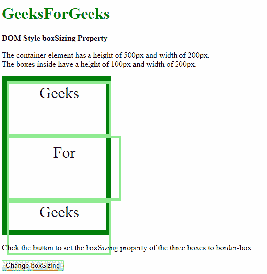
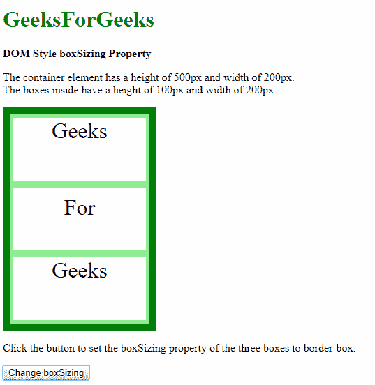
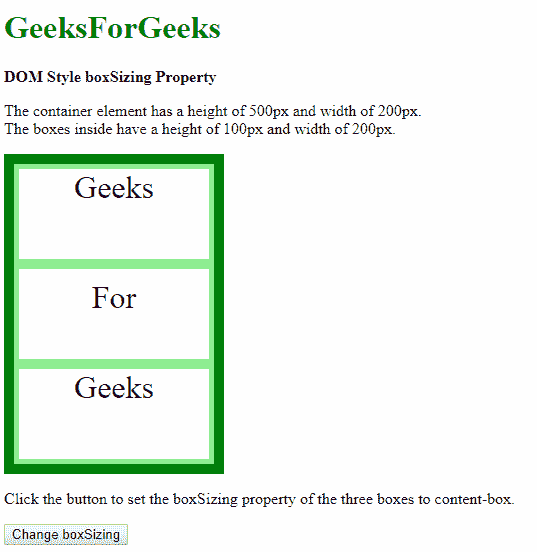
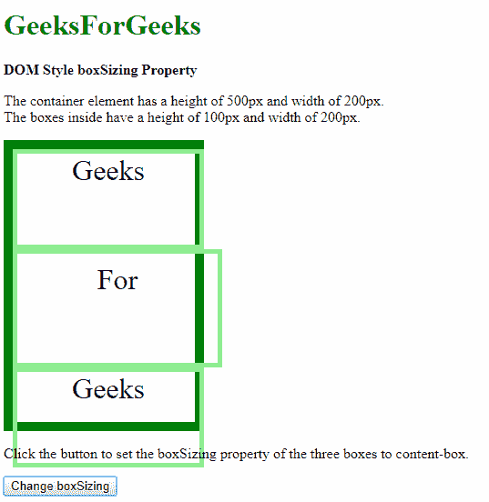
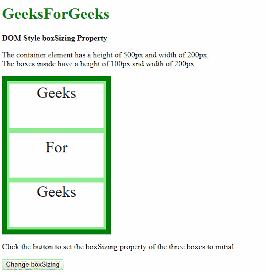
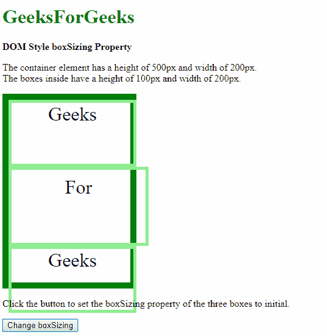
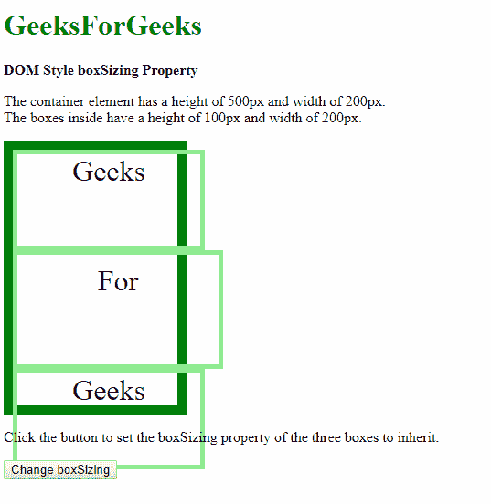
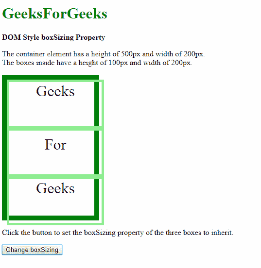

# HTML DOM `boxSizing` 样式属性

> 原文：[https://www.geeksforgeeks.org/html-dom-style-boxsizing-property/](https://www.geeksforgeeks.org/html-dom-style-boxsizing-property/)

DOM 样式 `boxSizing` 属性用于设置或返回一个对象应如何适应一个元素，并考虑其填充、边框和内容。当通过自动计算尺寸将元素装配到所需位置时，此属性会很有用。

## 语法

- 它返回盒子大小属性：
```html
object.style.boxSizing
```

- 用于设置装箱属性：
```html
object.style.boxSizing = "border-box | content-box | initial | inherit"
```

## 返回值

返回一个字符串值，代表元素的 `boxSizing` 属性。

## 属性值

- **`border-box`**：使用此值时，元素上指定的任何内边距或边框都包含在内，并在指定的宽度和高度内绘制。内容的尺寸是通过从元素本身的 `width` 和 `height` 属性中减去边框和内边距来计算的。

### 示例-1

```html
<!DOCTYPE html>
<html>
<head>
    <title>DOM Style boxSizing Property</title>
    <style>
        .container {
            width: 200px;
            height: 300px;
            border: 10px solid green;
        }
        .box {
            width: 200px;
            height: 100px;
            border: 5px solid lightgreen;
            text-align: center;
            font-size: 2rem;
        }
    </style>
</head>
<body>
    <h1 style="color: green">GeeksForGeeks</h1>
    <b>DOM Style boxSizing Property</b>
    <p>
        The container element has a height of 500px and width of 200px.
        <br>The boxes inside have a height of 100px and width of 200px.
    </p>
    <div class="container">
        <div class="box" id="box-1">Geeks</div>
        <div class="box" id="box-2" style="padding: 10px;">For</div>
        <div class="box" id="box-3">Geeks</div>
    </div>
    <p>
        Click the button to set the boxSizing property of the three boxes to border-box.
    </p>
    <button onclick="setBoxSizing()">Change boxSizing</button>
    <script>
        function setBoxSizing() {
            document.getElementById("box-1").style.boxSizing = "border-box";
            document.getElementById("box-2").style.boxSizing = "border-box";
            document.getElementById("box-3").style.boxSizing = "border-box";
        }
    </script>
</body>
</html>
```

**输出：**

**点击按钮前：**


**点击按钮后：**


- **`content-box`**：使用此值时，指定的宽度和高度应用于元素的内容框。元素上指定的任何内边距和边框都会添加并在指定的盒子尺寸之外绘制。这是默认值。

### 示例-2

```html
<!DOCTYPE html>
<html>
<head>
    <title>DOM Style boxSizing Property</title>
    <style>
        .container {
            width: 200px;
            height: 300px;
            border: 10px solid green;
        }
        .box {
            width: 200px;
            height: 100px;
            border: 5px solid lightgreen;
            text-align: center;
            font-size: 2rem;
            box-sizing: border-box;
        }
    </style>
</head>
<body>
    <h1 style="color: green">GeeksForGeeks</h1>
    <b>DOM Style boxSizing Property</b>
    <p>
        The container element has a height of 500px and width of 200px.
        <br>The boxes inside have a height of 100px and width of 200px.
    </p>
    <div class="container">
        <div class="box" id="box-1">Geeks</div>
        <div class="box" id="box-2" style="padding: 10px;">For</div>
        <div class="box" id="box-3">Geeks</div>
    </div>
    <p>
        Click the button to set the boxSizing property of the three boxes to content-box.
    </p>
    <button onclick="setBoxSizing()">Change boxSizing</button>
    <script>
        function setBoxSizing() {
            document.getElementById("box-1").style.boxSizing = "content-box";
            document.getElementById("box-2").style.boxSizing = "content-box";
            document.getElementById("box-3").style.boxSizing = "content-box";
        }
    </script>
</body>
</html>
```

**输出：**

**点击按钮前：**


**点击按钮后：**


- **`initial`**：用于将此属性设置为其默认值。

### 示例-3

```html
<!DOCTYPE html>
<html>
<head>
    <title>DOM Style boxSizing Property</title>
    <style>
        .container {
            width: 200px;
            height: 300px;
            border: 10px solid green;
        }
        .box {
            width: 200px;
            height: 100px;
            border: 5px solid lightgreen;
            text-align: center;
            font-size: 2rem;
            box-sizing: border-box;
        }
    </style>
</head>
<body>
    <h1 style="color: green">GeeksForGeeks</h1>
    <b>DOM Style boxSizing Property</b>
    <p>
        The container element has a height of 500px and width of 200px.
        <br>The boxes inside have a height of 100px and width of 200px.
    </p>
    <div class="container">
        <div class="box" id="box-1">Geeks</div>
        <div class="box" id="box-2" style="padding: 10px;">For</div>
        <div class="box" id="box-3">Geeks</div>
    </div>
    <p>
        Click the button to set the boxSizing property of the three boxes to initial.
    </p>
    <button onclick="setBoxSizing()">Change boxSizing</button>
    <script>
        function setBoxSizing() {
            document.getElementById("box-1").style.boxSizing = "initial";
            document.getElementById("box-2").style.boxSizing = "initial";
            document.getElementById("box-3").style.boxSizing = "initial";
        }
    </script>
</body>
</html>
```

**输出：**

**点击按钮前：**


**点击按钮后：**


- **`inherit`**：此值从其父元素继承该属性。

### 示例-4

```html
<!DOCTYPE html>
<html>
<head>
    <title>DOM Style boxSizing Property</title>
    <style>
        .container {
            width: 200px;
            height: 300px;
            border: 10px solid green;
            /* this acts as the parent */
            box-sizing: border-box;
        }
    </style>
</head>
<body>
    <h1 style="color: green">GeeksForGeeks</h1>
    <b>DOM Style boxSizing Property</b>
    <p>
        The container element has a height of 500px and width of 200px.
        <br>The boxes inside have a height of 100px and width of 200px.
    </p>
    <div class="container">
        <div class="box" id="box-1">Geeks</div>
        <div class="box" id="box-2" style="padding: 10px;">For</div>
        <div class="box" id="box-3">Geeks</div>
    </div>
    <p>
        Click the button to set the boxSizing property of the three boxes to inherit.
    </p>
    <button onclick="setBoxSizing()">Change boxSizing</button>
    <script>
        function setBoxSizing() {
            document.getElementById("box-1").style.boxSizing = "inherit";
            document.getElementById("box-2").style.boxSizing = "inherit";
            document.getElementById("box-3").style.boxSizing = "inherit";
        }
    </script>
</body>
</html>
```

**输出：**

**点击按钮前：**


**点击按钮后：**


# DOM Style boxSizing 属性示例

## 示例代码

```html
.box {
    width: 200px;
    height: 100px;
    border: 5px solid lightgreen;
    text-align: center;
    font-size: 2rem;
}
</style>
</head>

<body>
    <h1 style="color: green">
      GeeksForGeeks
    </h1>
    <b>
      DOM Style boxSizing Property
    </b>
    <p>
      The container element has a 
      height of 500px and width of 200px.
        <br>The boxes inside have a 
      height of 100px and width of 200px.
    </p>
    <div class="container">
        <div class="box" 
             id="box-1">
          Geeks
      </div>
        <div class="box" 
             id="box-2" 
             style="padding: 10px;">
          For
      </div>
        <div class="box" 
             id="box-3">
          Geeks
      </div>
    </div>
    <p>
      Click the button to set the boxSizing
      property of the three boxes to inherit.
    </p>
    <button onclick="setBoxSizing()">
      Change boxSizing
    </button>
    <script>
        function setBoxSizing() {
            document.getElementById(
                  "box-1").style.boxSizing = "inherit";
            document.getElementById(
                  "box-2").style.boxSizing = "inherit";
            document.getElementById(
                  "box-3").style.boxSizing = "inherit";
        }
    </script>
</body>

</html>
```

## 输出效果

**点击按钮前:**


**点击按钮后:**


## 支持的浏览器

以下是`box-sizing`属性支持的浏览器:

*   谷歌 Chrome
*   微软公司出品的 web 浏览器
*   火狐浏览器
*   歌剧
*   苹果 Safari