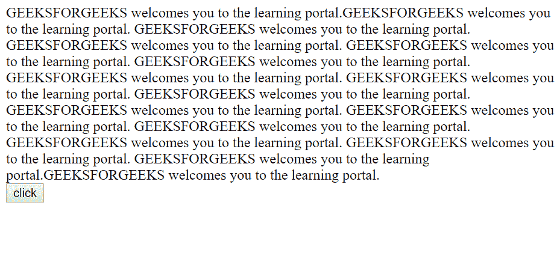
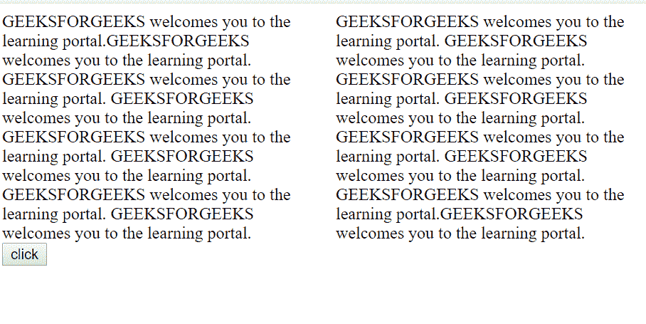

# HTML | DOM 样式列属性

> 原文: [https://www.geeksforgeeks.org/html-dom-style-columns-property/](https://www.geeksforgeeks.org/html-dom-style-columns-property/)

HTML DOM Style `columns` 属性用于设置列的宽度和列数。

## 语法:

*   **返回列属性:**
    ```html
    object.style.columns
    ```

*   **设置列属性:**
    ```html
    object.style.columns = "auto|columnwidth columncount|initial|inherit"
    ```

## 属性值:

*   **`auto`**: 将宽度和计数的两个值都设置为自动，即默认值。
*   **`column-width`**: 设置列宽。
*   **`column-count`**: 设置列数。
*   **`initial`**: 设置默认值。
*   **`inherit`**: 从其父元素继承值。

## 示例:

```html
<!DOCTYPE html>
<html>
<head>
    <title>
        HTML | DOM Style columns Property
    </title>
</head>
<body>
    <div id="example">
        GEEKSFORGEEKS welcomes you to the learning portal.
        GEEKSFORGEEKS welcomes you to the learning portal.
        GEEKSFORGEEKS welcomes you to the learning portal.
        GEEKSFORGEEKS welcomes you to the learning portal.
        GEEKSFORGEEKS welcomes you to the learning portal.
        GEEKSFORGEEKS welcomes you to the learning portal.
        GEEKSFORGEEKS welcomes you to the learning portal.
        GEEKSFORGEEKS welcomes you to the learning portal.
        GEEKSFORGEEKS welcomes you to the learning portal.
        GEEKSFORGEEKS welcomes you to the learning portal.
        GEEKSFORGEEKS welcomes you to the learning portal.
        GEEKSFORGEEKS welcomes you to the learning portal.
        GEEKSFORGEEKS welcomes you to the learning portal.
        GEEKSFORGEEKS welcomes you to the learning portal.
        GEEKSFORGEEKS welcomes you to the learning portal.
        GEEKSFORGEEKS welcomes you to the learning portal.
    </div>
    <button onclick="split()">click</button>
    <script>
        function split() {
            // Set column width and count.
            document.getElementById("example").style.columns = "200px 2";
            // Code for Firefox
            document.getElementById("example").style.MozColumns = "200px 2";
        }
    </script>
</body>
</html>
```

## 输出:

*   **点击按钮前:**
    
*   **点击按钮后:**
    

## 支持的浏览器:

以下列出了 *HTML | DOM Style columns 属性* 支持的浏览器:

*   Chrome
*   Edge
*   Firefox
*   Opera