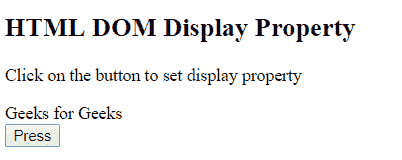
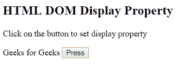
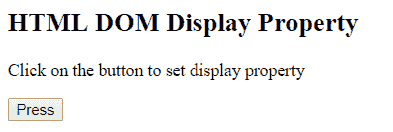
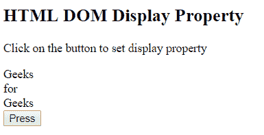

# HTML | DOM 样式显示属性

> 原文: [https://www.geeksforgeeks.org/html-dom-style-display-property/](https://www.geeksforgeeks.org/html-dom-style-display-property/)

HTML DOM 中的 Style 显示属性用于设置或返回元素的显示类型。它类似于显示或隐藏元素的可见性属性。显示略有不同: `none` 隐藏整个元素，而 `visibility: hidden` 意味着只有元素的内容将不可见，但元素将保持其原始位置和大小。

## 语法

它返回显示属性。

```html
object.style.display
```

它设置显示属性。

```html
object.style.display = value;
```

## 属性值

*   `inline`: 为默认值。它将元素呈现为内联元素。
*   `block`: 它将元素呈现为块级元素。
*   `compact`: 它根据上下文将元素呈现为块级或内嵌。
*   `flex`: 它将元素渲染为块级伸缩框。
*   `inline-block`: 它将元素呈现为内嵌框内的块框。
*   `inline-flex`: 它将元素呈现为内联级别的伸缩框。
*   `inline-table`: 它将元素呈现为一个内联表。
*   `list-item`: 它将元素呈现为列表。
*   `marker`: 将框前或框后的内容设置为标记。
*   `none`: 不显示任何元素。
*   `run-in`: 它根据上下文将元素呈现为块级或内嵌。
*   `table`: 它将元素渲染为块表格，表格前后有一个换行符。
*   `table-caption`: 它将元素呈现为表格标题。
*   `table-cell`: 它将元素呈现为表格单元格。
*   `table-column`: 它将元素呈现为一列单元格。
*   `table-column-group`: 它将元素呈现为一个或多个列的组。
*   `table-footer-group`: 将元素渲染为表尾行。
*   `table-header-group`: 将元素渲染为表头行。
*   `table-row`: 它将元素呈现为表格行。
*   `table-row-group`: 元素呈现为一个或多个行的组。
*   `initial`: 将显示属性设置为默认值。
*   `inherit`: 它从其父元素继承显示属性值。

## 返回值

返回一个字符串，代表元素的显示类型。

## 示例 1

本示例描述了 `inline` 属性值。

```html
<!DOCTYPE html>
<html>

<head>
    <title>
        HTML DOM Style display Property
    </title>
</head>

<body>
    <h2>
        HTML DOM Display Property
    </h2>

    <p>
        Click on the button to set
        display property
    </p>

    <div id = "GFG">
        Geeks for Geeks
    </div>

    <button onclick="myGeeks()">
        Press
    </button>

    <!-- script to set display property -->
    <script>
        function myGeeks() {
            document.getElementById("GFG").style.display
                    = "inline";
        }
    </script>
</body>

</html>
```

### 输出

**之前点击按钮:**


**之后点击按钮:**


## 示例 2

本示例描述了 `none` 属性值。

```html
<!DOCTYPE html>
<html>

<head>
    <title>
        HTML DOM Style display Property
    </title>
</head>

<body>
    <h2>
        HTML DOM Display Property
    </h2>

    <p>
        Click on the button to set
        display property
    </p>

    <div id = "GFG">
        Geeks for Geeks
    </div>

    <button onclick="myGeeks()">
        Press
    </button>

    <!-- script to set display property -->
    <script>
        function myGeeks() {
            document.getElementById("GFG").style.display
                    = "none";
        }
    </script>
</body>

</html>
```

### 输出

**之前点击按钮:**


**点击按钮后:**


## 示例 3

本示例描述了 `table-caption` 属性值。

```html
<!DOCTYPE html>
<html>

<head>
    <title>
        HTML DOM Style display Property
    </title>
</head>

<body>
    <h2>
        HTML DOM Display Property
    </h2>

    <p>
        Click on the button to set
        display property
    </p>

    <div id = "GFG">
        Geeks for Geeks
    </div>

    <button onclick="myGeeks()">
        Press
    </button>

    <!-- script to set display property -->
    <script>
        function myGeeks() {
            document.getElementById("GFG").style.display
                    = "table-caption";
        }
    </script>
</body>

</html>
```

### 输出

**之前点击按钮:**


**点击按钮后:**


## 示例 4

本示例描述了 `block` 属性值。

```html
<!DOCTYPE html>
<html>

<head>
    <title>
        HTML DOM Style display Property
    </title>
</head>

<body>
    <h2>
        HTML DOM Display Property
    </h2>

    <p>
        Click on the button to set
        display property
    </p>

    <div id = "GFG">
        Geeks for Geeks
    </div>

    <button onclick="myGeeks()">
        Press
    </button>

    <!-- script to set display property -->
    <script>
        function myGeeks() {
            document.getElementById("GFG").style.display
                    = "block";
        }
    </script>
</body>

</html>
```

### 输出

**之前点击按钮:**


**点击按钮后:**


## 支持的浏览器

*DOM 样式显示属性*支持的浏览器如下:

*   谷歌 Chrome
*   微软公司出品的 web 浏览器
*   火狐浏览器
*   歌剧
*   旅行队