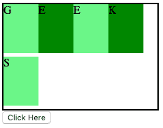
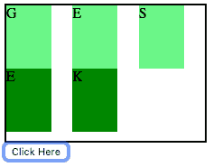
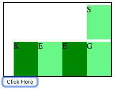
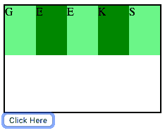

# HTML DOM 样式 flexFlow 属性

> 原文: [https://www.geeksforgeeks.org/html-dom-style-flexflow-property/](https://www.geeksforgeeks.org/html-dom-style-flexflow-property/)

HTML DOM 中的 `style.flexFlow` 属性用于指定 `flexDirection` 属性和 `flexWrap` 属性两个不同属性的值。`flexDirection` 属性用于指定弹性项的方向，`flexWrap` 属性用于指定弹性项是否应该换行。

## 语法

*   它返回表示元素的 `flexFlow` 属性的字符串。

    ```html
    object.style.flexFlow
    ```

*   它用于设置 `flexFlow` 属性值。

    ```html
    object.style.flexFlow = "flex-direction flex-wrap|initial|inherit"
    ```

## 返回值

它返回一个字符串，代表一个元素的伸缩流属性。

## 属性值

### flex-direction flex-wrap

`flexFlow` 属性是 `flexDirection` 和 `flexWrap` 属性的组合。`flex-direction flex-wrap` 的默认值是 `row nowrap`。以下是 `flexDirection` 和 `flexWrap` 属性的可能值列表。

```html
flex-direction = "row | row-reverse | column | column-reverse | initial | inherit";
```

```html
flex-wrap = "nowrap | wrap | wrap-reverse | initial | inherit";
```

### 示例 1

它将 `flexFlow` 属性值从“row wrap”更改为“column wrap”。

```html
<!DOCTYPE html>
<html>
<head>
    <title>
        HTML DOM Style flexFlow Property
    </title>
    <style>
        #GFG {
            width: 220px;
            height: 150px;
            border: 2px solid black;
            /* For Safari browsers */
            display: -webkit-flex;
            /* For Safari 6.1+ browsers  */
            -webkit-flex-flow: row wrap;
            display: flex;
            flex-flow: row wrap;
        }
        #GFG div {
            width: 50px;
            height: 70px;
        }
    </style>
</head>
<body>
    <div id="GFG">
        <div style="background-color:lightgreen;">G</div>
        <div style="background-color:green;">E</div>
        <div style="background-color:lightgreen;">E</div>
        <div style="background-color:green;">K</div>
        <div style="background-color:lightgreen;">S</div>
    </div>
    <button onclick="myGeek()">
        Click Here
    </button>
    <script>
        function myGeek() {
            /* For Safari Browsers */
            document.getElementById("GFG").style.WebkitFlexFlow = "column wrap";
            document.getElementById("GFG").style.FlexFlow = "column wrap";
        }
    </script>
</body>
</html>
```

**输出:**
**之前点击按钮:**

**之后点击按钮:**


### 示例 2

它将 `flexFlow` 属性值从“row wrap”更改为“row-reverse wrap-reverse”。

```html
<!DOCTYPE html>
<html>
<head>
    <title>
        HTML DOM Style flexFlow Property
    </title>
    <style>
        #GFG {
            width: 220px;
            height: 150px;
            border: 2px solid black;
            /* For Safari browsers */
            display: -webkit-flex;
            /* For Safari 6.1+ browsers  */
            -webkit-flex-flow: row wrap;
            display: flex;
            flex-flow: row wrap;
        }
        #GFG div {
            width: 50px;
            height: 70px;
        }
    </style>
</head>
<body>
    <div id="GFG">
        <div style="background-color:lightgreen;">G</div>
        <div style="background-color:green;">E</div>
        <div style="background-color:lightgreen;">E</div>
        <div style="background-color:green;">K</div>
        <div style="background-color:lightgreen;">S</div>
    </div>
    <button onclick="myGeek()">
        Click Here
    </button>
    <script>
        function myGeek() {
            /* For Safari Browsers */
            document.getElementById("GFG").style.WebkitFlexFlow = "row-reverse wrap-reverse";
            document.getElementById("GFG").style.FlexFlow = "row-reverse wrap-reverse";
        }
    </script>
</body>
</html>
```

**输出:**
**之前点击按钮:**

**之后点击按钮:**


### initial

它将 `flexFlow` 属性设置为其默认值。

### 示例 3

```html
<!DOCTYPE html>
<html>
<head>
    <title>
        HTML DOM Style flexFlow Property
    </title>
    <style>
        #GFG {
            width: 220px;
            height: 150px;
            border: 2px solid black;
            /* For Safari browsers */
            display: -webkit-flex;
            /* For Safari 6.1+ browsers  */
            -webkit-flex-flow: row wrap;
            display: flex;
            flex-flow: row wrap;
        }
        #GFG div {
            width: 50px;
            height: 70px;
        }
    </style>
</head>
<body>
    <div id="GFG">
        <div style="background-color:lightgreen;">G</div>
        <div style="background-color:green;">E</div>
        <div style="background-color:lightgreen;">E</div>
        <div style="background-color:green;">K</div>
        <div style="background-color:lightgreen;">S</div>
    </div>
    <button onclick="myGeek()">
        Click Here
    </button>
    <script>
        function myGeek() {
            /* For Safari Browsers */
            document.getElementById("GFG").style.WebkitFlexFlow = "initial";
            document.getElementById("GFG").style.FlexFlow = "initial";
        }
    </script>
</body>
</html>
```

**输出:**
**之前点击按钮:**

**之后点击按钮:**


### inherit

它从其父元素继承该属性。

### 示例 4

```html
<!DOCTYPE html>
<html>
<head>
    <title>
        HTML DOM Style flexFlow Property
    </title>
    <style>
        #GFG {
            width: 220px;
            height: 150px;
            border: 2px solid black;
            /* For Safari browsers */
            display: -webkit-flex;
            /* For Safari 6.1+ browsers  */
            -webkit-flex-flow: row wrap;
            display: flex;
            flex-flow: row wrap;
        }
        #GFG div {
            width: 50px;
            height: 70px;
        }
    </style>
</head>
<body>
    <div id="GFG">
        <div style="background-color:lightgreen;">G</div>
        <div style="background-color:green;">E</div>
        <div style="background-color:lightgreen;">E</div>
        <div style="background-color:green;">K</div>
        <div style="background-color:lightgreen;">S</div>
    </div>
    <button onclick="myGeek()">
        Click Here
    </button>
    <script>
        function myGeek() {
            /* For Safari Browsers */
            document.getElementById("GFG").style.WebkitFlexFlow = "inherit";
            document.getElementById("GFG").style.FlexFlow = "inherit";
        }
    </script>
</body>
</html>
```

**输出:**
**之前点击按钮:**

**之后点击按钮:**


## 支持的浏览器

`DOM Style flexFlow` 属性支持的浏览器如下:

*   谷歌 Chrome
*   Internet Explorer 11.0
*   火狐浏览器
*   歌剧
*   Safari 6.1+ (使用 `-webkit-flex-flow`)