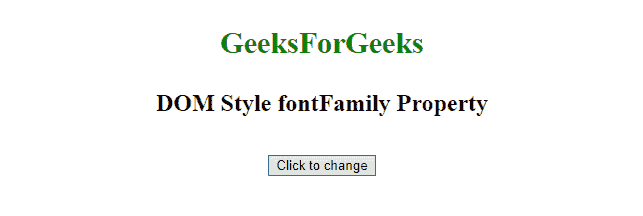
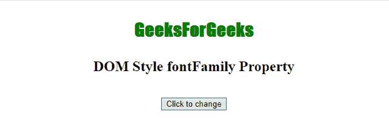

# HTML DOM 样式 fontFamily 属性

> 原文：[https://www.geeksforgeeks.org/html-dom-style-fontfamily-property/](https://www.geeksforgeeks.org/html-dom-style-fontfamily-property/)

`fontFamily` 属性为元素中的文本设置或返回字体系列名称和通用系列名称的列表。网络浏览器将实现它识别的第一个值。

## 语法

-   它返回 `fontFamily` 属性。

```javascript
object.style.fontFamily
```

-   它设置了字体系列属性。

```javascript
object.style.fontFamily = "font1, font2, etc.|initial|inherit"
```

## 属性值

| 值 | 描述 |
| :--- | :--- |
| font1, font2, etc. | 字体系列名称和通用系列名称的列表，用逗号分隔。 |
| initial | 在默认值中设置属性。 |
| inherit | 从父元素继承。 |

## 返回值

返回字体系列名称和/或通用系列名称的数量。

## 示例 1：字体系列 "Impact"

```html
<!DOCTYPE html>
<html>

<head>
    <title>DOM Style fontFamily Property </title>
</head>

<body>
    <center>
        <p style="color: green;
                  width: 100%; 
                  font-size: 30px; 
                  font-weight: bold;"
           id="Geek1">
            GeeksForGeeks
        </p>

        <h2>DOM Style fontFamily Property </h2>
        <br>

        <button type="button" onclick="myGeeks()">
            Click to change
        </button>

        <script>
            function myGeeks() {
                // Set font-family 'impact'.
                document.getElementById("Geek1").style.fontFamily = "Impact";
            }
        </script>
    </center>
</body>

</html>
```

**输出：**

-   **点击按钮前：**
    
-   **点击按钮后：**
    

## 示例 2：字体系列 "sans-serif"

```html
<!DOCTYPE html>
<html>

<head>
    <title>DOM Style fontFamily Property </title>
</head>

<body>
    <center>
        <p style="color: green;
                  width: 100%;
                  font-size: 30px;
                  font-weight: bold;" id="Geek1">
            GeeksForGeeks
        </p>

        <h2>DOM Style fontFamily Property </h2>
        <br>

        <button type="button" onclick="myGeeks()">
            Click to change
        </button>

        <script>
            function myGeeks() {
                // Set font-family 'sans-serif'.
                document.getElementById("Geek1").style.fontFamily = "sans-serif";
            }
        </script>
    </center>
</body>

</html>
```

**输出：**

-   **点击按钮前：**
    
-   **点击按钮后：**
    

## 示例 3：字体系列 "Comic Sans MS, cursive, sans-serif"

```html
<!DOCTYPE html>
<html>

<head>
    <title>DOM Style fontFamily Property </title>
</head>

<body>
    <center>
        <p style="color: green; 
                  width: 100%;
                  font-size: 30px;
                  font-weight: bold;" id="Geek1">
            GeeksForGeeks
        </p>

        <h2>DOM Style fontFamily Property </h2>
        <br>

        <button type="button" onclick="myGeeks()">
            Click to change
        </button>

        <script>
            function myGeeks() {
                // Set font-family 'Comic Sans MS, cursive and sans-serif'
                document.getElementById("Geek1").style.fontFamily =
                    'Comic Sans MS, cursive, sans-serif';
            }
        </script>
    </center>
</body>

</html>
```

**输出：**

-   **点击按钮前：**
    
-   **点击按钮后：**
    

## 支持的浏览器

以下列出了 *HTML DOM Style fontFamily Property* 支持的浏览器：

-   Google Chrome
-   Microsoft Edge
-   Mozilla Firefox
-   Opera
-   Safari