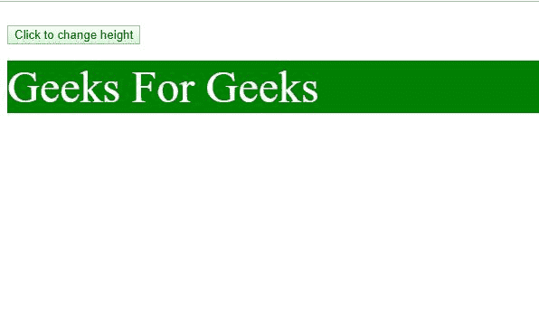
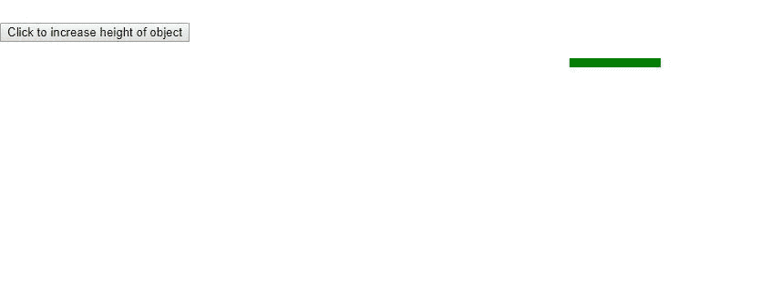
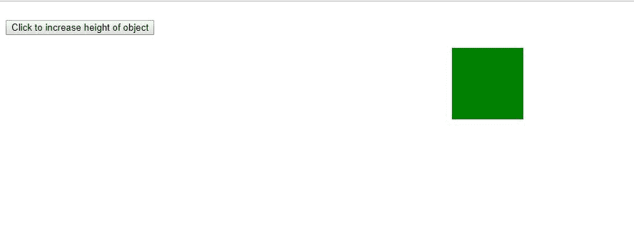

# HTML DOM 样式高度属性

> 原文：[https://www.geeksforgeeks.org/html-dom-style-height-property/](https://www.geeksforgeeks.org/html-dom-style-height-property/)

`HTML DOM Style` 高度属性与 [CSS 高度属性](https://www.geeksforgeeks.org/css-height-property/)类似，但用于动态设置或获取元素的高度。

**语法：**

要设置高度属性：
```html
object.style.height = auto|length|%|initial|inherit;
```

要获取高度属性值：
```html
object.style.height
```

**属性值：**

| 值 | 说明 |
| :--- | :--- |
| `auto` | 默认值。 |
| `length` | 使用长度单位定义高度。 |
| `%` | 定义高度为父元素高度的百分比。 |
| `initial` | 设置为默认值。 |
| `inherit` | 继承父元素的属性。 |

**返回值：** 给出元素高度的字符串。

### 示例 1

```html
<!DOCTYPE html>
<html>

<head>
    <title>
        HTML | DOM Style height Property
    </title>
    <style>
        p {
            height: auto;
            color: white;
            font-size: 50px;
            background-color: green;
        }
    </style>
</head>

<body>
    <br>
    <button onclick="Play()">
      Click to change height
    </button>
    <br />
    <br />

<script>
        function Play() {
            document.getElementById(
              "block").style.height = "200px"
        }
    </script>
    <p id="block">
        Geeks For Geeks

</p>

</body>

</html>
```

**输出**

*   **之前：**

    

    之前的 HTML DOM 高度

*   **之后：**

    

    之后的 HTML DOM 高度

### 示例 2

```html
<!DOCTYPE html>
<html>

<head>
    <title>
        HTML | DOM Style height Property
    </title>
    <style>
        div {
            height: 10px;
            background-color: green;
            width: 100px;
        }
    </style>
</head>

<body>
    <br>
    <button onclick="Play()">
      Click to increase height of object
    </button>
    <br />
    <br />

<script>
        function Play() {
            document.getElementById("block"
               ).style.height = "100px"
        }
    </script>
    <center>
        <div id="block">

</div>
    </center>
</body>

</html>
```

**输出：**

*   **之前：**

    

    之前的 DOM 高度示例

*   **之后：**

    

    之后的 DOM 高度

**支持的浏览器：** `DOM Style` 高度属性支持的浏览器如下：

*   谷歌 Chrome 1.0
*   Internet Explorer 4.0
*   Firefox 1.0
*   Opera
*   Safari 1.0