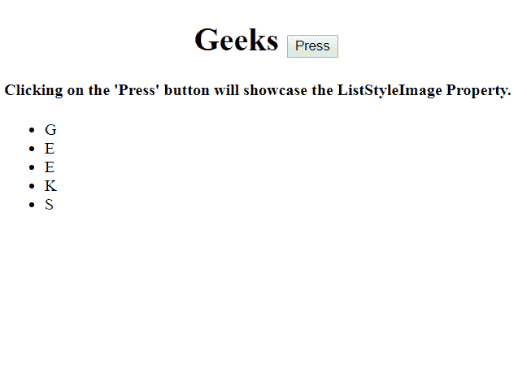
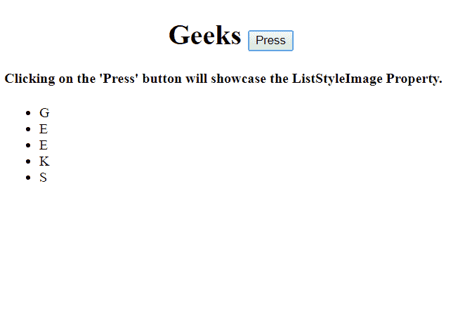
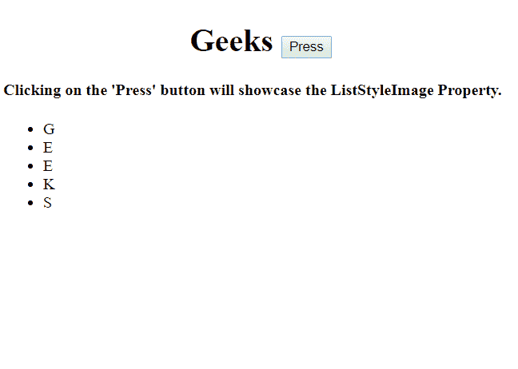
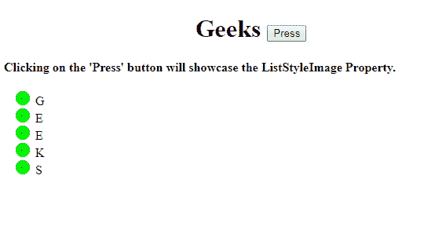
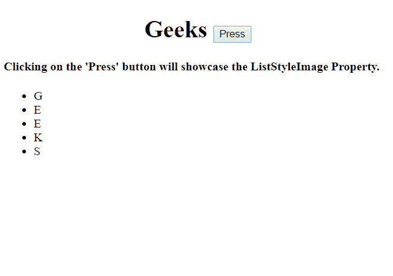
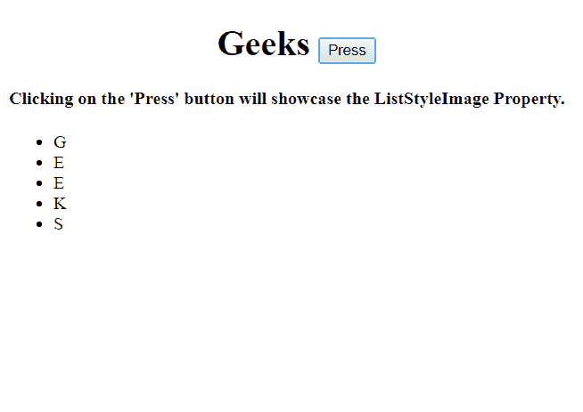

# HTML DOM 样式 `listStyleImage` 属性

> 原文: [https://www.geeksforgeeks.org/html-dom-style-liststyleimage-property/](https://www.geeksforgeeks.org/html-dom-style-liststyleimage-property/)

`listStyleImage` 属性用于设置或返回作为列表项标记的图像。

## 语法

*   返回 `listStyleImage` 属性:
    ```html
    object.style.listStyleImage
    ```

*   设置 `listStyleImage` 属性:
    ```html
    object.style.listStyleImage = "none|url|initial|inherit"
    ```

## 属性值

*   `none`: 使用该值，将不显示图像。
*   `url`: 用于指定图像的路径。
*   `initial`: 用于将属性设置为其默认值。
*   `inherit`: 用于从父元素继承该属性的值。

## 返回值

返回一个字符串，代表图像的位置路径。

## 示例 1：不显示属性

```html
<!DOCTYPE html>
<html>
<head>
    <title>HTML | DOM Style listStyleImage Property</title>
</head>
<body>
    <h1>
        <center>
            Geeks <button onclick="image()">Press</button>
        </center>
    </h1>
    <h4>Clicking on the 'Press' button will showcase the ListStyleImage Property.</h4>
    <ul id="gfg">
        <li>G</li>
        <li>E</li>
        <li>E</li>
        <li>K</li>
        <li>S</li>
    </ul>
    <script>
        function image() {
            // Set list style "none".
            document.getElementById("gfg").style.listStyleImage = "none";
        }
    </script>
</body>
</html>
```

**输出:**

*   点击按钮前:
    
*   点击按钮后:
    

## 示例 2：显示 `url` 属性

```html
<!DOCTYPE html>
<html>
<head>
    <title>HTML | DOM Style listStyleImage Property</title>
</head>
<body>
    <h1>
        <center>
            Geeks <button onclick="image()">Press</button>
        </center>
    </h1>
    <h4>Clicking on the 'Press' button will showcase the ListStyleImage Property.</h4>
    <ul id="gfg">
        <li>G</li>
        <li>E</li>
        <li>E</li>
        <li>K</li>
        <li>S</li>
    </ul>
    <script>
        function image() {
            // Set list style image using URL.
            document.getElementById("gfg").style.listStyleImage = "url('https://media.geeksforgeeks.org/wp-content/uploads/rlist.png')";
        }
    </script>
</body>
</html>
```

**输出:**

*   点击按钮前:
    
*   点击按钮后:
    

## 示例 3：显示 `initial` 属性

```html
<!DOCTYPE html>
<html>
<head>
    <title>HTML | DOM Style listStyleImage Property</title>
</head>
<body>
    <h1>
        <center>
            Geeks <button onclick="image()">Press</button>
        </center>
    </h1>
    <h4>Clicking on the 'Press' button will showcase the ListStyleImage Property.</h4>
    <ul id="gfg">
        <li>G</li>
        <li>E</li>
        <li>E</li>
        <li>K</li>
        <li>S</li>
    </ul>
    <script>
        function image() {
            // Set list style initial.
            document.getElementById("gfg").style.listStyleImage = "initial";
        }
    </script>
</body>
</html>
```

**输出:**

*   点击按钮前:
    
*   点击按钮后:
    

## 示例 4：显示 `inherit` 属性

```html
<!DOCTYPE html>
<html>
<head>
    <title>HTML | DOM Style listStyleImage Property</title>
</head>
<body>
    <h1>
        <center>
            Geeks <button onclick="image()">Press</button>
        </center>
    </h1>
    <h4>Clicking on the 'Press' button will showcase the ListStyleImage Property.</h4>
    <ul id="gfg">
        <li>G</li>
        <li>E</li>
        <li>E</li>
        <li>K</li>
        <li>S</li>
    </ul>
    <script>
        function image() {
            // Set list style inherit.
            document.getElementById("gfg").style.listStyleImage = "inherit";
        }
    </script>
</body>
</html>
```

**输出:**

*   点击按钮前:
    
*   点击按钮后:
    

## 浏览器支持

浏览器对 `listStyleImage` 属性的支持情况如下：

*   谷歌 Chrome
*   微软 Edge
*   火狐 Firefox
*   Opera
*   Safari