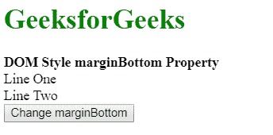
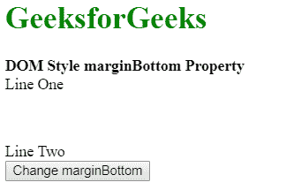

# HTML DOM 样式边框底部属性

> 原文: [https://www.geeksforgeeks.org/html-dom-style-marginbottom-property/](https://www.geeksforgeeks.org/html-dom-style-marginbottom-property/)

HTML DOM 中的**样式边距底部属性**用于设置或返回元素的底部边距。

## 语法

*   它返回元素的下边距。

    ```html
    object.style.marginBottom
    ```

*   它用于设置元素的下边距。

    ```html
    object.style.marginBottom = "length|percentage|auto|initial|inherit"
    ```

## 返回值

返回一个字符串值，代表一个元素的下边距。

## 属性值

### `length`

用于将边距设置为固定单位。其默认值为 `0`。

**示例:**

```html
<!DOCTYPE html>
<html>
<head>
    <title>DOM Style marginBottom Property</title>
</head>
<body>
    <h1 style="color: green">GeeksforGeeks</h1>
    <b>DOM Style marginBottom Property</b>
    <div class="container">
        <div class="div1">Line One</div>
        <div class="div2">Line Two</div>
        <button onclick="setMargin()">Change marginBottom</button>
    </div>
    <!-- Script to set bottom margin -->
    <script>
        function setMargin() {
            elem = document.querySelector('.div1');
            elem.style.marginBottom = '50px';
        }
    </script>
</body>
</html>
```

**输出:**
**点击按钮前:**

**点击按钮后:**


### `percentage`

用于将边距量指定为相对于包含元素宽度的百分比。

**示例:**

```html
<!DOCTYPE html>
<html>
<head>
    <title>DOM Style marginBottom Property</title>
</head>
<body>
    <h1 style="color: green">GeeksforGeeks</h1>
    <b>DOM Style marginBottom Property</b>
    <div class="container">
        <div class="div1">Line One</div>
        <div class="div2">Line Two</div>
        <button onclick="setMargin()">Change marginBottom</button>
    </div>
    <!-- Script to set bottom margin -->
    <script>
        function setMargin() {
            elem = document.querySelector('.div1');
            elem.style.marginBottom = '10%';
        }
    </script>
</body>
</html>
```

**输出:**
**点击按钮前:**

**点击按钮后:**


### `auto`

如果值设置为 `auto`，则浏览器会自动计算合适的边距大小值。

**示例:**

```html
<!DOCTYPE html>
<html>
<head>
    <title>DOM Style marginBottom Property</title>
</head>
<body>
    <h1 style="color: green">GeeksforGeeks</h1>
    <b>DOM Style marginBottom Property</b>
    <div class="container">
        <div class="div1" style="margin-bottom:50px;">Line One</div>
        <div class="div2">Line Two</div>
        <button onclick="setMargin()">Change marginBottom</button>
    </div>
    <!-- Script to set bottom margin -->
    <script>
        function setMargin() {
            elem = document.querySelector('.div1');
            elem.style.marginBottom = 'auto';
        }
    </script>
</body>
</html>
```

**输出:**
**点击按钮前:**

**点击按钮后:**


### `initial`

用于将属性设置为其默认值。

**示例:**

```html
<!DOCTYPE html>
<html>
<head>
    <title>DOM Style marginBottom Property</title>
</head>
<body>
    <h1 style="color: green">GeeksforGeeks</h1>
    <b>DOM Style marginBottom Property</b>
    <div class="container">
        <div class="div1" style="margin-bottom:50px;">Line One</div>
        <div class="div2">Line Two</div>
        <button onclick="setMargin()">Change marginBottom</button>
    </div>
    <!-- Script to set bottom margin -->
    <script>
        function setMargin() {
            elem = document.querySelector('.div1');
            elem.style.marginBottom = 'initial';
        }
    </script>
</body>
</html>
```

**输出:**
**点击按钮前:**

**点击按钮后:**


### `inherit`

用于从元素的父级继承值。

**示例:**

```html
<!DOCTYPE html>
<html>
<head>
    <title>DOM Style marginBottom Property</title>
</head>
<body>
    <h1 style="color: green">GeeksforGeeks</h1>
    <b>DOM Style marginBottom Property</b>
    <div class="container" style="margin-bottom:50px;">
        <div class="div1">Line One</div>
        <div class="div2">Line Two</div>
        <button onclick="setMargin()">Change marginBottom</button>
    </div>
    <!-- Script to set bottom margin -->
    <script>
        function setMargin() {
            elem = document.querySelector('.div1');
            elem.style.marginBottom = 'inherit';
        }
    </script>
</body>
</html>
```

**输出:**
**点击按钮前:**

**点击按钮后:**


## 支持的浏览器

`DOM Style marginBottom` 属性支持的浏览器如下:

*   谷歌 Chrome
*   微软公司出品的 web 浏览器
*   火狐浏览器
*   歌剧
*   旅行队