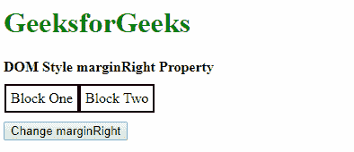
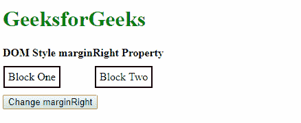
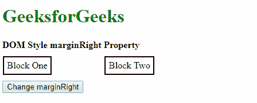
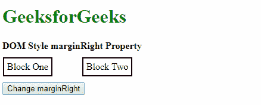
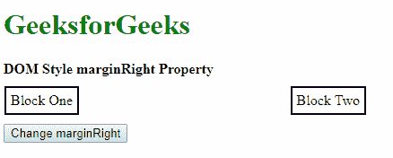
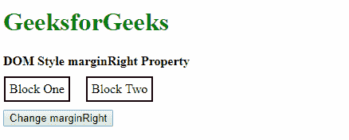
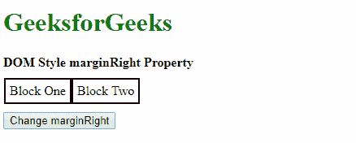
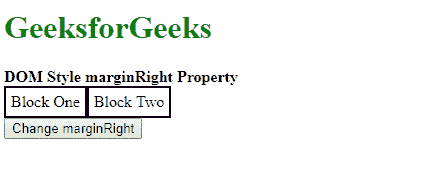
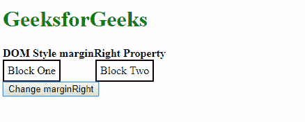

# HTML DOM 样式边距右侧属性

> 原文：[https://www.geeksforgeeks.org/html-dom-style-marginright-property/](https://www.geeksforgeeks.org/html-dom-style-marginright-property/)

HTML DOM 中的 `marginRight` 属性用于设置或返回元素的右边距。

## 语法

它返回 `marginRight` 属性。

```html
object.style.marginRight
```

它用于设置 `marginRight` 属性。

```html
object.style.marginRight = "length|percentage|auto|initial|inherit"
```

## 返回值

返回一个字符串值，代表一个元素的右边距。

## 属性值

*   **length:** 用于以固定长度单位指定边距。默认值是 `0`。

    **示例：**

    ```html
    <!DOCTYPE html>
    <html>
    <head>
        <title>DOM Style marginRight Property</title>
        <style>
            .container {
                display: flex;
                flex-direction: row;
                padding: 10px 1px;
            }
            .div1, .div2 {
                padding: 5px;
                border: 2px solid;
            }
        </style>
    </head>
    <body>
        <h1 style="color: green">GeeksforGeeks</h1>
        <b>DOM Style marginRight Property</b>
        <div class="container">
            <div class="div1">Block One</div>
            <div class="div2">Block Two</div>
        </div>
        <button onclick="setMargin()">Change marginRight</button>
        <!-- Script to set marginRight to a fixed value -->
        <script>
            function setMargin() {
                elem = document.querySelector('.div1');
                elem.style.marginRight = '50px';
            }
        </script>
    </body>
    </html>
    ```

    **输出：**
    *   点击按钮前：
        
    *   点击按钮后：
        

*   **percentage:** 用于以相对于包含元素宽度的百分比来指定边距量。

    **示例：**

    ```html
    <!DOCTYPE html>
    <html>
    <head>
        <title>DOM Style marginRight Property</title>
        <style>
            .container {
                display: flex;
                flex-direction: row;
                padding: 10px 1px;
            }
            .div1, .div2 {
                padding: 5px;
                border: 2px solid;
            }
        </style>
    </head>
    <body>
        <h1 style="color: green">GeeksforGeeks</h1>
        <b>DOM Style marginRight Property</b>
        <div class="container">
            <div class="div1">Block One</div>
            <div class="div2">Block Two</div>
        </div>
        <button onclick="setMargin()">Change marginRight</button>
        <!-- Script to set marginRight to a fixed value -->
        <script>
            function setMargin() {
                elem = document.querySelector('.div1');
                elem.style.marginRight = '20%';
            }
        </script>
    </body>
    </html>
    ```

    **输出：**
    *   点击按钮前：
        
    *   点击按钮后：
        

*   **auto:** 如果值设置为 `auto`，则浏览器会自动计算合适的边距大小。

    **示例：**

    ```html
    <!DOCTYPE html>
    <html>
    <head>
        <title>DOM Style marginRight Property</title>
        <style>
            .container {
                display: flex;
                flex-direction: row;
                padding: 10px 1px;
            }
            .div1, .div2 {
                margin-right: 50px;
                padding: 5px;
                border: 2px solid;
            }
        </style>
    </head>
    <body>
        <h1 style="color: green">GeeksforGeeks</h1>
        <b>DOM Style marginRight Property</b>
        <div class="container">
            <div class="div1">Block One</div>
            <div class="div2">Block Two</div>
        </div>
        <button onclick="setMargin()">Change marginRight</button>
        <!-- Script to set marginRight to auto -->
        <script>
            function setMargin() {
                elem = document.querySelector('.div1');
                elem.style.marginRight = 'auto';
            }
        </script>
    </body>
    </html>
    ```

    **输出：**
    *   点击按钮前：
        
    *   点击按钮后：
        

*   **initial:** 用于将属性设置为其默认值。

    **示例：**

    ```html
    <!DOCTYPE html>
    <html>
    <head>
        <title>DOM Style marginRight Property</title>
        <style>
            .container {
                display: flex;
                flex-direction: row;
                padding: 10px 1px;
            }
            .div1, .div2 {
                margin-right: 20px;
                padding: 5px;
                border: 2px solid;
            }
        </style>
    </head>
    <body>
        <h1 style="color: green">GeeksforGeeks</h1>
        <b>DOM Style marginRight Property</b>
        <div class="container">
            <div class="div1">Block One</div>
            <div class="div2">Block Two</div>
        </div>
        <button onclick="setMargin()">Change marginRight</button>
        <!-- Script to set marginRight to initial -->
        <script>
            function setMargin() {
                elem = document.querySelector('.div1');
                elem.style.marginRight = 'initial';
            }
        </script>
    </body>
    </html>
    ```

    **输出：**
    *   点击按钮前：
        
    *   点击按钮后：
        

*   **inherit:** 用于从其父元素继承值。

    **示例：**

    ```html
    <!DOCTYPE html>
    <html>
    <head>
        <title>DOM Style marginRight Property</title>
        <style>
            .container {
                margin-right: 50px;
                display: flex;
                flex-direction: row;
            }
            .div1, .div2 {
                padding: 5px;
                border: 2px solid;
            }
        </style>
    </head>
    <body>
        <h1 style="color: green">GeeksforGeeks</h1>
        <b>DOM Style marginRight Property</b>
        <div class="container">
            <div class="div1">Block One</div>
            <div class="div2">Block Two</div>
        </div>
        <button onclick="setMargin()">Change marginRight</button>
        <!-- Script to set marginRight to inherit -->
        <script>
            function setMargin() {
                elem = document.querySelector('.div1');
                elem.style.marginRight = 'inherit';
            }
        </script>
    </body>
    </html>
    ```

    **输出：**
    *   点击按钮前：
        
    *   点击按钮后：
        

## 支持的浏览器

由 `marginRight` 属性支持的浏览器如下：

*   谷歌 Chrome
*   微软 Edge
*   火狐浏览器
*   Opera
*   Safari