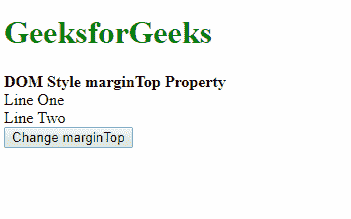
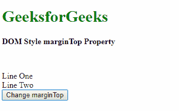
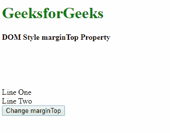
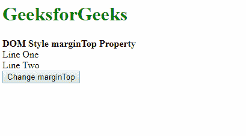
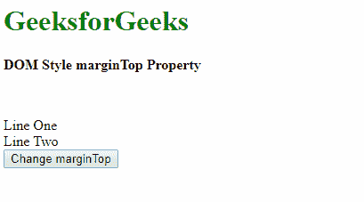

# HTML DOM 样式边距属性

> 原文: [https://www.geeksforgeeks.org/html-dom-style-margintop-property/](https://www.geeksforgeeks.org/html-dom-style-margintop-property/)

HTML DOM 中的样式边距属性用于设置或返回元素的上边距。

## 语法

它返回 `marginTop` 属性。

```html
object.style.marginTop
```

它用于设置 `marginTop` 属性。

```html
object.style.marginTop = "length|percentage|auto|initial|inherit"
```

## 返回值

它返回一个代表元素上边距的字符串值。

## 属性值

**length:** 用于以固定单位指定边距。其默认值是 `0`。

### 示例

```html
<!DOCTYPE html>
<html>
<head>
    <title>DOM Style marginTop Property</title>
</head>
<body>
    <h1 style="color: green">GeeksforGeeks</h1>
    <b>DOM Style marginTop Property</b>
    <div class="container">
        <div class="div1">Line One</div>
        <div class="div2">Line Two</div>
        <button onclick="setMargin()">Change marginTop</button>
    </div>
    <!-- Script to set top margin -->
    <script>
        function setMargin() {
            elem = document.querySelector('.div1');
            elem.style.marginTop = '50px';
        }
    </script>
</body>
</html>
```

### 输出

点击按钮前:


点击按钮后:


**percentage:** 用于将边距量指定为相对于包含元素宽度的百分比。

### 示例

```html
<!DOCTYPE html>
<html>
<head>
    <title>DOM Style marginTop Property</title>
</head>
<body>
    <h1 style="color: green">GeeksforGeeks</h1>
    <b>DOM Style marginTop Property</b>
    <div class="container">
        <div class="div1">Line One</div>
        <div class="div2">Line Two</div>
        <button onclick="setMargin()">Change marginTop</button>
    </div>
    <!-- Script to set top margin -->
    <script>
        function setMargin() {
            elem = document.querySelector('.div1');
            elem.style.marginTop = '20%';
        }
    </script>
</body>
</html>
```

### 输出

点击按钮前:


点击按钮后:


**auto:** 如果值设置为 `auto`，则浏览器会自动计算合适的边距大小。

### 示例

```html
<!DOCTYPE html>
<html>
<head>
    <title>DOM Style marginTop Property</title>
</head>
<body>
    <h1 style="color: green">GeeksforGeeks</h1>
    <b>DOM Style marginTop Property</b>
    <div class="container">
        <div class="div1" style="margin-top: 50px;">Line One</div>
        <div class="div2">Line Two</div>
        <button onclick="setMargin()">Change marginTop</button>
    </div>
    <!-- Script to set top margin -->
    <script>
        function setMargin() {
            elem = document.querySelector('.div1');
            elem.style.marginTop = 'auto';
        }
    </script>
</body>
</html>
```

### 输出

点击按钮前:


点击按钮后:


**initial:** 用于将属性设置为其默认值。

### 示例

```html
<!DOCTYPE html>
<html>
<head>
    <title>DOM Style marginTop Property</title>
</head>
<body>
    <h1 style="color: green">GeeksforGeeks</h1>
    <b>DOM Style marginTop Property</b>
    <div class="container">
        <div class="div1" style="margin-top: 50px;">Line One</div>
        <div class="div2">Line Two</div>
        <button onclick="setMargin()">Change marginTop</button>
    </div>
    <!-- Script to set top margin -->
    <script>
        function setMargin() {
            elem = document.querySelector('.div1');
            elem.style.marginTop = 'initial';
        }
    </script>
</body>
</html>
```

### 输出

点击按钮前:


点击按钮后:


**inherit:** 用于从其父元素继承值。

### 示例

```html
<!DOCTYPE html>
<html>
<head>
    <title>DOM Style marginTop Property</title>
</head>
<body>
    <h1 style="color: green">GeeksforGeeks</h1>
    <b>DOM Style marginTop Property</b>
    <div class="container">
        <div class="div1" style="margin-top: 50px;">Line One</div>
        <div class="div2">Line Two</div>
        <button onclick="setMargin()">Change marginTop</button>
    </div>
    <!-- Script to set top margin -->
    <script>
        function setMargin() {
            elem = document.querySelector('.div1');
            elem.style.marginTop = 'inherit';
        }
    </script>
</body>
</html>
```

### 输出

点击按钮前:


点击按钮后:


## 支持的浏览器

`DOM Style marginTop` 属性支持的浏览器如下:

*   谷歌 Chrome
*   微软公司出品的 web 浏览器
*   火狐浏览器
*   歌剧
*   旅行队