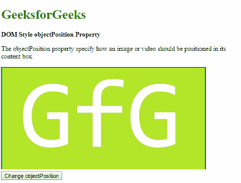
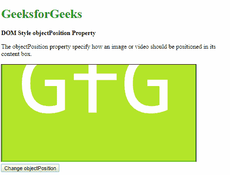

# HTML DOM 样式对象位置属性

> 原文：[https://www.geeksforgeeks.org/html-dom-style-objectposition-property/](https://www.geeksforgeeks.org/html-dom-style-objectposition-property/)

`objectPosition` 属性用于设置或返回图像或视频在自己的内容框中的位置。

## 语法

它返回 `objectPosition` 属性。

```html
object.style.objectPosition
```

它用于设置 `objectPosition` 属性。

```html
object.style.objectPosition = "position|initial|inherit"
```

## 属性值

### position
用于指定图像或视频的位置，可以使用长度值或字符串（left、right 和 center）。

**示例-1：**

```html
<!DOCTYPE html>
<html>
<head>
    <title>
        DOM Style objectPosition Property
    </title>
    <style>
        .content {
            border: 1px solid;
            object-fit: cover;
            height: 250px;
            width: 500px;
        }
    </style>
</head>
<body>
    <h1 style="color: green">
      GeeksforGeeks
    </h1>
    <b>
      DOM Style objectPosition Property
    </b>
    <p>
      The objectPosition property 
      specify how an image or video 
      should be positioned in its content box.
    </p>
    
    <button onclick="setObjectPosition()">
        Change resize
    </button>
    <!-- Script to set objectPosition to 50% 100% -->
    <script>
        function setObjectPosition() {
            elem = document.querySelector('.content');
            elem.style.objectPosition = '75% 100%';
        }
    </script>
</body>
</html>
```

**输出：**

*   点击按钮前：



*   点击按钮后：


### initial
用于将此属性设置为其默认值。

**示例-2：**

```html
<!DOCTYPE html>
<html>
<head>
    <title>
        DOM Style objectPosition Property
    </title>
    <style>
        .content {
            border: 1px solid;
            object-fit: cover;
            height: 250px;
            width: 500px;
            object-position: 50% 100%;
        }
    </style>
</head>
<body>
    <h1 style="color: green">
      GeeksforGeeks
    </h1>
    <b>
      DOM Style objectPosition Property
    </b>
    <p>
        The objectPosition property specify 
      how an image or video should be
      positioned in its content box.
    </p>
    
    <button onclick="setObjectPosition()">
        Change resize
    </button>
    <!-- Script to set objectPosition to initial -->
    <script>
        function setObjectPosition() {
            elem = document.querySelector('.content');
            elem.style.objectPosition = 'initial';
        }
    </script>
</body>
</html>
```

**输出：**

*   点击按钮前：



*   点击按钮后：


### inherit
从其父元素继承该属性。

**示例-3：**

```html
<!DOCTYPE html>
<html>
<head>
    <title>
        DOM Style objectPosition Property
    </title>
    <style>
        #parent {
            object-position: 50% 100%;
        }
        .content {
            border: 1px solid;
            object-fit: cover;
            height: 250px;
            width: 500px;
        }
    </style>
</head>
<body>
    <h1 style="color: green">
      GeeksforGeeks
    </h1>
    <b>
      DOM Style objectPosition Property
    </b>
    <p>
        The objectPosition property specify how an 
      image or video should be positioned in its content box.
    </p>
    <div id="parent">
        
    </div>
    <button onclick="setObjectPosition()">
        Change resize
    </button>
    <!-- Script to set objectPosition to inherit -->
    <script>
        function setObjectPosition() {
            elem = document.querySelector('.content');
            elem.style.objectPosition = 'inherit';
        }
    </script>
</body>
</html>
```

**输出：**

*   点击按钮前：


*   点击按钮后：


## 支持的浏览器
`objectPosition` 属性支持的浏览器如下：

*   谷歌 Chrome 31.0
*   Internet Explorer 16.0
*   Firefox 36.0
*   Opera 19.0
*   苹果 Safari 10.1