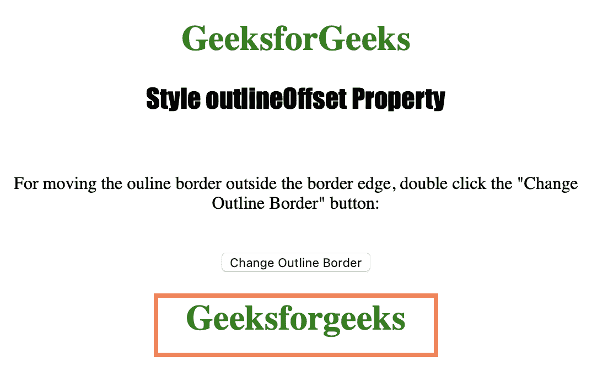
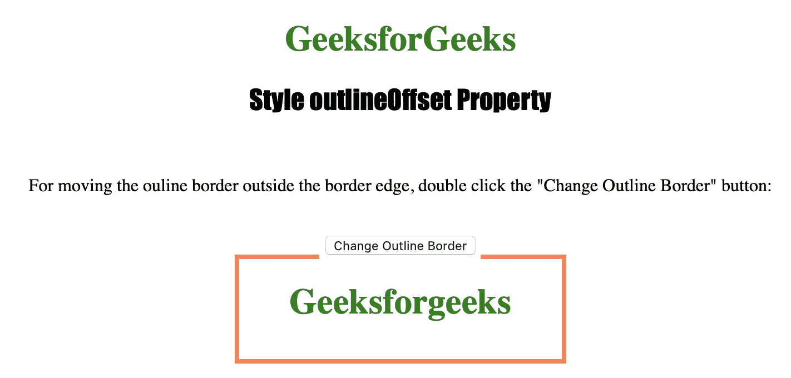

# HTML DOM 样式 outlineOffset 属性

> 原文：[https://www.geeksforgeeks.org/html-dom-style-outlineoffset-property/](https://www.geeksforgeeks.org/html-dom-style-outlineoffset-property/)

`outline-offset` 属性用于偏移轮廓并将其绘制到边界边缘之外。轮廓不占用空间，不像边框。它返回一个字符串，表示元素的 `outline-offset` 属性。

## 语法

### 获取属性

```html
object.style.outlineOffset
```

### 设置属性

```html
object.style.outlineOffset = "length|initial|inherit"
```

## 属性值

| 值 | 说明 |
| :--- | :--- |
| `length` | 以长度单位定义偏移量。 |
| `initial` | 设置为默认值。 |
| `inherit` | 继承自父元素。 |

## 示例

下面的程序说明了 `Style outlineOffset` 属性方法：

```html
<!DOCTYPE html>
<html>

<head>
    <title>Style outlineOffset Property in HTML</title>
    <style>
        #samplediv {
            margin: auto;
            border: 2px green;
            outline: coral solid 4px;
            width: 250px;
            height: 50px;
        }

        h1 {
            color: green;
        }

        h2 {
            font-family: Impact;
        }

        body {
            text-align: center;
        }
    </style>
</head>

<body>

    <h1>GeeksforGeeks</h1>
    <h2>Style outlineOffset Property</h2>
    <br>

    <p>For moving the ouline border outside the border edge, double click the "Change Outline Border" button: </p>

    <br>

    <button ondblclick="outline()">
        Change Outline Border
    </button>

    <div id="samplediv">
        <h1>Geeksforgeeks</h1>
    </div>

    <script>
        function outline() {
            document.getElementById("samplediv")
                .style.outlineOffset = "20px";
        }
    </script>

</body>

</html>
```

## 输出

*   在单击按钮之前：



*   单击按钮后：



## 支持的浏览器

以下列出了 *HTML DOM Style outlineOffset Property* 支持的浏览器：

*   微软公司出品的 web 浏览器
*   谷歌 Chrome
*   火狐浏览器
*   歌剧
*   苹果 Safari