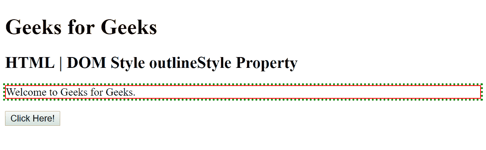
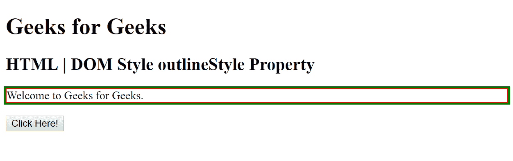
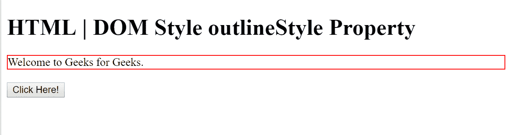
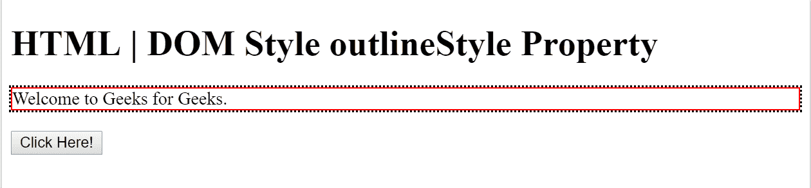

# HTML DOM 样式 outlineStyle 属性

> 原文：[https://www.geeksforgeeks.org/html-dom-style-outlinestyle-property/](https://www.geeksforgeeks.org/html-dom-style-outlinestyle-property/)

HTML DOM 中的 `outlineStyle` 属性用于设置或返回元素周围轮廓的样式。

## 语法

*   它用于返回 `outlineStyle` 属性。

```html
object.style.outlineStyle
```

*   它用于设置 `outlineStyle` 属性。

```html
object.style.outlineStyle = value
```

## 属性值

*   `none`: 这是不设置轮廓的默认值。
*   `hidden`: 使用该值，轮廓被关闭。
*   `dotted`: 该值设置虚线轮廓。
*   `dashed`: 该值设置虚线轮廓。
*   `solid`: 该值设置一个实心轮廓。
*   `double`: 该值设置双轮廓。
*   `groove`: 该值设置三维凹槽轮廓。
*   `ridge`: 该值设置三维脊状轮廓。
*   `inset`: 该值设置三维嵌入轮廓。
*   `outset`: 该值设置 3D 开始轮廓。
*   `initial`: 该值将大纲属性设置为浏览器的默认值。
*   `inherit`: 该值将大纲属性设置为其父元素的值。

## 返回值

这个方法返回一个字符串值，代表元素轮廓的样式。

## 示例

### 示例 1

```html
<!DOCTYPE html>
<html>
<head>
    <title>
        HTML | DOM Style outlineStyle Property
    </title>
    <style>
        #myDiv {
            border: 1px solid red;
            outline: green dotted thick;
        }
    </style>
</head>
<body>
    <h1> Geeks for Geeks</h1>
    <h2>HTML | DOM Style outlineStyle Property</h2>
    <div id="myDiv">Welcome to Geeks for Geeks.</div>
    <br>
    <button type="button" onclick="myFunction()">
        Click Here!
    </button>
    <script>
        function myFunction() {
            document.getElementById("myDiv")
                .style.outlineStyle = "solid";
        }
    </script>
</body>
</html>
```

**输出:**

*   之前点击按钮:
    
*   之后点击按钮:
    

### 示例 2

```html
<!DOCTYPE html>
<html>
<head>
    <title>
        HTML | DOM Style outlineStyle Property
    </title>
    <style>
        #myDiv {
            border: 1px solid red;
        }
    </style>
</head>
<body>
    <h1> HTML | DOM Style outlineStyle Property</h1>
    <div id="myDiv">Welcome to Geeks for Geeks.</div>
    <br>
    <button type="button" onclick="myFunction()">
        Click Here!
    </button>
    <script>
        function myFunction() {
            document.getElementById("myDiv")
                .style.outlineStyle = "dotted";
        }
    </script>
</body>
</html>
```

**输出:**

*   之前点击按钮:
    
*   之后点击按钮:
    

## 支持的浏览器

以下列出了 `DOM Style outlineStyle Property` 支持的浏览器:

*   谷歌 Chrome
*   微软公司出品的 web 浏览器
*   火狐浏览器
*   歌剧
*   旅行队