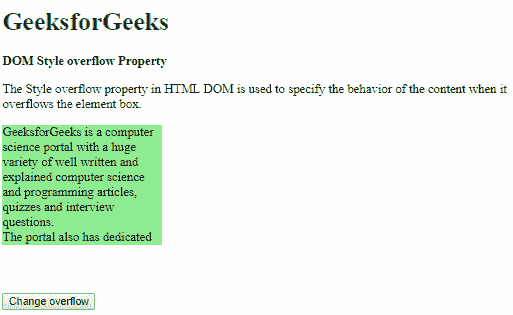
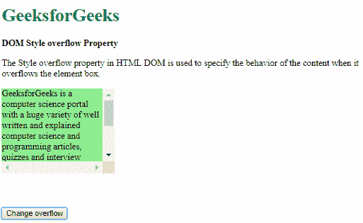
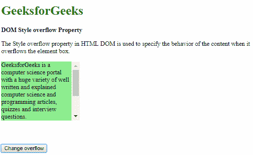
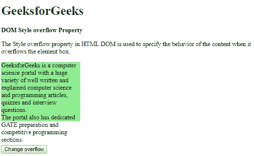
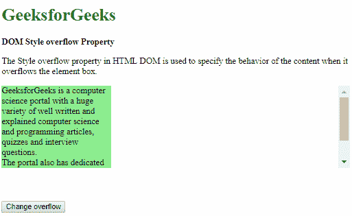

# HTML DOM 样式溢出属性

> 原文：[https://www.geeksforgeeks.org/html-dom-style-overflow-property/](https://www.geeksforgeeks.org/html-dom-style-overflow-property/)

HTML DOM 中的 `overflow` 属性用于指定内容溢出元素框时的行为。内容可以隐藏、显示，或者根据值显示滚动条。

## 语法

*   它返回 `overflow` 属性。
    ```html
    object.style.overflow
    ```
*   它用于设置 `overflow` 属性。
    ```html
    object.style.overflow = "visible|hidden|scroll|auto|initial|inherit"
    ```

## 返回值

返回一个字符串值，代表元素框外呈现的内容。

## 属性值

*   `visible`：内容不会被裁剪，可能会溢出包含元素。

### 示例

```html
<!DOCTYPE html>
<html>
<head>
    <title>DOM Style overflow Property</title>
    <style>
        .content {
            background-color: lightgreen;
            height: 150px;
            width: 200px;
            overflow: hidden;
        }
        button {
            margin-top: 60px;
        }
    </style>
</head>
<body>
    <h1 style="color: green">GeeksforGeeks</h1>
    <b>DOM Style overflow Property</b>
    <p>
        The Style overflow property in HTML DOM is used to specify the behavior of the content when it overflows the element box.
    </p>
    <div class="content">
        GeeksforGeeks is a computer science portal with a huge variety of well written and explained computer science and programming articles, quizzes and interview questions.
        <br>The portal also has dedicated GATE preparation and competitive programming sections.
    </div>
    <button onclick="setOverflow()">Change overflow</button>
    <!-- Script to set overflow to visible -->
    <script>
        function setOverflow() {
            elem = document.querySelector('.content');
            elem.style.overflow = 'visible';
        }
    </script>
</body>
</html>
```

### 输出

*   点击按钮前:
    
*   点击按钮后:
    

*   `hidden`：内容会被裁剪以适应元素。使用此值时不提供滚动条。

### 示例

```html
<!DOCTYPE html>
<html>
<head>
    <title>DOM Style overflow Property</title>
    <style>
        .content {
            background-color: lightgreen;
            height: 150px;
            width: 200px;
        }
        button {
            margin-top: 60px;
        }
    </style>
</head>
<body>
    <h1 style="color: green">GeeksforGeeks</h1>
    <b>DOM Style overflow Property</b>
    <p>
        The Style overflow property in HTML DOM is used to specify the behavior of the content when it overflows the element box.
    </p>
    <div class="content">
        GeeksforGeeks is a computer science portal with a huge variety of well written and explained computer science and programming articles, quizzes and interview questions.
        <br>The portal also has dedicated GATE preparation and competitive programming sections.
    </div>
    <button onclick="setOverflow()">Change overflow</button>
    <!-- Script to set overflow to visible -->
    <script>
        function setOverflow() {
            elem = document.querySelector('.content');
            elem.style.overflow = 'hidden';
        }
    </script>
</body>
</html>
```

### 输出

*   点击按钮前:
    
*   点击按钮后:
    

*   `scroll`：内容会被裁剪以适应元素框，并提供滚动条来滚动溢出的内容。即使内容未被裁剪，此处也会添加滚动条。

### 示例

```html
<!DOCTYPE html>
<html>
<head>
    <title>DOM Style overflow Property</title>
    <style>
        .content {
            background-color: lightgreen;
            height: 150px;
            width: 200px;
            overflow: hidden;
        }
        button {
            margin-top: 60px;
        }
    </style>
</head>
<body>
    <h1 style="color: green">GeeksforGeeks</h1>
    <b>DOM Style overflow Property</b>
    <p>
        The Style overflow property in HTML DOM is used to specify the behavior of the content when it overflows the element box.
    </p>
    <div class="content">
        GeeksforGeeks is a computer science portal with a huge variety of well written and explained computer science and programming articles, quizzes and interview questions.
        <br>The portal also has dedicated GATE preparation and competitive programming sections.
    </div>
    <button onclick="setOverflow()">Change overflow</button>
    <!-- Script to set overflow to visible -->
    <script>
        function setOverflow() {
            elem = document.querySelector('.content');
            elem.style.overflow = 'scroll';
        }
    </script>
</body>
</html>
```

### 输出

*   点击按钮前:
    
*   点击按钮后:
    

*   `auto`：`auto` 的行为取决于内容，仅在内容溢出时才添加滚动条。

### 示例

```html
<!DOCTYPE html>
<html>
<head>
    <title>DOM Style overflow Property</title>
    <style>
        .content {
            background-color: lightgreen;
            height: 150px;
            width: 200px;
            overflow: visible;
        }
        button {
            margin-top: 60px;
        }
    </style>
</head>
<body>
    <h1 style="color: green">GeeksforGeeks</h1>
    <b>DOM Style overflow Property</b>
    <p>
        The Style overflow property in HTML DOM is used to specify the behavior of the content when it overflows the element box.
    </p>
    <div class="content">
        GeeksforGeeks is a computer science portal with a huge variety of well written and explained computer science and programming articles, quizzes and interview questions.
        <br>The portal also has dedicated GATE preparation and competitive programming sections.
    </div>
    <button onclick="setOverflow()">Change overflow</button>
    <!-- Script to set overflow to visible -->
    <script>
        function setOverflow() {
            elem = document.querySelector('.content');
            elem.style.overflow = 'auto';
        }
    </script>
</body>
</html>
```

### 输出

*   点击按钮前:
    
*   点击按钮后:
    

*   `initial`：用于将此属性设置为其默认值。

### 示例

```html
<!DOCTYPE html>
<html>
<head>
    <title>DOM Style overflow Property</title>
    <style>
        .content {
            background-color: lightgreen;
            height: 150px;
            width: 200px;
            overflow: scroll;
        }
        button {
            margin-top: 60px;
        }
    </style>
</head>
<body>
    <h1 style="color: green">GeeksforGeeks</h1>
    <b>DOM Style overflow Property</b>
```

# DOM Style overflow Property

The Style `overflow` property in HTML DOM is used to specify the behavior of the content when it overflows the element box.

```html
<div class="content">
    GeeksforGeeks is a computer science portal
    with a huge variety of well written and
    explained computer science and programming
    articles, quizzes and interview questions.
    <br>The portal also has dedicated GATE
    preparation and competitive programming 
    sections.
</div>

<button onclick="setOverflow()">
    Change overflow
</button>

<!-- Script to set overflow to visible -->
<script>
    function setOverflow() {
        elem = document.querySelector('.content');
        elem.style.overflow = 'initial';
    }
</script>
```

## 输出

*   点击按钮前:
    
*   点击按钮后:
    

## 示例

```html
<!DOCTYPE html>
<html>
<head>
    <title>
        DOM Style overflow Property
    </title>
    <style>
        #parent {
            overflow: auto;
        }
        .content {
            background-color: lightgreen;
            height: 150px;
            width: 200px;
        }
        button {
            margin-top: 60px;
        }
    </style>
</head>
<body>
    <h1 style="color: green">
        GeeksforGeeks
    </h1>
    <b>DOM Style overflow Property</b>
    <p>
        The Style overflow property in HTML DOM is used
        to specify the behavior of the content when it
        overflows the element box.
    </p>
    <div id="parent">
        <div class="content">
            GeeksforGeeks is a computer science portal with
            a huge variety of well written and explained
            computer science and programming articles, 
            quizzes and interview questions.<br>The portal
            also has dedicated GATE preparation and competitive
            programming sections.
        </div>
    </div>
    <button onclick="setOverflow()">
        Change overflow
    </button>
    <!-- Script to set overflow to inherit -->
    <script>
        function setOverflow() {
            elem = document.querySelector('.content');
            elem.style.overflow = 'inherit';
        }
    </script>
</body>
</html>
```

### inherit

This inherits the property from its parent.

**输出:**

*   点击按钮前:
    
*   点击按钮后:
    

## 支持的浏览器

`DOM Style` 溢出属性支持的浏览器如下:

*   谷歌 Chrome
*   微软公司出品的 web 浏览器
*   火狐浏览器
*   歌剧
*   苹果 Safari