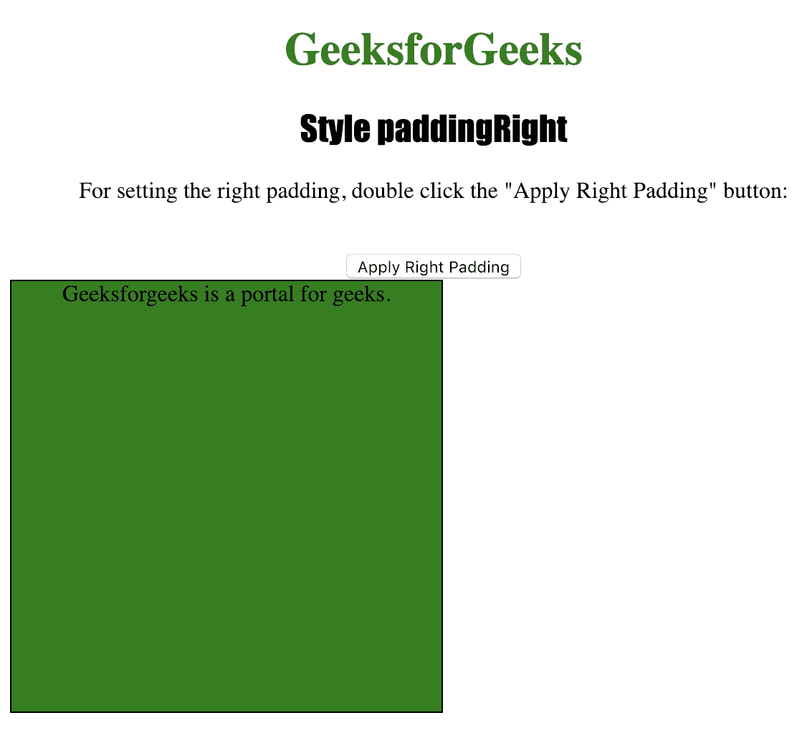
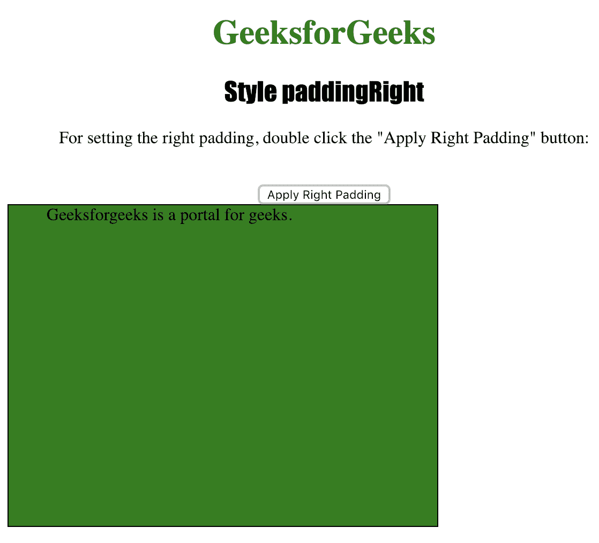

# HTML DOM `paddingRight` 属性

> 原文：[https://www.geeksforgeeks.org/html-dom-style-paddingright-property/](https://www.geeksforgeeks.org/html-dom-style-paddingright-property/)

`paddingRight` 属性用于设置或返回元素的右侧内边距。
`padding` 属性在元素的边框内插入用户想要的空间。

## 语法

*   获取属性：
    ```html
    object.style.paddingRight
    ```

*   设置属性：
    ```html
    object.style.paddingRight = "%|length|initial|inherit"
    ```

## 返回值

它返回一个字符串值，代表一个元素的右内边距。

## 属性值

*   `%`：用于定义以父元素宽度的百分比为单位的右边距。
*   `length`：用于以长度单位定义右边距。
*   `initial`：用于将该属性设置为默认值。
*   `inherit`：用于从其父元素继承该属性。

下面的程序说明了 `paddingRight` 属性方法：

## 示例：设置 `<div>` 元素的右内边距

```html
<!DOCTYPE html>
<html>

<head>
    <title>Style paddingRight in HTML</title>
    <style>
        #MyElement {
            border: 1px solid black;
            background-color: green;
            width: 300px;
            height: 300px;
        }

        h1 {
            color: green;
        }

        h2 {
            font-family: Impact;
        }

        body {
            text-align: center;
        }
    </style>
</head>

<body>

    <h1>GeeksforGeeks</h1>
    <h2>Style paddingRight</h2>

    <p>For setting the right padding, double click the "Apply Right Padding" button: </p>
    <br>

    <button onClick="padding()">Apply Right Padding</button>

    <div id="MyElement">
        Geeksforgeeks is a portal for geeks.
    </div>

    <script>
        function padding() {
            document.getElementById("MyElement")
            .style.paddingRight = "100px";
        }
    </script>

</body>

</html>
```

## 输出

*   点击按钮前：
    

*   点击按钮后：
    

## 支持的浏览器

下面列出了 `HTML DOM Style paddingRight` 属性支持的浏览器：

*   谷歌 Chrome
*   微软 Edge
*   火狐浏览器
*   Opera
*   苹果 Safari