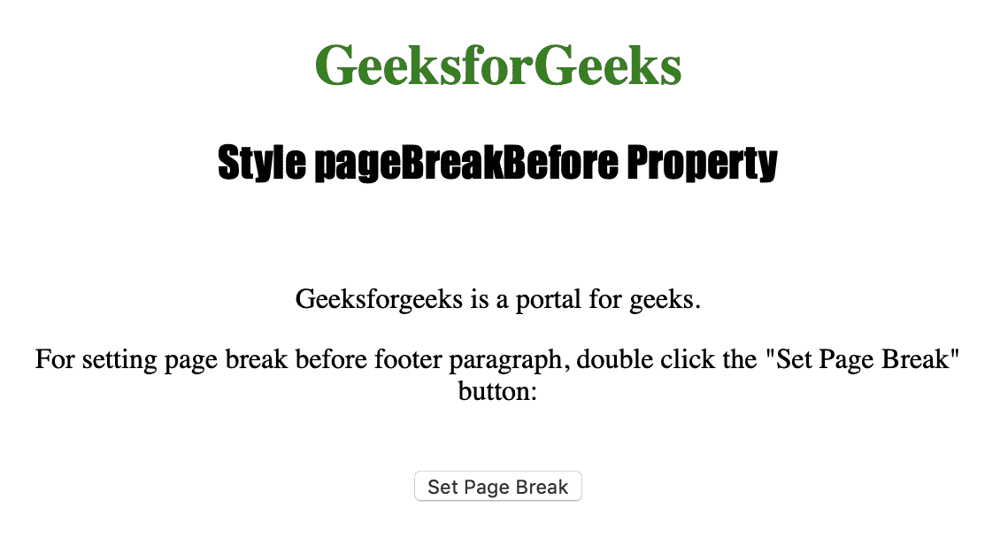
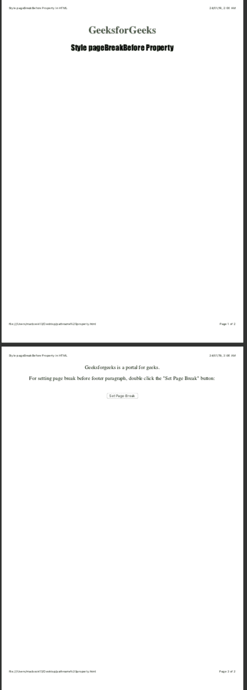

# HTML DOM | Style pageBreakBefore 属性

> 原文: [https://www.geeksforgeeks.org/html-dom-style-pagebreakbefore-property-2/](https://www.geeksforgeeks.org/html-dom-style-pagebreakbefore-property-2/)

`style.pageBreakBefore` 属性用于在打印或打印预览中设置或返回元素之前的分页行为。
`style.pageBreakBefore` 属性不影响绝对定位的元素。

## 语法

```html
object.style.pageBreakBefore
```

## 返回值

返回一个字符串，代表打印时元素前的分页符行为。

## 属性值

> `object.style.pageBreakBefore = "auto | always | avoid | empty-string | left | right | initial | inherit"`

## 数值说明

*   `auto`: 用于必要时在元素前插入分页符。
*   `always`: 用于在元素前始终插入分页符。
*   `avoid`: 用于避免元素前出现分页符。
*   `empty-string`: 分页符没有插入到元素之前。
*   `left`: 用于在元素前插入一两个分页符，所以下一页被认为是左页。
*   `right`: 用于在元素前插入一两个分页符，所以下一页被认为是右页。
*   `initial`: 用于将该属性设置为默认值。
*   `inherit`: 用于从其父元素继承该属性。

下面的程序说明了 `pageBreakBefore` 属性:

## 示例：在 id="footer" 的 `<p>` 元素前设置分页符

```html
<!DOCTYPE html>
<html>

<head>
    <title>Style pageBreakBefore Property in HTML</title>
    <style>
        h1 {
            color: green;
        }

        h2 {
            font-family: Impact;
        }

        body {
            text-align: center;
        }
    </style>
</head>

<body>

<h1>GeeksforGeeks</h1>
    <h2>Style pageBreakBefore Property</h2>
    <br>

<p id="myfooter">Geeksforgeeks is a portal for geeks.</p>

<p>For setting page break before footer paragraph, 
      double click the "Set Page Break" button: </p>
    <br>

<button ondblclick="pagebreak()">Set Page Break</button>

<script>
        function pagebreak() {
            document.getElementById("myfooter")
            .style.pageBreakBefore = "always";
        }
    </script>

</body>

</html>
```

## 输出

*   **点击按钮前:**
    

*   **点击按钮后:**
    

**注意:** 为了看到输出，请将代码保存在 HTML 文件中，并在浏览器上运行。当您看到该文件的打印预览时，将会看到输出。