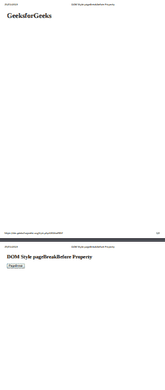

# HTML DOM 样式 pageBreakBefore 属性

> 原文：[https://www.geeksforgeeks.org/html-dom-style-pagebreakbefore-property/](https://www.geeksforgeeks.org/html-dom-style-pagebreakbefore-property/)

HTML DOM 中的 `pageBreakBefore` 属性用于设置或返回 HTML 文档中指定元素之前的分页特征。此属性在打印和打印预览模式下工作。`pageBreakBefore` 属性对 HTML DOM 中绝对定位的元素没有影响。“分页前”属性只能在打印预览模式和硬拷贝中生效。

## 语法

它返回 `pageBreakBefore` 属性。

```html
object.style.pageBreakBefore
```

它用于设置 `pageBreakBefore` 属性。

```html
object.style.pageBreakBefore = "auto|always|avoid|emptystring|left|right|initial|inherit"
```

## 属性值

*   `auto`：为默认值。如有必要，它用于在元素前分页。
*   `always`：该值始终在元素前插入分页符。
*   `avoid`：该值避免元素前的分页符。
*   `emptystring`：当分页符没有插入到元素之前时，使用该值。
*   `left`：用于在元素前插入一两个分页符，所以下一页被认为是左页。
*   `right`：用于在元素前插入一两个分页符，所以下一页被认为是右页。
*   `initial`：`pageBreakBefore` 属性用于设置其默认值。
*   `inherit`：从其父元素继承而来。

## 返回值

返回一个字符串，代表打印时指定元素前的分页符属性。

## 示例 1

```html
<!DOCTYPE html>
<html>
    <head>
        <title>DOM Style pageBreakBefore Property</title>
    </head>
    <body>
        <h1>GeeksforGeeks</h1>
        <h2 id="footer">DOM Style pageBreakBefore Property</h2>
        <button type="button" onclick="geeks()">PageBreak</button>
        <script>
            function geeks() {
                document.getElementById("footer").style.pageBreakBefore = "always";
            }
        </script>
    </body>
</html>
```

**输出：**
点击按钮前打印-预览：

点击按钮后打印-预览：


## 示例 2：避免元素前的分页符

```html
<!DOCTYPE html>
<html>
    <head>
        <title>DOM Style pageBreakBefore Property</title>
    </head>
    <body>
        <h1>GeeksforGeeks</h1>
        <h2 id="footer">DOM Style pageBreakBefore Property</h2>
        <button type="button" onclick="geeks()">PageBreak</button>
        <script>
            function geeks() {
                document.getElementById("footer").style.pageBreakBefore = "avoid";
            }
        </script>
    </body>
</html>
```

**输出：**
点击按钮前打印-预览：

点击按钮后打印-预览：


## 支持的浏览器

`pageBreakBefore` 属性支持的浏览器如下：

*   Google Chrome
*   Microsoft Edge
*   Firefox
*   Opera
*   Safari